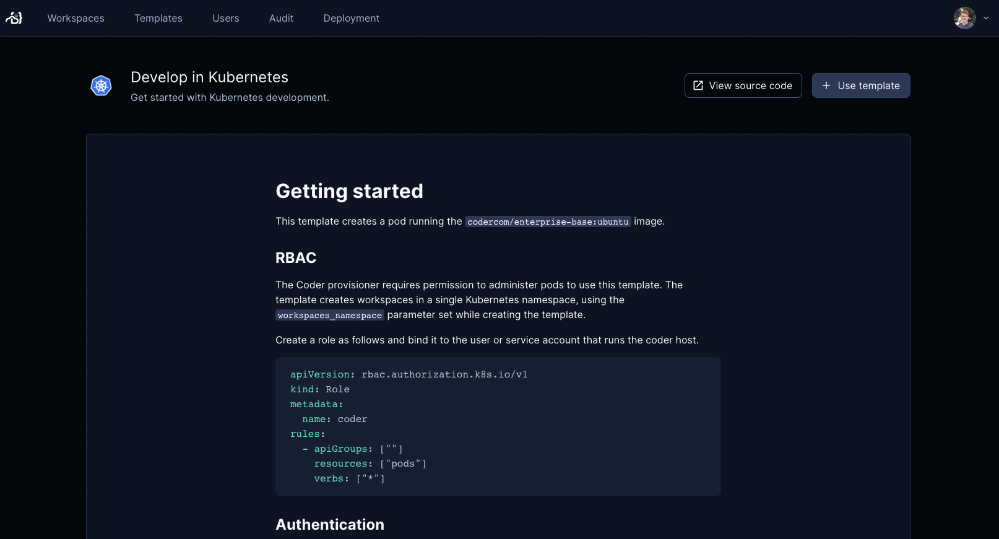

# Guide: Coder on Kubernetes

Coder's control plane and/or workspaces can be deployed on Kubernetes.

## Installation

Refer to our [Helm install docs](../../install/kubernetes.md) to deploy Coder on Kubernetes. The default helm values will provision the following:

- Coder control plane (as a `Deployment`)
- ServiceAccount + Role + RoleBinding to provision pods + PVCS in the current namespace (used for Kubernetes workspaces)
- LoadBalancer to access control plane

## Kubernetes templates

From the dashboard, import the Kubernetes starter template:

In the next screen, set the following template variables:

- `use_kubeconfig`: `false` (The ServiceAccount will authorize Coder to create pods on your cluster)
- `namespace`: `coder` (or whatever namespace you deployed Coder on)

> If you deployed Coder on another platform besides Kubernetes, you can set `use_kubeconfig: true` for Coder to read the config from your VM, for example.
