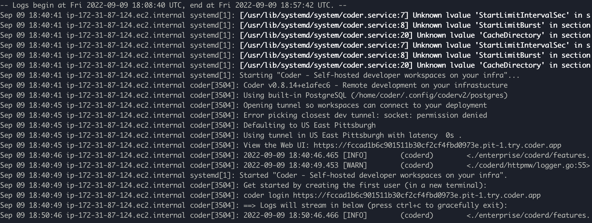

## Requirements 
To get started running Coder on Azure, you will need an Azure account with the capability to create new Virtual Machines. 

## Create An Azure VM

From the Azure Portal, navigate to the Virtual Machines Dashboard. Click Create, and select creating a new Azure Virtual machine .


This will bring you to the `Create a virtual machine page`. Select the subscription group of your choice, or create one if necessary.

Next, name the VM something relevant to this project using the naming convention of your choice. Change the region to something more appropriate for your current location. For this tutorial, we will use the base selection of the Ubuntu Gen2 Image and keep the rest of the base settings for this image the same.


Up next, under `Inbound port rules` modify the Select `inbound ports` to also take in `HTTPS` and `HTTP`.

 


The set up for the image is complete at this stage. Click `Review and Create` - review the information and click `Create`. A popup will appear asking you to download the key pair for the server. Click `Download private key and create resource` and place it into a folder of your choice on your local system. 


Click `Return to create a virtual machine`. Your VM will start up! 


Click `Go to resource` in the Virtual machine and copy the public IP address. You will need it to SSH into the virtual machine via your local machine.
Follow these instructions to SSH into the virtual machine. Once on the VM, you can run and install Coder using your method of choice. For the fastest install, we recommend running Coder as a system process.

## Install Coder

For this instance, we will run Coder as a service command, however you can run coder a multitude of different ways. You can learn more about those here.

In the Azure VM instance, run the following command to install Coder

```
curl -fsSL <https://coder.com/install.sh> | sh
```


## Run Coder

First, edit the coder.env file to enable `CODER_TUNNEL` by setting the value to true with the following command:

```
sudo vim /etc/coder.d/coder.env
```


 Exit vim and run the following command to start Coder as a system level service:

```
 sudo systemctl enable --now coder
```


The following command will get you information about the Coder launch process

```
 journalctl -u coder.service -b
```


This will return a series of Coder logs, however, embedded in the launch is the URL for accessing Coder.



In this instance, Coder can be accessed at the url https://fccad1b6c901511b30cf2cf4fbd0973e.pit-1.try.coder.app.

Copy the URL and run the following command to create the first user, either on your local machine or in the AWS EC2 instance terminal. 

```coder login <url.try.coder.app>```

Fill out the prompts. Be sure to save use email and password as these are your admin username and password.

You can now access coder on your local machine with the relevant  `***.try.coder.app` URL and logging in with the username and password.


## Creating and Uploading Your First Template

First, run `coder template init` to create your first template. You’ll be given a list of possible templates to use. This tutorial will show you how to set up your Coder instance to create a Linux based machine on Azure. 


Press `enter` to select `Develop in Linux on Azure` template. This will return the following: 


To get started using the Azure template, install the Azure CLI by following the instructions here. Run `az login` and follow the instructions to configure the Azure command line. 

For this example, Coder was run as a system level process, which creates the system user `coder` for handling processes. The coder user will require access to the Azure credentials to initialize the template.
Run the following commands to copy the Azure credentials and give the `coder` user access to them:

```bash
sudo cp -r ~/.azure /home/coder/.azure 
sudo chown -R coder:coder /home/coder/.azure/
```


Navigate to the `/azure-linux` folder where you created your template and run the following command to put the template on your coder instance. 

```
coder templates create
```


Congrats! You can now navigate to your Coder dashboard and use this Linux on Azure template to create a new workspace!


## Debugging Help

If you’re not sure if Coder is running correctly as a system service, use the command `systemctl status coder` to show the status of the coder process.


To stop running coder as a system process, run the following command: `systemctl stop coder`. 

When you run ` journalctl -u coder.service -b`, there’s a chance that it may not show any logs, preventing you from seeing the url for the running coder instance. Use the command `systemctl stop coder` to stop the coder system process, and run the command to start Coder as a system process again. You can also use the command `systemctl restart coder` to quickly restart the process. 


