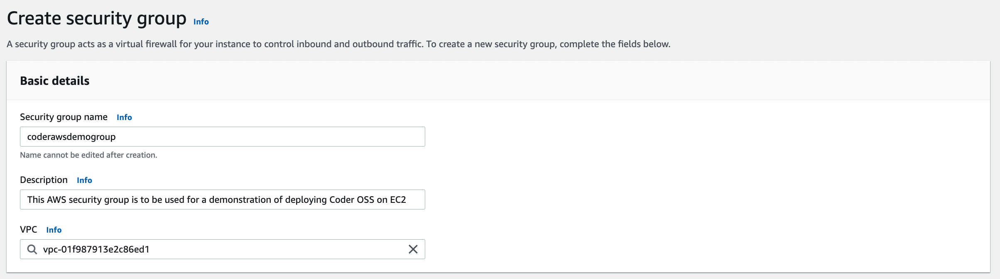
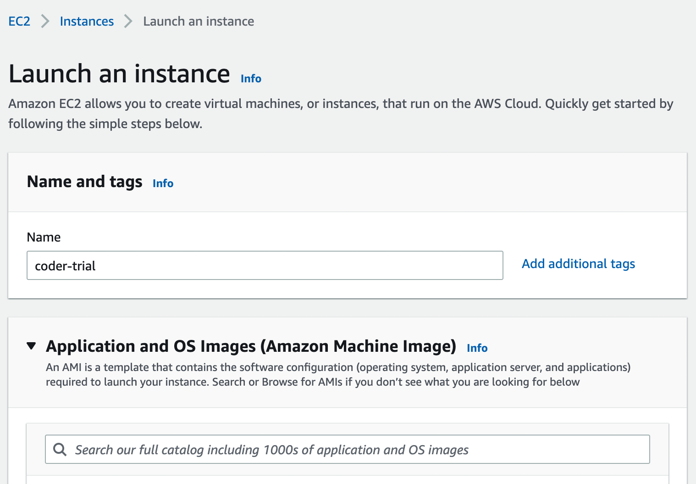
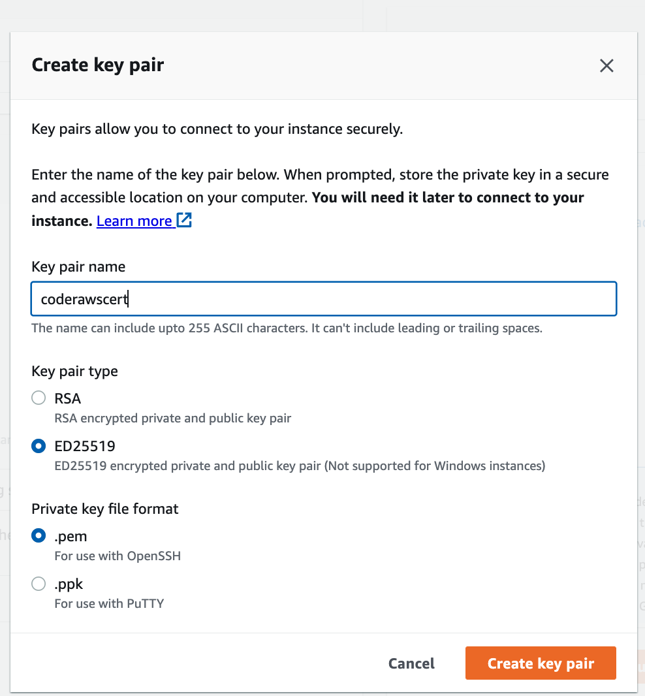
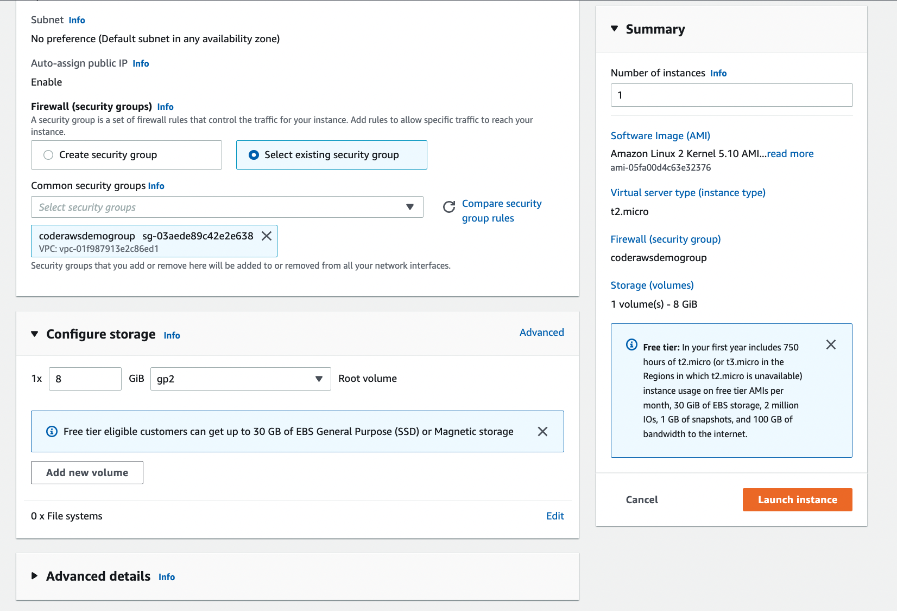
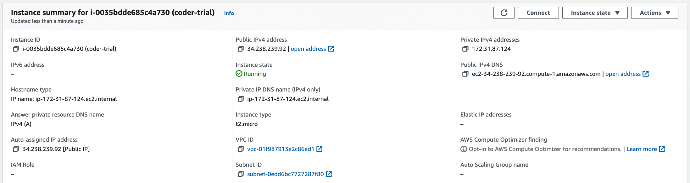
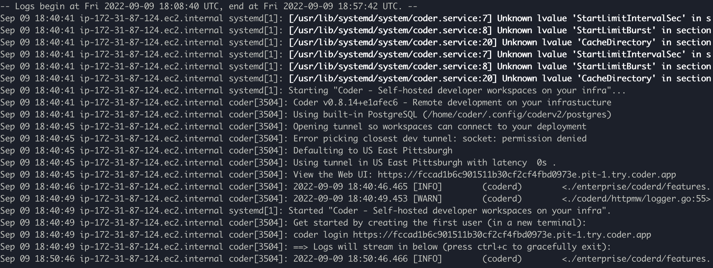
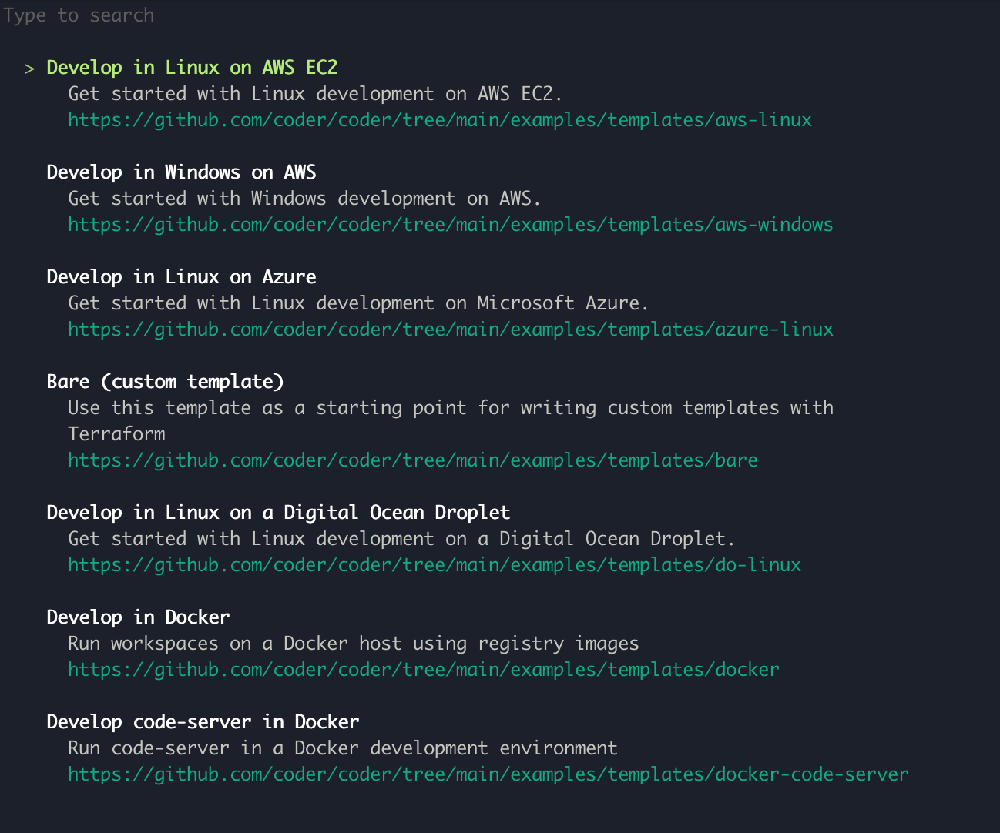
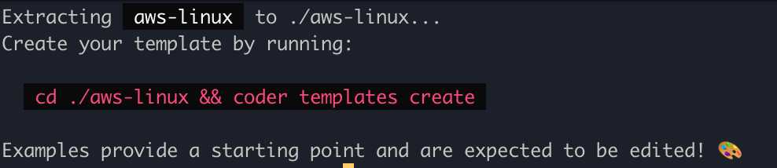

# Amazon Web Services

This quickstart shows you how to set up the Coder server on AWS which will
provision AWS-hosted, Linux workspaces.

## Requirements

This quickstart assumes you are assigned the `AdministratorAccess` policy on AWS.

## Setting Up Security Groups for EC2

To set up a security group for an EC2 instance, navigate to the AWS EC2 Dashboard. In the side panel click `Security Groups`.

In the upper right hand corner, click `Create Security Group`. In the creator screen, name the security group something relevant to the EC2 instance you will create.



For ease of use, we are going to set this up using the simplest rules.


Create a new `Inbound Rule` that allows for SSH from your computer’s IP address.

You’ve now created a security group that will be used by your EC2 instance.

## Setting Up Your EC2 instance

On the EC2 dashboard, click `Instances`. This will take you to all the EC2 instances you have created. Click `Launch New Instance`. Name the EC2 instance following the naming convention of your choice.



For this tutorial, we are going to launch this as the base Ubuntu server.

For the `Create key pair`, we are using ED25519 and `.pem` as we will SSH into the instance later in the tutorial.


Next, under `Network Settings`, change your Firewall security group to Select existing security group and from the resulting dropdown, select the security group you created in the previous section.

You don’t need to change anything else - click `Launch Instance`.



It’ll take a few minutes for it to show up in your existing instances, so take a break as it starts up.

## SSHing into the EC2 instance

If you’ve launched a new EC2 instance following the previous steps of this tutorial, find the username for the EC2 instance [here](https://docs.aws.amazon.com/AWSEC2/latest/UserGuide/connection-prereqs.html). The version launched in the previous steps was a version of the Amazon Linux so the username is `ubuntu`.

You will also need the IP address of the server. Click on the server in the `Instances` dashboard, and copy the IPv4 address



Now that we’ve gathered all the information you will need to SSH into your EC2 instance, on a terminal on your local system, navigate to the `.pem` file downloaded when you created the EC2 instance. Run the following command:

```console
chmod 400 [mykey].pem
```

This adds the required permissions for SSH-ing into an EC2 instance.

Run the following command in terminal, where `mykey` is the security key file, `username` is the username found above for the relevant EC2 operating system image, and the `ip-address` is the IPv4 address for the server:

```console
ssh -i [mykey].pem username@ip-address
```

Congrats you’ve SSH’d into the server.

## Install Coder

For this instance, we will run Coder as a system service, however you can run Coder a multitude of different ways. You can learn more about those [here](https://coder.com/docs/coder-oss/latest/install).

In the EC2 instance, run the following command to install Coder

```console
curl -fsSL https://coder.com/install.sh | sh
```

## Run Coder

Run the following command to start Coder as a system level service:

```console
sudo systemctl enable --now coder
```

The following command will get you information about the Coder launch service

```console
journalctl -u coder.service -b
```

This will return a series of Coder logs, however, embedded in the launch is the URL for accessing Coder.



In this instance, Coder can be accessed at the url `https://fccad1b6c901511b30cf2cf4fbd0973e.pit-1.try.coder.app`.

Copy the URL and run the following command to create the first user, either on your local machine or in the AWS EC2 instance terminal.

```console
coder login <url***.try.coder.app>
```

Fill out the prompts. Be sure to save use email and password as these are your admin username and password.

You can now access Coder on your local machine with the relevant `***.try.coder.app` URL and logging in with the username and password.

## Creating and Uploading Your First Template

Run `coder template init` to create your first template. You’ll be given a list of possible templates. This tutorial will show you how to set up your Coder instance to create Linux based machines on AWS.



Press `enter` to select `Develop in Linux` on AWS template. This will return the following:



Now, we must install the AWS CLI and authorize the template. Follow [these instructions to install the AWS CLI](https://docs.aws.amazon.com/cli/latest/userguide/getting-started-install.html) and [add your credentials](https://docs.aws.amazon.com/cli/latest/userguide/cli-configure-quickstart.html).

Coder runs as a system service under a system user `coder`. The `coder` user will require access to the AWS credentials to initialize the template and provision workspaces.

Run the following command to create a folder for the AWS credentials to live in:

```console
sudo mkdir /home/coder/.aws
```

Run the following commands to copy the AWS credentials and give the `coder` user access to them:

```console
sudo cp ~/.aws/credentials /home/coder/.aws/credentials
sudo chown coder:coder /home/coder/.aws/credentials
```

Navigate to the `./aws-linux` folder where you created your template and run the following command to put the template on your Coder instance.

```console
coder templates create
```

Congrats! You can now navigate to your Coder dashboard and use this Linux on AWS template to create a new workspace!

## Next Steps

- [Port-forward](../networking/port-forwarding.md)
- [Learn more about template configuration](../templates.md)
- [Configure more IDEs](../ides/web-ides.md)
