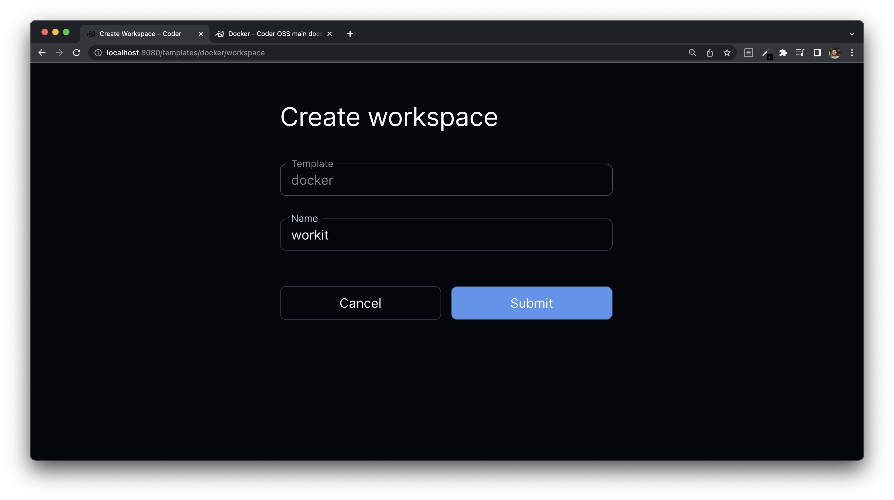

# Docker

Coder with Docker has the following advantages:

- Simple installation (everything is on a single box)
- Workspace images are easily configured
- Workspaces share resources for burst operations

## Requirements

- A single macOS or Linux box
- A running Docker daemon

## Instructions

1.  [Install and launch Coder](../install)

    The Coder server binds to port 3000 by default. Use `--address :<port>` to customize it!

    ```bash
    $ coder server
    ```

1.  Run `coder login http://localhost:3000` in a new terminal and follow the
    interactive instructions to create your user.

1.  Pull the "Docker" example template using the interactive `coder templates init`:

    ```bash
    $ coder templates init
    $ cd docker
    ```

1.  Push up the template with `coder templates create`
1.  Open the dashboard in your browser (http://localhost:3000) to create your
    first workspace:

    

    Then navigate to `Templates > docker > Create workspace`

    

    Now wait a few moments for the workspace to build... After the first build,
    the image is cached and subsequent builds will take a few seconds.

1.  Your workspace is ready to go!

    

    Open up a web application or [SSH in](../ides.md#ssh-configuration).

1.  If you want to modify the Docker image or template, edit the files in the
    previously created `./docker` directory, then run `coder templates push`.

## Next Steps

- [Port-forward](../networking/port-forwarding.md)
- [Learn more about template configuration](../templates.md)
- [Configure more IDEs](../ides/web-ides.md)
