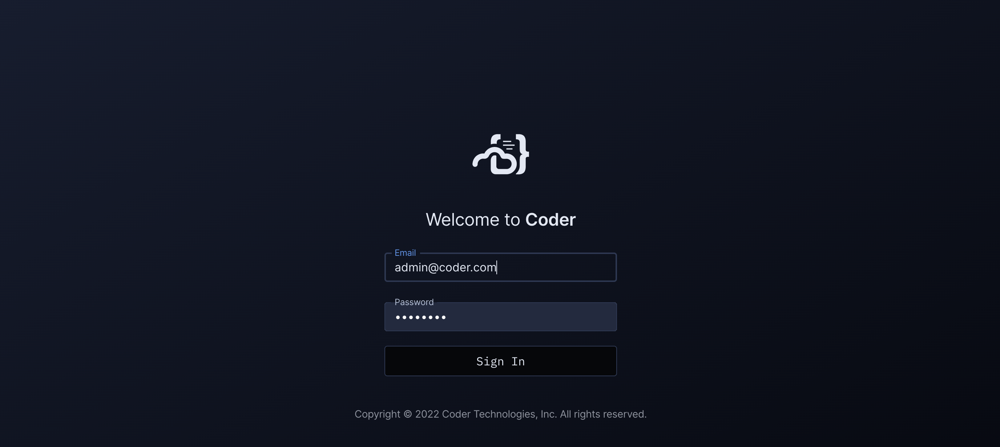

# Docker

Coder with Docker has the following advantages:

- Simple installation (everything is on a single box)
- Workspace images are easily configured
- Workspaces share resources for burst operations

## Requirements

- A single macOS or Linux box
- A running Docker daemon

## Instructions

1.  [Install and launch Coder](../install)

    Specify `CODER_ACCESS_URL=http://localhost:7080` since we're using
    local Docker workspaces exclusively. `CODER_ACCESS_URL` is the external URL
    to access Coder. The rest of the Docker quickstart guide will assume that
    this is your Access URL.

    Also, set `CODER_ADDRESS=0.0.0.0:7080` which is the address coder
    serve the API and dashboard at.

    ```bash
    coder server --address $CODER_ADDRESS --access-url $CODER_ACCESS_URL
    ```

1.  Run `coder login http://localhost:7080` in a new terminal and follow the
    interactive instructions to create your user.

1.  Pull the example template using the interactive `coder templates init`:

    ```bash
    $ coder templates init
    $ cd docker
    ```

1.  Push up the template with `coder templates create`
1.  Open the dashboard in your browser (http://localhost:7080) to create your
    first workspace:

    

    Then navigate to `Templates > docker > Create workspace`

    

    Now wait a few moments for the workspace to build... After the first build
    the image is cached and subsequent builds will take a few seconds.

1.  All done!

    

    Open up a web application or [SSH in](../ides.md#ssh-configuration).

## Next Steps

- [Learn more about template configuration](../templates.md)
- [Configure more IDEs](../ides/web-ides.md)
