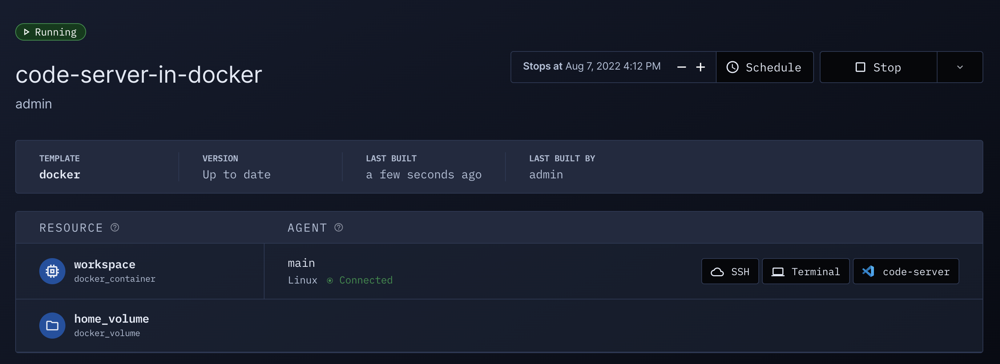

# Docker

Coder with Docker has the following advantages:

- Simple installation (everything is on a single box)
- Workspace images are easily configured
- Workspaces share resources for burst operations

## Requirements

- A single macOS or Linux box
- A running Docker daemon

## Instructions

1.  [Install and launch Coder](../install)

    The Coder server binds to port 3000 by default. Use `--address :<port>` to customize it!

    Use the [Coder tunnel](../admin/configure.md#tunnel) for a public URL:

    ```bash
    coder server
    ```

    Or set an [access URL](../admin/configure.md#access-url) to run entirely locally:

    ```bash
    coder server --access-url=http://localhost:3000 --address=:3000
    ```

1.  Run `coder login <access url>` in a new terminal and follow the
    interactive instructions to create your user.

1.  Pull the "Docker" example template using the interactive `coder templates init`:

    ```bash
    coder templates init
    cd docker
    ```

1.  Push up the template with `coder templates create`
1.  Open the dashboard in your browser (http://localhost:3000) to create your
    first workspace:

    

    Then navigate to `Templates > docker > Create workspace`

    

    Now wait a few moments for the workspace to build... After the first build,
    the image is cached and subsequent builds will take a few seconds.

1.  Your workspace is ready to go!

    

    Open up a web application or [SSH in](../ides.md#ssh-configuration).

1.  If you want to modify the Docker image or template, edit the files in the
    previously created `./docker` directory, then run `coder templates push`.

## Troubleshooting

### Docker-based workspace is stuck in "Connecting..."

Ensure you have an externally-reachable `CODER_ACCESS_URL` set. See [troubleshooting templates](../templates.md#creating-and-troubleshooting-templates) for more steps.

### Permission denied while trying to connect to the Docker daemon socket

See Docker's official documentation to [Manage Docker as a non-root user](https://docs.docker.com/engine/install/linux-postinstall/#manage-docker-as-a-non-root-user).

## Next Steps

- [Port-forward](../networking/port-forwarding.md)
- [Learn more about template configuration](../templates.md)
- [Configure more IDEs](../ides/web-ides.md)
