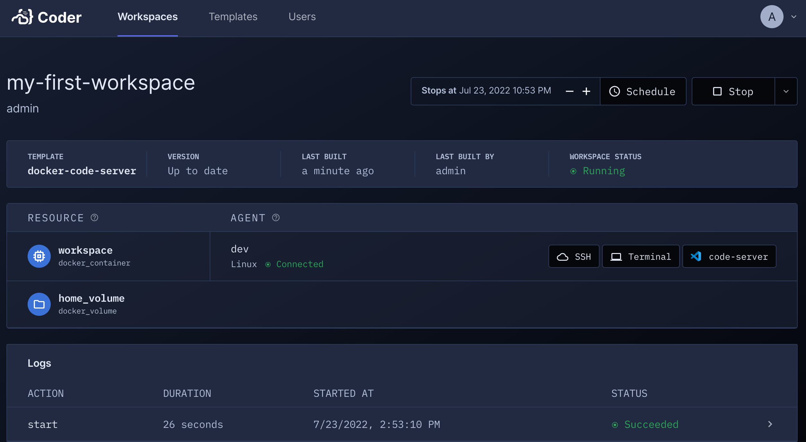

# Getting Started

This article will walk you through how to set up your first Coder user, and begin
using the templates to create and access your development workspaces.

## Prerequisites

Please [install and configure Coder](./install.md) before proceeding with the steps below.

## First time admin user setup

1. Run `coder login <your Access URL>` in a new terminal and follow the
    interactive instructions to create your admin user and password.

> If using `coder server --tunnel`, the Access URL appears in the terminal logs.

## Templates

To get started using templates, run the following command to generate a sample template:

```bash
coder templates init
```

Follow the CLI instructions to select an example that you can modify for your
specific usage (e.g., a template to **Develop code-server in Docker**):

1. Navigate into your new templates folder and create your first template using
   the provided command (e.g., `cd ./docker-code-server && coder templates create`)

1. Answer the CLI prompts; when done, confirm that you want to create your template.

## Create a workspace

Now, create a workspace using your template:

```bash
coder create --template="yourTemplate" <workspaceName>
```

Connect to your workspace via SSH:

```bash
coder ssh <workspaceName>
```

To access your workspace in the Coder dashboard, navigate to the [configured access URL](../install.md#configure),
and log in with the admin credentials provided to you by Coder.



You can also create workspaces using the access URL and the Templates UI.


## Modifying templates

You can edit the Terraform template as follows:

```sh
coder templates init
cd gcp-linux # modify this line as needed to access the template
vim main.tf
coder templates update gcp-linux # updates the template
```

## Up Next

Learn about [templates](../templates.md).
