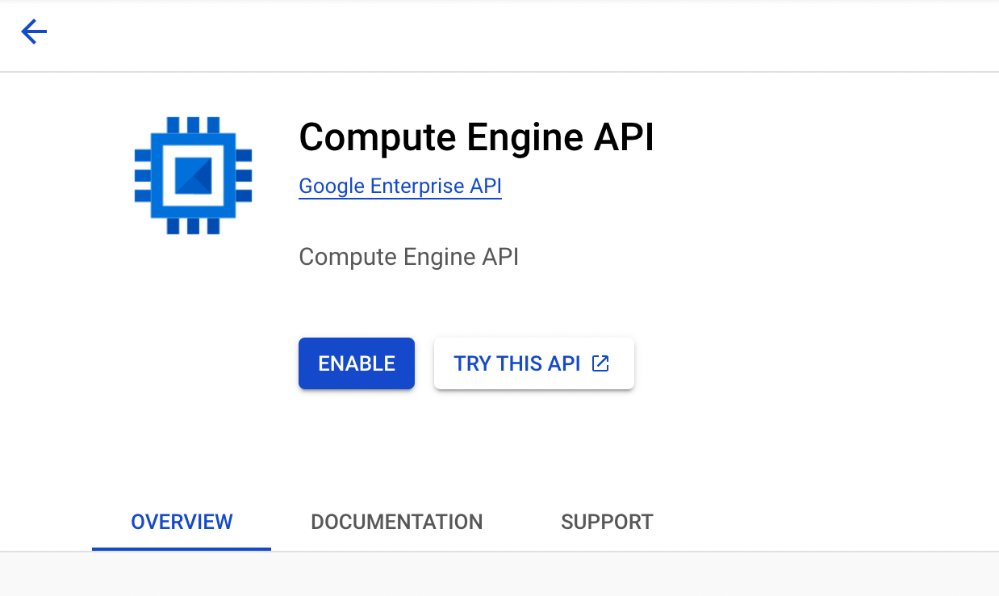
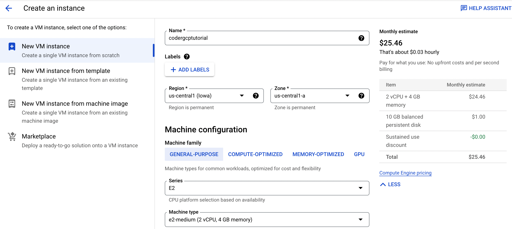
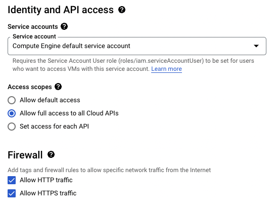
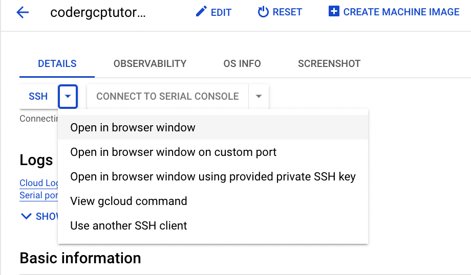
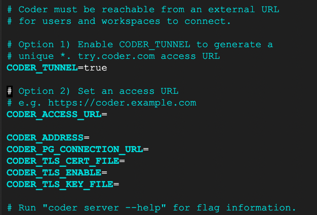
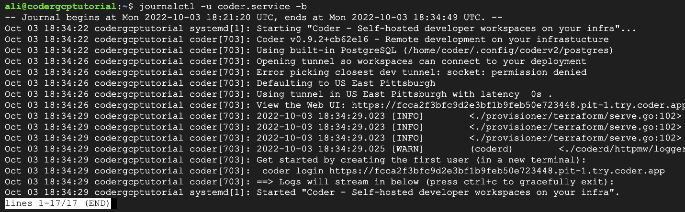
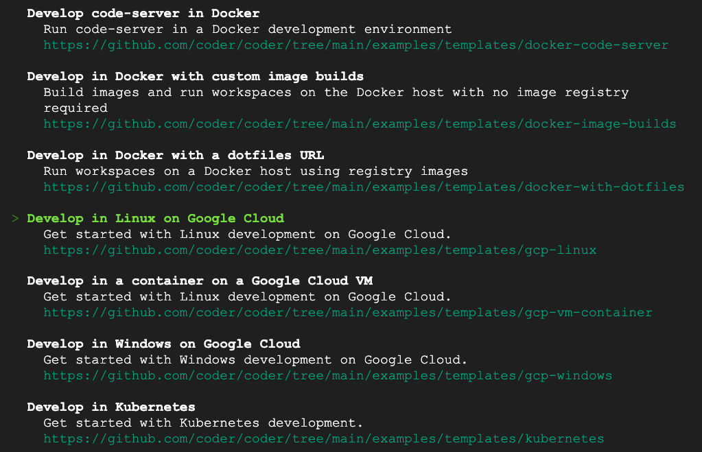
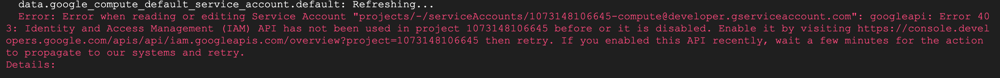
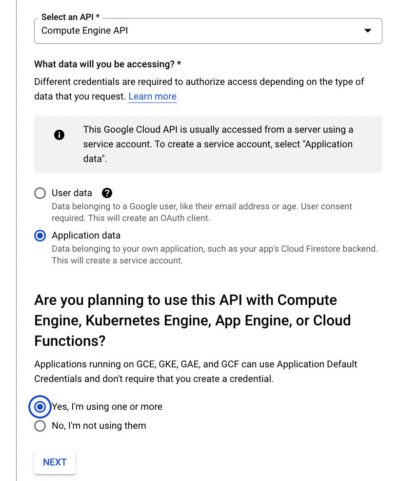

# Google Cloud Platform

In this quickstart, you will learn how to deploy the Coder control plane instance and your first template.

## Requirements

This quickstart assumes you have `roles/compute.instanceAdmin.v1` access to your Google Cloud Platform project.

## Setting Up your VM

If this is the first time you’re creating a VM on this project, you will need to enable the `Compute Engine API`. On the Compute Engine API page, click `enable` and wait for the service to finish connecting.



This will pull up the `Create an Instance` page - name the instance something relevant to this project, following your naming convention of choice. In addition, select a region and zone that is close to your physical location. For this instance, we will use the base suggested image.



Under `Identity and API Access`, click `Allow full access to all Cloud APIs`. Scroll down to `Firewall` and click `Allow HTTPS traffic` and `Allow HTTP traffic`.



Scroll down to the bottom and click `Create` to create and deploy the VM.

Congrats you’ve created your VM instance!

## SSH-ing into the VM

On the Compute Engine Dashboard, click on the VM for this project. Under `Details`, click `SSH` and select `Open in browser window`.



This will give you a terminal into the VM that we will use to install Coder.

## Install Coder

In the terminal, run the following command

```console
curl -fsSL https://coder.com/install.sh | sh
```

## Run Coder

For this tutorial, we will run Coder as a `systemd` service. You can run Coder in [a multitude of different ways](https://coder.com/docs/coder-oss/latest/install).

First, edit the `coder.env` file to enable `CODER_TUNNEL` by setting the value to true with the following command:

```console
sudo vim /etc/coder.d/coder.env
```



Exit vim and run the following command to start Coder as a system service:

```console
sudo systemctl enable --now coder
```

The following command shows the Coder service's logs, including the Access URL. The Access URL will be used to access the Coder control plane.

```console
journalctl -u coder.service -b
```



In this instance, Coder can be accessed at the URL `https://fcca2f3bfc9d2e3bf1b9feb50e723448.pit-1.try.coder.app`.

Copy the URL and run the following command to create the workspace admin:

```console
coder login <url***.try.coder.app>
```

Fill out the prompts and be sure to save use email and password. This is your admin login. Now, you can now access Coder from your local machine by navigating to the `***.try.coder.app` URL and logging in with that same username and password.

## Creating and Uploading your First Template

First, run `coder template init` to create your first template. You’ll be given a list of prefabricated templates. This tutorial shows you how to create a Linux based template on GCP.



Select the `Develop in Linux on Google Cloud`, then `cd ./gcp-linux`.

Run the following command:

```console
coder templates create
```

It will ask for your `project-id`, which you can find on the home page of your GCP Dashboard.

Given it’s your first time setting up Coder, it may give an error that will look like the following:



In the error message will be a link. In this case, the URL is `https://console.developes.google.com/apis/api/iam.googles.com/overview:?project=1073148106645`. Copy the respective URL from your error message, and visit it via your browser. It may ask you to enable `Identity and Access Management (IAM) API`.

Click `enable` and wait as the API initializes for your account.

Once initialized, click create credentials in the upper right-hand corner. Select the `Compute Engine API` from the dropdown, and select `Application Data` under `What data will you be accessing?`. In addition, select `Yes, I’m using one or more` under `Are you planning on using this API with Compute Engine, Kubernetes Engine, App Engine, or Cloud Functions?`.



Back in your GCP terminal, run the `coder templates create` one more time.

Congrats! You can now create new Linux-based workspaces that use Google Cloud Platform. Go onto your Coder dashboard, build your workspace, and get started coding!

## Next Steps

- [Learn more about template configuration](../templates.md)
- [Configure more IDEs](../ides/web-ides.md)
