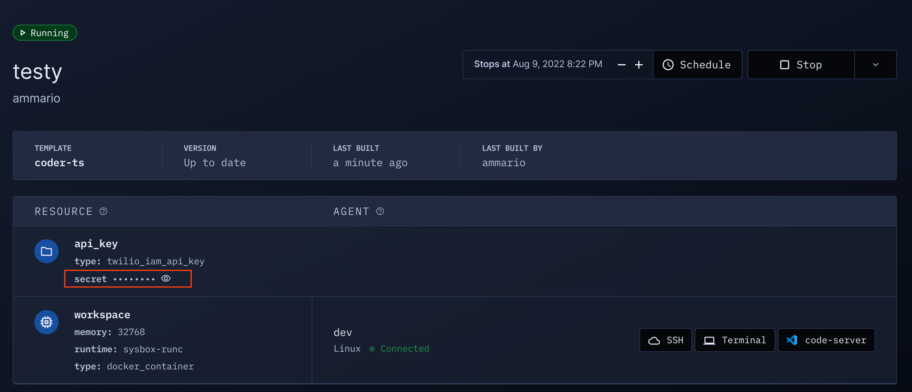

# Secrets

<blockquote class="info">
This article explains how to use secrets in a workspace. To authenticate the
workspace provisioner, see <a href="/admin/auth">this</a>.
</blockquote>

Coder is open-minded about how you get your secrets into your workspaces.

## Wait a minute...

Your first stab at secrets with Coder should be your local method.
You can do everything you can locally and more with your Coder workspace, so
whatever workflow and tools you already use to manage secrets may be brought
over.

Often, this workflow is simply:

1. Give your users their secrets in advance
1. Your users write them to a persistent file after
   they've built their workspace

[Template parameters](./templates.md#parameters) are a dangerous way to accept secrets.
We show parameters in cleartext around the product. Assume anyone with view
access to a workspace can also see its parameters.

## SSH Keys

Coder generates SSH key pairs for each user. This can be used as an authentication mechanism for
git providers or other tools. Within workspaces, git will attempt to use this key within workspaces
via the `$GIT_SSH_COMMAND` environment variable.

Users can view their public key in their account settings:


## Dynamic Secrets

Dynamic secrets are attached to the workspace lifecycle and automatically
injected into the workspace. With a little bit of up front template work,
they make life simpler for both the end user and the security team.

This method is limited to
[services with Terraform providers](https://registry.terraform.io/browse/providers),
which excludes obscure API providers.

Dynamic secrets can be implemented in your template code like so:

```hcl
resource "twilio_iam_api_key" "api_key" {
  account_sid   = "ACXXXXXXXXXXXXXXXXXXXXXXXXXXXXXXXX"
  friendly_name = "Test API Key"
}

resource "coder_agent" "main" {
  # ...
  env = {
    # Let users access the secret via $TWILIO_API_SECRET
    TWILIO_API_SECRET = "${twilio_iam_api_key.api_key.secret}"
  }
}
```

A catch-all variation of this approach is dynamically provisioning a cloud service account (e.g [GCP](https://registry.terraform.io/providers/hashicorp/google/latest/docs/resources/google_service_account_key#private_key))
for each workspace and then making the relevant secrets available via the cloud's secret management
system.

## Displaying Secrets

While you can inject secrets into the workspace via environment variables, you
can also show them in the Workspace UI with [`coder_metadata`](https://registry.terraform.io/providers/coder/coder/latest/docs/resources/metadata).



Can be produced with

```hcl
resource "twilio_iam_api_key" "api_key" {
  account_sid   = "ACXXXXXXXXXXXXXXXXXXXXXXXXXXXXXXXX"
  friendly_name = "Test API Key"
}


resource "coder_metadata" "twilio_key" {
  resource_id = twilio_iam_api_key.api_key.id
  item {
    key = "secret"
    value = twilio_iam_api_key.api_key.secret
    sensitive = true
  }
}
```
