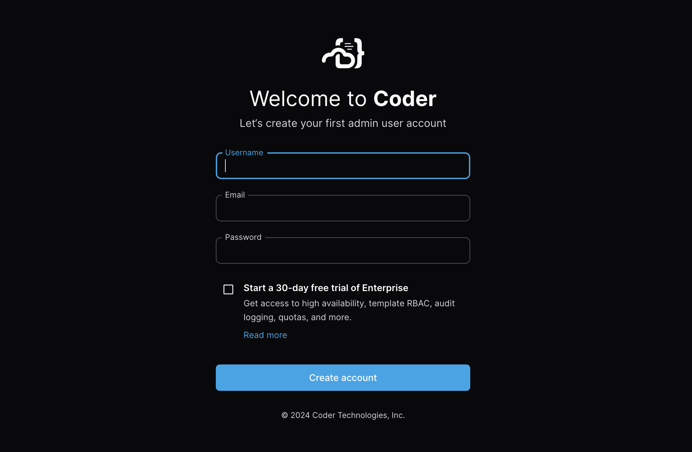
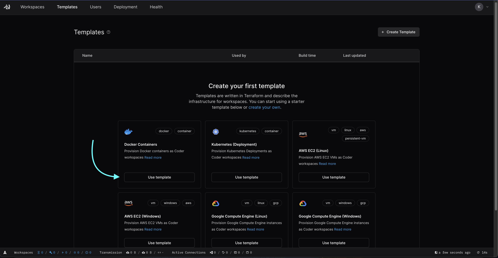
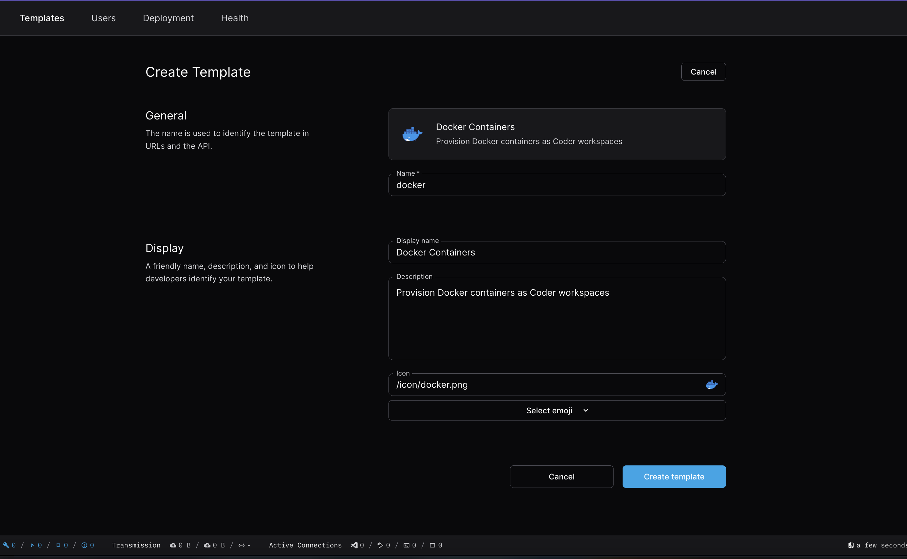
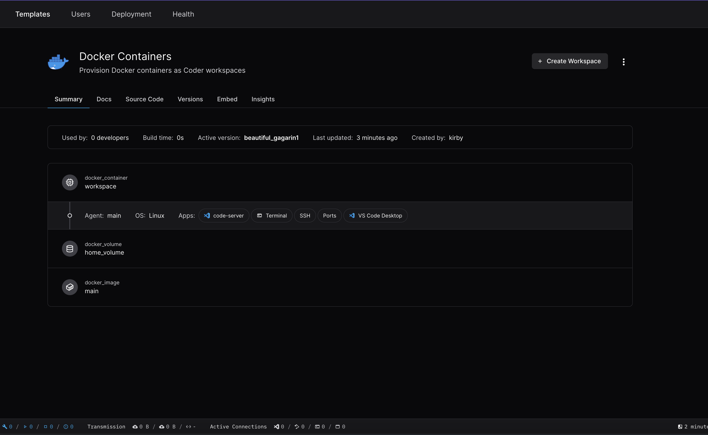
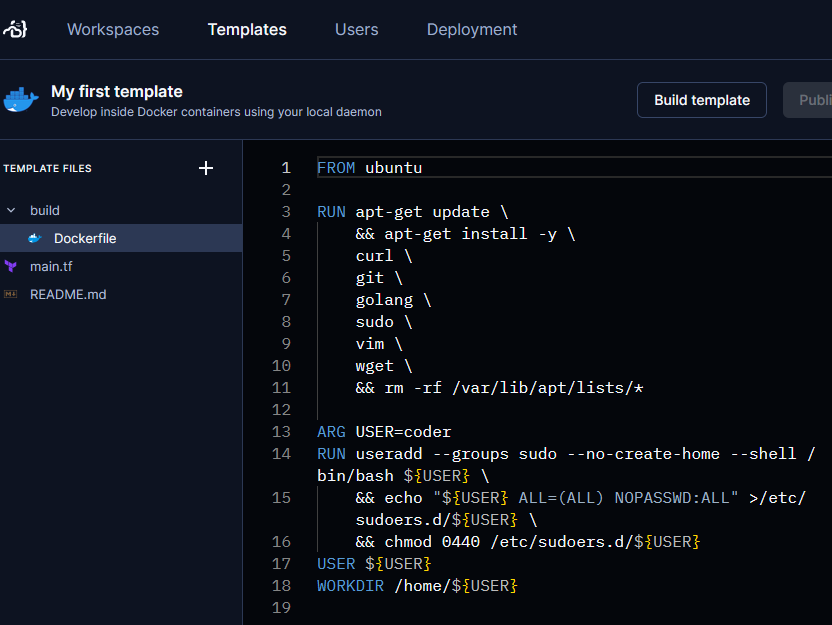
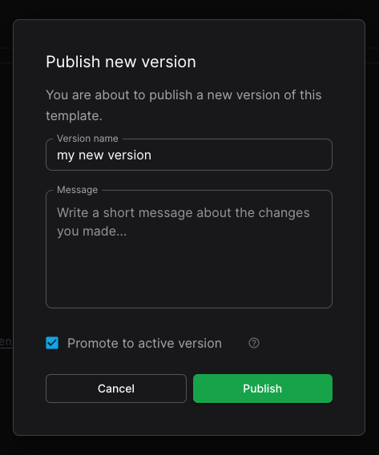

## Tour Coder and Set up your first deployment.

For day-zero Coder users, we recommend following this guide to set up a local
Coder deployment, create your first template, and connect to a workspace. This
is completely free and leverages our
[open source repository](https://github.com/coder/coder).

We'll use [Docker](https://docs.docker.com/engine) to manage the compute for a
slim deployment to experiment with [workspaces](../user-guides/index.md) and
[templates](../admin/templates/index.md).

Docker is not necessary for every Coder deployment and is only used here for
simplicity.

# Set up your Coder Deployment

## 1. Install Docker

First, install [Docker](https://docs.docker.com/engine/install/) locally.

> If you already have the Coder binary installed, restart it after installing
> Docker.

## 2. Install Coder daemon

<div class="tabs">

## Linux/macOS

Our install script is the fastest way to install Coder on Linux/macOS:

```sh
curl -L https://coder.com/install.sh | sh
```

## Windows

> **Important:** If you plan to use the built-in PostgreSQL database, you will
> need to ensure that the
> [Visual C++ Runtime](https://learn.microsoft.com/en-US/cpp/windows/latest-supported-vc-redist#latest-microsoft-visual-c-redistributable-version)
> is installed.

You can use the
[`winget`](https://learn.microsoft.com/en-us/windows/package-manager/winget/#use-winget)
package manager to install Coder:

```powershell
winget install Coder.Coder
```

</div>

## 3. Start the server

To start or restart the Coder deployment, use the following command:

```shell
coder server
```

The output will provide you with a URL to access your deployment, where you'll
create your first administrator account.



Once you've signed in, you'll be brought to an empty workspaces page, which
we'll soon populate with your first development environments.

### More information on the Coder Server

# Create your first template

A common way to create a template is to begin with a starter template then
modify it for your needs. Coder makes this easy with starter templates for
popular development targets like Docker, Kubernetes, Azure, and so on. Once your
template is up and running, you can edit it in the Coder dashboard. Coder even
handles versioning for you so you can publish official updates or revert to
previous versions.

In this tutorial, you'll create your first template from the Docker starter
template.

## 1. Choose a starter template

Select **Templates** to see the **Starter Templates**. Use the **Docker
Containers** template by pressing **Use Template**.



> You can also a find a comprehensive list of starter templates in **Templates**
> -> **Create Template** -> **Starter Templates**.

## 2. Create your template

In **Create template**, fill in **Name** and **Display name**, then select
**Create template**.



TODO:

- add CLI guide for making a new template
- refactor text below to be more beginner-friendly

# Create a workspace

## 1. Create a workspace from your template

When the template is ready, select **Create Workspace**.



In **New workspace**, fill in **Name** then scroll down to select **Create
Workspace**.


Coder starts your new workspace from your template.

After a few seconds, your workspace is ready to use.


## 4. Try out your new workspace

This starter template lets you connect to your workspace in a few ways:

- VS Code Desktop: Loads your workspace into
  [VS Code Desktop](https://code.visualstudio.com/Download) installed on your
  local computer.
- code-server: Opens
  [browser-based VS Code](../user-guides/workspace-access/vscode.md) with your
  workspace.
- Terminal: Opens a browser-based terminal with a shell in the workspace's
  Docker instance.
- SSH: Use SSH to log in to the workspace from your local machine. If you
  haven't already, you'll have to install Coder on your local machine to
  configure your SSH client.

> **Tip**: You can edit the template to let developers connect to a workspace in
> [a few more ways](../admin/templates/managing-templates/devcontainers.md).

When you're done, you can stop the workspace.

## 6. Modify your template

Now you can modify your template to suit your team's needs.

Let's replace the `golang` package in the Docker image with the `python3`
package. You can do this by editing the template's `Dockerfile` directly in your
web browser.

In the Coder dashboard, select **Templates** then your first template.


In the drop-down menu, select **Edit files**.


Expand the **build** directory and select **Dockerfile**.



Edit `build/Dockerfile` to replace `golang` with `python3`.


Select **Build template** and wait for Coder to prepare the template for
workspaces.


Select **Publish version**. In the **Publish new version** dialog, make sure
**Promote to default version** is checked then select **Publish**.



Now when developers create a new workspace from this template, they can use
Python 3 instead of Go.

For developers with workspaces that were created with a previous version of your
template, Coder will notify them that there's a new version of the template.

You can also handle
[change management](../admin/templates/managing-templates/change-management.md)
through your own repo and continuous integration.
