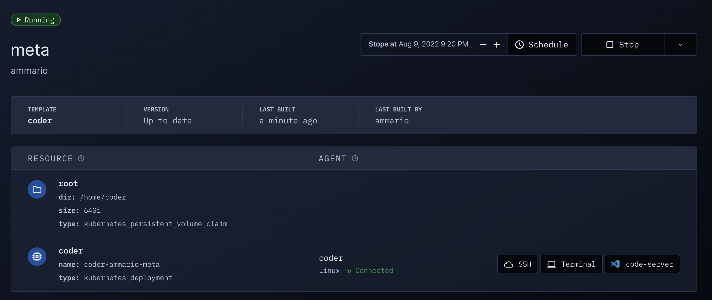

# Resource Metadata

Expose key workspace information to your users with
[`coder_metadata`](https://registry.terraform.io/providers/coder/coder/latest/docs/resources/metadata)
resources in your template code.

You can use `coder_metadata` to show Terraform resource attributes like these:

- Compute resources
- IP addresses
- [Secrets](../secrets.md#displaying-secrets)
- Important file paths



<blockquote class="info">
Coder automatically generates the <code>type</code> metadata.
</blockquote>

You can also present automatically updating, dynamic values with
[agent metadata](./agent-metadata.md).

## Example

Expose the disk size, deployment name, and persistent directory in a Kubernetes
template with:

```hcl
resource "kubernetes_persistent_volume_claim" "root" {
    ...
}

resource "kubernetes_deployment" "coder" {
  # My deployment is ephemeral
  count = data.coder_workspace.me.start_count
  ...
}

resource "coder_metadata" "pvc" {
  resource_id = kubernetes_persistent_volume_claim.root.id
  item {
    key = "size"
    value = kubernetes_persistent_volume_claim.root.spec[0].resources[0].requests.storage
  }
  item {
    key = "dir"
    value = "/home/coder"
  }
}

resource "coder_metadata" "deployment" {
  count = data.coder_workspace.me.start_count
  resource_id = kubernetes_deployment.coder[0].id
  item {
    key = "name"
    value = kubernetes_deployment.coder[0].metadata[0].name
  }
}
```

## Hiding resources in the dashboard

Some resources don't need to be exposed in the dashboard's UI. This helps keep
the workspace view clean for developers. To hide a resource, use the `hide`
attribute:

```hcl
resource "coder_metadata" "hide_serviceaccount" {
  count = data.coder_workspace.me.start_count
  resource_id = kubernetes_service_account.user_data.id
  hide = true
  item {
    key = "name"
    value = kubernetes_deployment.coder[0].metadata[0].name
  }
}
```

## Using a custom resource icon

To use custom icons for your resource metadata, use the `icon` attribute. It
must be a valid path or URL.

```hcl
resource "coder_metadata" "resource_with_icon" {
  count = data.coder_workspace.me.start_count
  resource_id = kubernetes_service_account.user_data.id
  icon = "/icon/database.svg"
  item {
    key = "name"
    value = kubernetes_deployment.coder[0].metadata[0].name
  }
}
```

To make it easier for you to customize your resource we added some built-in
icons:

- Folder `/icon/folder.svg`
- Memory `/icon/memory.svg`
- Image `/icon/image.svg`
- Widgets `/icon/widgets.svg`
- Database `/icon/database.svg`

We also have other icons related to the IDEs. You can see more information on
how to use the builtin icons [here](./icons.md).

## Up next

- [Secrets](../secrets.md)
- [Agent metadata](./agent-metadata.md)
