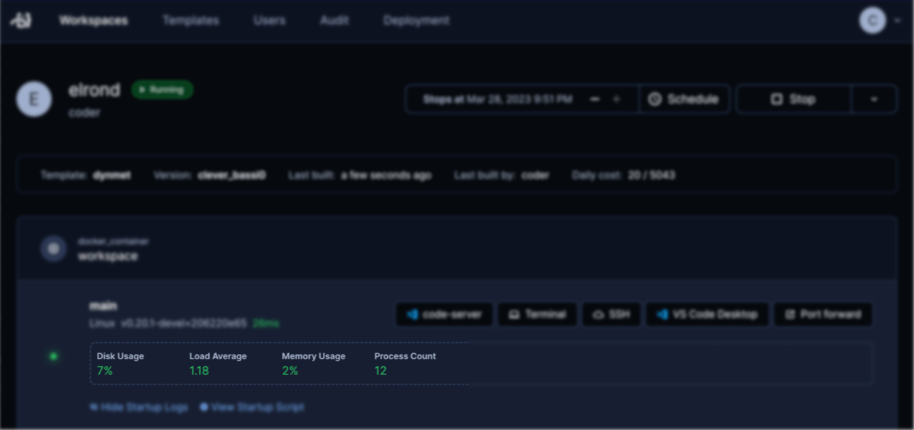

# Agent Metadata

<blockquote class="warning">
Agent metadata is in an alpha state and may break or disappear at any time.
</blockquote>



With Agent Metadata, template admin can expose operational metrics from
their workspaces to their users. It is a sibling of [Resource Metadata](./resource-metadata.md).

See the [Terraform reference](https://registry.terraform.io/providers/coder/coder/latest/docs/resources/agent#metadata).

## Examples

Here are useful agent metadata snippets for Linux agents:

Show users how much CPU they're using:

```hcl
resource "coder_agent" "main" {
  os             = "linux"
  ...
  metadata {
    display_name = "CPU Usage"
    key  = "cpu"
    # calculates CPU usage by summing the "us", "sy" and "id" columns of
    # vmstat.
    script = <<EOT
        vmstat | awk 'FNR==3 {printf "%2.0f%%", $13+$14+$16}'
    EOT
    interval = 1
    timeout = 1
  }

  metadata {
    display_name = "Disk Usage"
    key  = "cpu"
    script = <<EOT
        df -h | awk -v mount="/" '$6 == mount { print $5 }'
    EOT
    interval = 1
    timeout = 1
  }

  metadata {
    display_name = "Memory Usage"
    key  = "mem"
    script = <<EOT
    free | awk '/^Mem/ { printf("%.0f%%", $4/$2 * 100.0) }'
    EOT
    interval = 1
    timeout = 1
  }

  metadata {
    display_name = "Load Average"
    key  = "load"
    script = <<EOT
        awk '{print $1,$2,$3}' /proc/loadavg 
    >>
    interval = 1
    timeout = 1
  }
}
```

## Utilities

* [vmstat](https://linux.die.net/man/8/vmstat) is available in most Linux
distributions and contains virtual memory, CPU and IO statistics. Running `vmstat`
produces output that looks like:
```
procs -----------memory---------- ---swap-- -----io---- -system-- ------cpu-----
 r  b   swpd   free   buff  cache   si   so    bi    bo   in   cs us sy id wa st
 0  0  19580 4781680 12133692 217646944    0    2     4    32    1    0  1  1 98  0  0
 ```

* [dstat](https://linux.die.net/man/1/dstat) is considerably more human-friendly
than `vmstat` but not always already installed. It is available in almost any
package manager under the name `dstat`. The output of running `dstat 1 1` looks
like:

```
--total-cpu-usage-- -dsk/total- -net/total- ---paging-- ---system--
usr sys idl wai stl| read  writ| recv  send|  in   out | int   csw 
  1   1  98   0   0|3422k   25M|   0     0 | 153k  904k| 123k  174k
```
