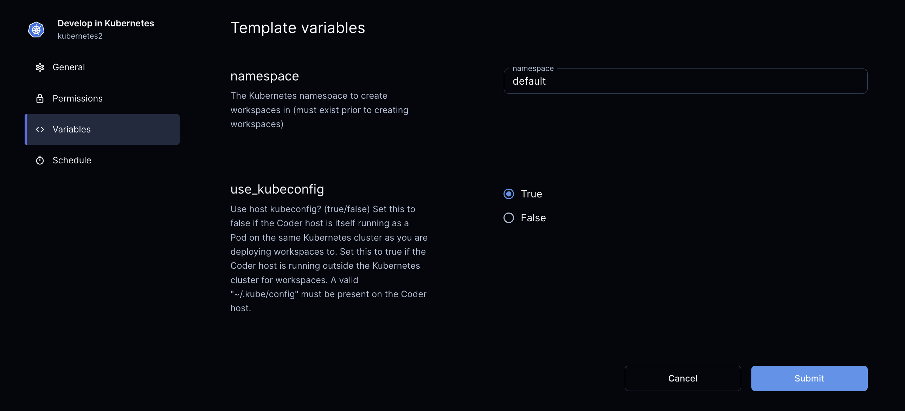

# Anatomy of a template

Coder templates are written in [Terraform](https://terraform.io).
Coder can provision all Terraform modules, resources, and
properties. The Coder server essentially runs a `terraform apply`
every time a workspace is created/started/stopped.

Haven't written Terraform before? Check out Hashicorp's [Getting Started Guides](https://developer.hashicorp.com/terraform/tutorials).

## Architecture

This is a simplified diagram of our [Kubernetes starter
template](https://github.com/coder/coder/blob/main/examples/templates/kubernetes/main.tf):


Keep reading for a breakdown of each concept.

## Coder Terraform Provider

The [Coder Terraform
provider](https://registry.terraform.io/providers/coder/coder/latest)
makes it possible for standard Terraform resources
(e.g. `kubernetes_deployment`) to connect to Coder. The Coder provider
also lets you customize the behavior of workspaces using your
template.

```hcl
terraform {
  required_providers {
    coder = {
      source  = "coder/coder"
    }
  }
}
```

### coder_agent

All templates need to create and run a Coder agent to let developers
connect to their workspaces. The `coder_agent` resource runs inside
the compute aspect of your workspace (typically a VM or
container). You do not need to have any open ports on the compute
aspect, but the agent needs `curl` access to the Coder server.

This snippet creates the agent, runs it inside the container via the
`entrypoint`, and authenticates to Coder via the agent's token.

```hcl
resource "coder_agent" "main" {
  os = "linux"
  arch = "amd64"
}

resource "kubernetes_deployment" "workspace" {
  entrypoint = ["sh", "-c", coder_agent.main.init_script]
  env        = ["CODER_AGENT_TOKEN=${coder_agent.main.token}"]
  # ...
}
```

Agents can also run startup scripts, set environment variables, and
provide [metadata](../agent-metadata.md) about the workspace (e.g. CPU
usage). See [coder_agent
docs](https://registry.terraform.io/providers/coder/coder/latest/docs/resources/agent#startup_script)
for more details.

### coder_workspace

This data source provides details about the state of a workspace, such
as its name, owner, and whether the workspace is being started or
stopped.

The following snippet creates a container when the workspace is being
started, and deletes the container when it is stopped. It does this
with Terraform's
[count](https://developer.hashicorp.com/terraform/language/meta-arguments/count)
meta-argument.

```hcl
data "coder_workspace" "me" {}

# Delete the container when workspace is stopped (count = 0)
resource "kubernetes_deployment" "workspace" {
  count = data.coder_workspace.me.transition == "start" ? 1 : 0
  # ...
}

# Persist the volume, even if stopped
resource "docker_volume" "projects" {}
```

### coder_app

Web apps that are running inside the workspace
(e.g. `http://localhost:8080`) can be forwarded to the Coder dashboard
with the `coder_app` resource. This is commonly used for [web
IDEs](../ides/web-ides.md) such as code-server, RStudio, and
JupyterLab. External apps, such as links to internal wikis or cloud
consoles can also be embedded here.

Apps are rendered on the workspace page:


The apps themselves have to be installed and running on the
workspace. You can do this in the agent's `startup_script`. See [web
IDEs](../ides/web-ides.md) for some examples.

```hcl
# coder_agent will install and start code-server
resource "coder_agent" "main" {
  # ...
  startup_script =<<EOF
  curl -L https://code-server.dev/install.sh | sh
  code-server --port 8080 &
  EOF
}

# expose code-server on workspace via a coder_app
resource "coder_app" "code-server" {
  agent_id     = coder_agent.main.id
  icon         = "/icon/code.svg"
  display_name = "code-server"
  slug         = "code"
  url          = "http://localhost:8080"
}

# link to an external site
resource "coder_app" "getting-started" {
  agent_id     = coder_agent.main.id
  icon         = "/emojis/1f4dd.png"
  display_name = "getting-started"
  slug         = "getting-started"
  url          = "https://wiki.example.com/coder/quickstart"
  external     = true
}
```

### coder_parameter

Parameters are inputs that users fill in when creating their workspace.


```hcl
data "coder_parameter" "repo" {
  name         = "repo"
  display_name = "Repository (auto)"
  order        = 1
  description  = "Select a repository to automatically clone and start working with a devcontainer."
  mutable      = true
  option {
    name        = "vercel/next.js"
    description = "The React Framework"
    value       = "https://github.com/vercel/next.js"
  }
  option {
    name        = "home-assistant/core"
    description = "🏡 Open source home automation that puts local control and privacy first."
    value       = "https://github.com/home-assistant/core"
  }
  # ...
}
```

## Terraform variables

Coder supports Terraform variables for templates. You can managed them
in a template settings.

Use Terraform variables to keep secrets outside of the
template. Variables are also useful for adjusting a template without
having to commit a new version.



> Per-workspace settings can be defined via [Parameters](./parameters.md).

## Best practices
- [Resource Persistence](./resource-persistence.md): Control which resources are persistent/ephemeral and avoid accidental disk deletion.
- [Provider Authentication](./provider-authentication.md): Securely authenticate with cloud APIs with Terraform
- [Change Management](./change-management.md): Manage Coder templates in git with CI/CD pipelines.

## Use cases

- [Devcontainers](./devcontainers.md): Add devcontainer support to your Coder templates.
- [Docker in Workspaces](./docker-in-workspaces.md): Add docker-in-Docker support or even run system-level services.
- [Open in Coder](./open-in-coder.md): Auto-create a workspace from your GitHub repository or internal wiki with deep links.

## Next steps

- [Setting up templates](./best-practices.md)
- [Customizing templates](./customizing.md)

