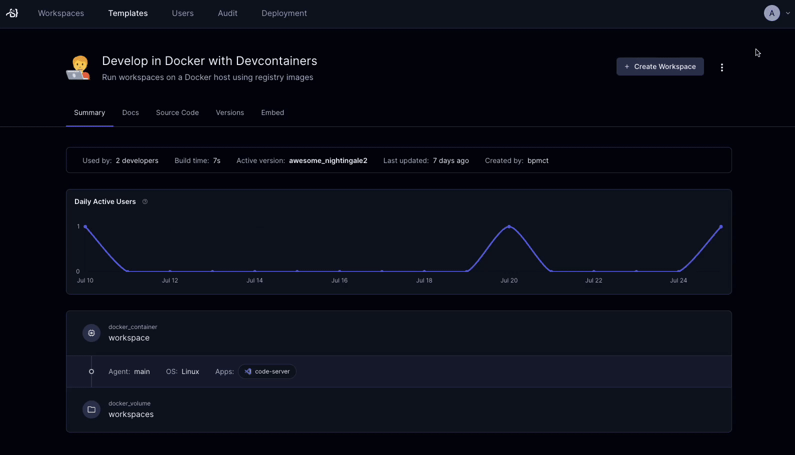

#  Creating, editing, and updating templates

You create and edit Coder templates as [Terraform](./concepts.md)
configuration files (`.tf`) and any supporting files, like a README or
configuration files for other services.

## Who creates templates?

The [Template Admin](../admin/users.md) role (and above) can create
templates. End users, like developers, create workspaces from them.

Templates can also be [managed with git](./change-management.md),
allowing any developer to propose changes to a template.

> [Template RBAC](../admin/rbac.md) lets you give different users and groups access to templates.

## Starter templates

We provide starter templates for common cloud providers (e.g. AWS) and
orchestrators (e.g. Kubernetes). From there, you can modify them to
use your own images, VPC, cloud credentials, etc. All Terraform
resources and properties are supported, so fear not if your favorite
cloud provider isn't here!

If you'd prefer to use the CLI, use `coder templates init`.

> The Terraform code for our starter templates are available on our [GitHub](https://github.com/coder/coder/tree/main/examples/templates).

## Editing templates

Our starter templates are meant to be modified work for your use
cases. You can edit a template's files directly in the Coder
dashboard.

If you'd prefer to use the CLI, use `coder templates pull` and `coder
templates push`.

> Even if you are a Terraform expert, we suggest reading our [guided
> tour](./tour.md).

## Updating templates

Templates are versioned, keeping all developer workspaces up-to-date. When a new version is published, developers are notified to get the latest infrastructure, software, or security patches. Learn more about [change management](./change-management.md).

## Next step

- [Your first template](./tutorial.md)
