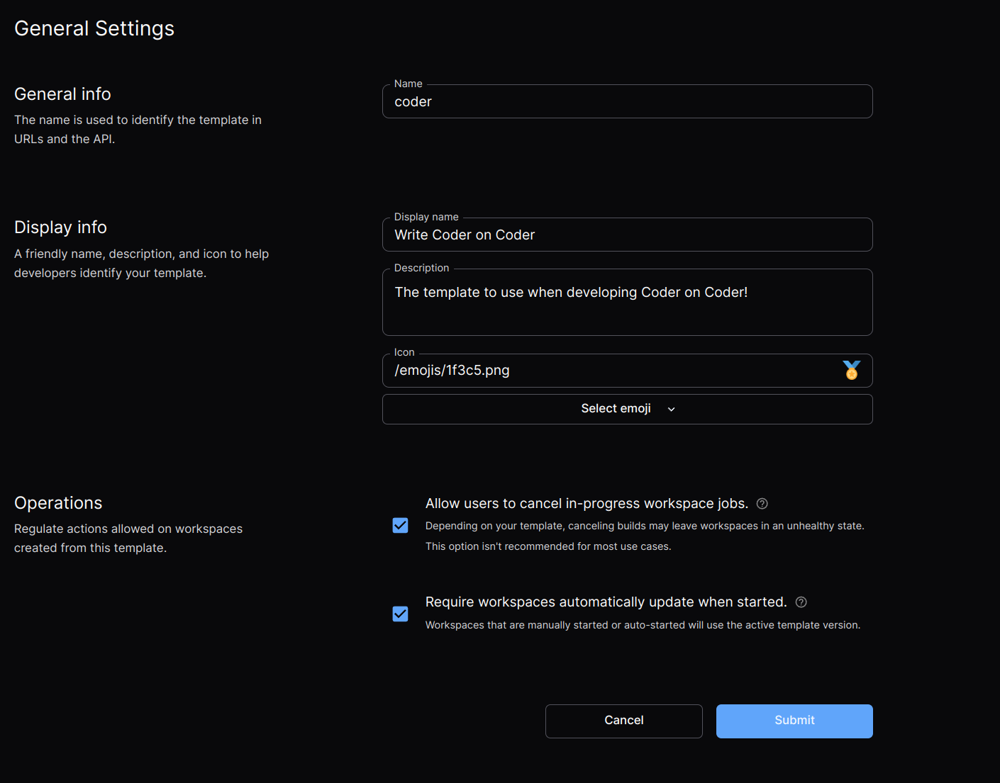

# General Settings

## Display Info

Display Info allows admins to modify how templates are displayed to users. This
can be useful for showing a more user-friendly name in the UI along with a
relevant icon and description.

## Operations

### Cancel in-progress jobs

Canceling in-progress jobs allows users to cancel ongoing workspace builds.
While this can be helpful for cases where a build is unlikely to finish, it also
carries the risk of potentially corrupting your workspace. The setting is
disabled by default.

### Require automatic updates

> Requiring automatic updates is in an
> [experimental state](../contributing/feature-stages.md#experimental-features)
> and the behavior is subject to change. Use
> [GitHub issues](https://github.com/coder/coder) to leave feedback. This
> experiment must be specifically enabled with the
> `--experiments="template_update_policies"` option on your coderd deployment.

Admins can require all workspaces update to the latest active template version
when they're started. This can be used to enforce security patches or other
important changes are quickly applied to all workspaces. This setting is not
mandatory for template admins to ensure template iteration is still possible.

While this setting applies to both manual starts and
[autostarts](../workspaces.md), promoting a template version that requires
manual intervention by the user (such as mandatory new template parameters) will
result in autostart being disabled for all incompatible workspaces until a
manual update is performed by the user.

This setting is an enterprise-only feature.
