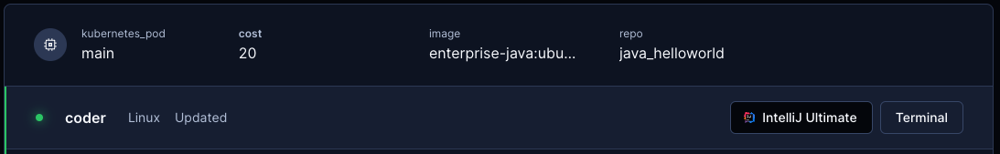

# Templates

Templates are written in [Terraform](https://www.terraform.io/) and describe the
infrastructure for workspaces (e.g., docker_container, aws_instance,
kubernetes_pod).

In most cases, a small group of users (team leads or Coder administrators)
[have permissions](../admin/users.md#roles) to create and manage templates.
Then, other users provision their [workspaces](../workspaces.md) from templates
using the UI or CLI.

## Get the CLI

The CLI and the server are the same binary. We did this to encourage virality so
individuals can start their own Coder deployments.

From your local machine, download the CLI for your operating system from the
[releases](https://github.com/coder/coder/releases/latest) or run:

```shell
curl -fsSL https://coder.com/install.sh | sh
```

To see the sub-commands for managing templates, run:

```shell
coder templates --help
```

## Login to your Coder Deployment

Before you can create templates, you must first login to your Coder deployment
with the CLI.

```shell
coder login https://coder.example.com # aka the URL to your coder instance
```

This will open a browser and ask you to authenticate to your Coder deployment,
returning an API Key.

> Make a note of the API Key. You can re-use the API Key in future CLI logins or
> sessions.

```shell
coder --token <your-api-key> login https://coder.example.com/ # aka the URL to your coder instance
```

## Add a template

Before users can create workspaces, you'll need at least one template in Coder.

```shell
# create a local directory to store templates
mkdir -p $HOME/coder/templates
cd $HOME/coder/templates

# start from an example
coder templates init

# optional: modify the template
vim <template-name>/main.tf

# add the template to Coder deployment
coder templates create <template-name>
```

> See the documentation and source code for each example as well as community
> templates in the
> [examples/](https://github.com/coder/coder/tree/main/examples/templates)
> directory in the repo.

## Configure Max Workspace Autostop

To control cost, specify a maximum time to live flag for a template in hours or
minutes.

```shell
coder templates create my-template --default-ttl 4h
```

## Customize templates

Example templates are not designed to support every use (e.g
[examples/aws-linux](https://github.com/coder/coder/tree/main/examples/templates/aws-linux)
does not support custom VPCs). You can add these features by editing the
Terraform code once you run `coder templates init` (new) or
`coder templates pull` (existing).

Refer to the following resources to build your own templates:

- Terraform: [Documentation](https://developer.hashicorp.com/terraform/docs) and
  [Registry](https://registry.terraform.io)
- Common [concepts in templates](#concepts-in-templates) and
  [Coder Terraform provider](https://registry.terraform.io/providers/coder/coder/latest/docs)
- [Coder example templates](https://github.com/coder/coder/tree/main/examples/templates)
  code

## Concepts in templates

While templates are written with standard Terraform, the
[Coder Terraform Provider](https://registry.terraform.io/providers/coder/coder/latest/docs)
is used to define the workspace lifecycle and establish a connection from
resources to Coder.

Below is an overview of some key concepts in templates (and workspaces). For all
template options, reference
[Coder Terraform provider docs](https://registry.terraform.io/providers/coder/coder/latest/docs).

### Resource

Resources in Coder are simply
[Terraform resources](https://www.terraform.io/language/resources). If a Coder
agent is attached to a resource, users can connect directly to the resource over
SSH or web apps.

### Coder agent

Once a Coder workspace is created, the Coder agent establishes a connection
between a resource (docker_container) and Coder, so that a user can connect to
their workspace from the web UI or CLI. A template can have multiple agents to
allow users to connect to multiple resources in their workspace.

> Resources must download and start the Coder agent binary to connect to Coder.
> This means the resource must be able to reach your Coder URL.

```hcl
data "coder_workspace" "me" {
}

resource "coder_agent" "pod1" {
  os   = "linux"
  arch = "amd64"
}

resource "kubernetes_pod" "pod1" {
  spec {
    ...
    container {
      command = ["sh", "-c", coder_agent.pod1.init_script]
      env {
        name  = "CODER_AGENT_TOKEN"
        value = coder_agent.dev.token
      }
    }
  }
}
```

The `coder_agent` resource can be configured with additional arguments. For
example, you can use the `env` property to set environment variables that will
be inherited by all child processes of the agent, including SSH sessions. See
the
[Coder Terraform Provider documentation](https://registry.terraform.io/providers/coder/coder/latest/docs/resources/agent)
for the full list of supported arguments for the `coder_agent`.

#### `startup_script`

Use the Coder agent's `startup_script` to run additional commands like
installing IDEs, [cloning dotfiles](../dotfiles.md#templates), and cloning
project repos.

**Note:** By default, the startup script is executed in the background. This
allows users to access the workspace before the script completes. If you want to
change this, see [`startup_script_behavior`](#startup_script_behavior) below.

Here are a few guidelines for writing a good startup script (more on these
below):

1. Use `set -e` to exit the script if any command fails and `|| true` for
   commands that are allowed to fail
2. Use `&` to start a process in the background, allowing the startup script to
   complete
3. Inform the user about what's going on via `echo`

```hcl
resource "coder_agent" "coder" {
  os   = "linux"
  arch = "amd64"
  dir = "/home/coder"
  startup_script = <<EOT
#!/bin/bash

# Install code-server 4.8.3 under /tmp/code-server using the "standalone" installation
# that does not require root permissions. Note that /tmp may be mounted in tmpfs which
# can lead to increased RAM usage. To avoid this, you can pre-install code-server inside
# the Docker image or VM image.
echo "Installing code-server..."
curl -fsSL https://code-server.dev/install.sh | sh -s -- --method=standalone --prefix=/tmp/code-server --version 4.8.3

# The & prevents the startup_script from blocking so the next commands can run.
# The stdout and stderr of code-server is redirected to /tmp/code-server.log.
echo "Starting code-server..."
/tmp/code-server/bin/code-server --auth none --port 13337 >/tmp/code-server.log 2>&1 &

# Notice: var.repo and var.dotfiles_uri are specified elsewhere in the Terraform
# code as input variables.
REPO=${var.repo}
DOTFILES_URI=${var.dotfiles_uri}

# clone repo
ssh-keyscan -t rsa github.com >> ~/.ssh/known_hosts
echo "Cloning $REPO..."
git clone --progress git@github.com:"$REPO"

# use coder CLI to clone and install dotfiles
echo "Cloning dotfiles..."
coder dotfiles -y "$DOTFILES_URI"
  EOT
}
```

The startup script can contain important steps that must be executed
successfully so that the workspace is in a usable state, for this reason we
recommend using `set -e` (exit on error) at the top and `|| true` (allow command
to fail) to ensure the user is notified when something goes wrong. These are not
shown in the example above because, while useful, they need to be used with
care. For more assurance, you can utilize
[shellcheck](https://www.shellcheck.net) to find bugs in the script and employ
[`set -euo pipefail`](https://wizardzines.com/comics/bash-errors/) to exit on
error, unset variables, and fail on pipe errors.

We also recommend that startup scripts do not run forever. Long-running
processes, like code-server, should be run in the background. This is usually
achieved by adding `&` to the end of the command. For example, `sleep 10 &` will
run the command in the background and allow the startup script to complete.

> **Note:** If a backgrounded command (`&`) writes to stdout or stderr, the
> startup script will not complete until the command completes or closes the
> file descriptors. To avoid this, you can redirect the stdout and stderr to a
> file. For example, `sleep 10 >/dev/null 2>&1 &` will redirect the stdout and
> stderr to `/dev/null` (discard) and run the command in the background.

PS. Notice how each step starts with `echo "..."` to provide feedback to the
user about what is happening? This is especially useful when the startup script
behavior is set to blocking because the user will be informed about why they're
waiting to access their workspace.

#### `startup_script_behavior`

Use the Coder agent's `startup_script_behavior` to change the behavior between
`blocking` and `non-blocking` (default). The blocking behavior is recommended
for most use cases because it allows the startup script to complete before the
user accesses the workspace. For example, let's say you want to check out a very
large repo in the startup script. If the startup script is non-blocking, the
user may log in via SSH or open the IDE before the repo is fully checked out.
This can lead to a poor user experience.

```hcl
resource "coder_agent" "coder" {
  os   = "linux"
  arch = "amd64"
  startup_script_behavior = "blocking"
  startup_script = "echo 'Starting...'"
```

Whichever behavior is enabled, the user can still choose to override it by
specifying the appropriate flags (or environment variables) in the CLI when
connecting to the workspace. The behavior can be overridden by one of the
following means:

- Set an environment variable (for use with `ssh` or `coder ssh`):
  - `export CODER_SSH_WAIT=yes` (blocking)
  - `export CODER_SSH_WAIT=no` (non-blocking)
- Use a flag with `coder ssh`:
  - `coder ssh --wait=yes my-workspace` (blocking)
  - `coder ssh --wait=no my-workspace` (non-blocking)
- Use a flag to configure all future `ssh` connections:
  - `coder config-ssh --wait=yes` (blocking)
  - `coder config-ssh --wait=no` (non-blocking)

### Start/stop

[Learn about resource persistence in Coder](./resource-persistence.md)

Coder workspaces can be started/stopped. This is often used to save on cloud
costs or enforce ephemeral workflows. When a workspace is started or stopped,
the Coder server runs an additional
[terraform apply](https://www.terraform.io/cli/commands/apply), informing the
Coder provider that the workspace has a new transition state.

This template sample has one persistent resource (docker volume) and one
ephemeral resource (docker container).

```hcl
data "coder_workspace" "me" {
}

resource "docker_volume" "home_volume" {
  # persistent resource (remains a workspace is stopped)
  count = 1
  name  = "coder-${data.coder_workspace.me.id}-home"
  lifecycle {
    ignore_changes = all
  }
}

resource "docker_container" "workspace" {
  # ephemeral resource (deleted when workspace is stopped, created when started)
  count = data.coder_workspace.me.start_count # 0 (stopped), 1 (started)
  volumes {
    container_path = "/home/coder/"
    volume_name    = docker_volume.home_volume.name
    read_only      = false
  }
  # ... other config
}
```

#### Using updated images when rebuilding a workspace

To ensure that Coder uses an updated image when rebuilding a workspace, we
suggest that admins update the tag in the template (e.g., `my-image:v0.4.2` ->
`my-image:v0.4.3`) or digest (`my-image@sha256:[digest]` ->
`my-image@sha256:[new_digest]`).

Alternatively, if you're willing to wait for longer start times from Coder, you
can set the `imagePullPolicy` to `Always` in your Terraform template; when set,
Coder will check `image:tag` on every build and update if necessary:

```hcl
resource "kubernetes_pod" "podName" {
    spec {
        container {
            image_pull_policy = "Always"
        }
    }
}
```

### Edit templates

You can edit a template using the coder CLI or the UI. Only
[template admins and owners](../admin/users.md) can edit a template.

Using the UI, navigate to the template page, click on the menu, and select "Edit
files". In the template editor, you create, edit and remove files. Before
publishing a new template version, you can test your modifications by clicking
the "Build template" button. Newly published template versions automatically
become the default version selection when creating a workspace.

> **Tip**: Even without publishing a version as active, you can still use it to
> create a workspace before making it the default for everybody in your
> organization. This may help you debug new changes without impacting others.

Using the CLI, login to Coder and run the following command to edit a single
template:

```shell
coder templates edit <template-name> --description "This is my template"
```

Review editable template properties by running `coder templates edit -h`.

Alternatively, you can pull down the template as a tape archive (`.tar`) to your
current directory:

```shell
coder templates pull <template-name> file.tar
```

Then, extract it by running:

```shell
tar -xf file.tar
```

Make the changes to your template then run this command from the root of the
template folder:

```shell
coder templates push <template-name>
```

Your updated template will now be available. Outdated workspaces will have a
prompt in the dashboard to update.

### Delete templates

You can delete a template using both the coder CLI and UI. Only
[template admins and owners](../admin/users.md) can delete a template, and the
template must not have any running workspaces associated to it.

Using the CLI, login to Coder and run the following command to delete a
template:

```shell
coder templates delete <template-name>
```

In the UI, navigate to the template you want to delete, and select the dropdown
in the right-hand corner of the page to delete the template.


#### Delete workspaces

When a workspace is deleted, the Coder server essentially runs a
[terraform destroy](https://www.terraform.io/cli/commands/destroy) to remove all
resources associated with the workspace.

> Terraform's
> [prevent-destroy](https://www.terraform.io/language/meta-arguments/lifecycle#prevent_destroy)
> and
> [ignore-changes](https://www.terraform.io/language/meta-arguments/lifecycle#ignore_changes)
> meta-arguments can be used to prevent accidental data loss.

### Coder apps

By default, all templates allow developers to connect over SSH and a web
terminal. See [Configuring Web IDEs](../ides/web-ides.md) to learn how to give
users access to additional web applications.

Template administrators can hide apps like the web-based Terminal or VS Code
Desktop with the
[`display_apps`](https://registry.terraform.io/providers/coder/coder/0.11.2/docs/resources/agent#display_apps)
configuration in the
[`coder_agent`](https://registry.terraform.io/providers/coder/coder/latest/docs/resources/agent)
resource. For example, the following configuration block will hide all default
Coder apps except the web terminal.

```hcl
  display_apps {
    vscode = false
    vscode_insiders = false
    ssh_helper = false
    port_forwarding_helper = false
    web_terminal = true
  }
```

Example use cases for `display_apps` are JetBrains users or zero-trust
deployments who do not want nor should have access to a local VS Code IDE.



### Data source

When a workspace is being started or stopped, the `coder_workspace` data source
provides some useful parameters. See the
[Coder Terraform provider](https://registry.terraform.io/providers/coder/coder/latest/docs/data-sources/workspace)
for more information.

For example, the
[Docker quick-start template](https://github.com/coder/coder/tree/main/examples/templates/docker)
sets a few environment variables based on the username and email address of the
workspace's owner, so that you can make Git commits immediately without any
manual configuration:

```hcl
resource "coder_agent" "main" {
  # ...
  env = {
    GIT_AUTHOR_NAME = "${data.coder_workspace.me.owner}"
    GIT_COMMITTER_NAME = "${data.coder_workspace.me.owner}"
    GIT_AUTHOR_EMAIL = "${data.coder_workspace.me.owner_email}"
    GIT_COMMITTER_EMAIL = "${data.coder_workspace.me.owner_email}"
  }
}
```

You can add these environment variable definitions to your own templates, or
customize them however you like.

## Troubleshooting templates

Occasionally, you may run into scenarios where a workspace is created, but the
agent is either not connected or the
[startup script](https://registry.terraform.io/providers/coder/coder/latest/docs/resources/agent#startup_script)
has failed or timed out.

### Agent connection issues

If the agent is not connected, it means the agent or
[init script](https://github.com/coder/coder/tree/main/provisionersdk/scripts)
has failed on the resource.

```console
$ coder ssh myworkspace
⢄⡱ Waiting for connection from [agent]...
```

While troubleshooting steps vary by resource, here are some general best
practices:

- Ensure the resource has `curl` installed (alternatively, `wget` or `busybox`)
- Ensure the resource can `curl` your Coder
  [access URL](../admin/configure.md#access-url)
- Manually connect to the resource and check the agent logs (e.g.,
  `kubectl exec`, `docker exec` or AWS console)
  - The Coder agent logs are typically stored in `/tmp/coder-agent.log`
  - The Coder agent startup script logs are typically stored in
    `/tmp/coder-startup-script.log`
  - The Coder agent shutdown script logs are typically stored in
    `/tmp/coder-shutdown-script.log`
- This can also happen if the websockets are not being forwarded correctly when
  running Coder behind a reverse proxy.
  [Read our reverse-proxy docs](../admin/configure.md#tls--reverse-proxy)

### Startup script issues

Depending on the contents of the
[startup script](https://registry.terraform.io/providers/coder/coder/latest/docs/resources/agent#startup_script),
and whether or not the
[startup script behavior](https://registry.terraform.io/providers/coder/coder/latest/docs/resources/agent#startup_script_behavior)
is set to blocking or non-blocking, you may notice issues related to the startup
script. In this section we will cover common scenarios and how to resolve them.

#### Unable to access workspace, startup script is still running

If you're trying to access your workspace and are unable to because the
[startup script](https://registry.terraform.io/providers/coder/coder/latest/docs/resources/agent#startup_script)
is still running, it means the
[startup script behavior](https://registry.terraform.io/providers/coder/coder/latest/docs/resources/agent#startup_script_behavior)
option is set to blocking or you have enabled the `--wait=yes` option (for e.g.
`coder ssh` or `coder config-ssh`). In such an event, you can always access the
workspace by using the web terminal, or via SSH using the `--wait=no` option. If
the startup script is running longer than it should, or never completing, you
can try to [debug the startup script](#debugging-the-startup-script) to resolve
the issue. Alternatively, you can try to force the startup script to exit by
terminating processes started by it or terminating the startup script itself (on
Linux, `ps` and `kill` are useful tools).

For tips on how to write a startup script that doesn't run forever, see the
[`startup_script`](#startup_script) section. For more ways to override the
startup script behavior, see the
[`startup_script_behavior`](#startup_script_behavior) section.

Template authors can also set the
[startup script behavior](https://registry.terraform.io/providers/coder/coder/latest/docs/resources/agent#startup_script_behavior)
option to non-blocking, which will allow users to access the workspace while the
startup script is still running. Note that the workspace must be updated after
changing this option.

#### Your workspace may be incomplete

If you see a warning that your workspace may be incomplete, it means you should
be aware that programs, files, or settings may be missing from your workspace.
This can happen if the
[startup script](https://registry.terraform.io/providers/coder/coder/latest/docs/resources/agent#startup_script)
is still running or has exited with a non-zero status (see
[startup script error](#startup-script-error)). No action is necessary, but you
may want to
[start a new shell session](#session-was-started-before-the-startup-script-finished-web-terminal)
after it has completed or check the
[startup script logs](#debugging-the-startup-script) to see if there are any
issues.

#### Session was started before the startup script finished

The web terminal may show this message if it was started before the
[startup script](https://registry.terraform.io/providers/coder/coder/latest/docs/resources/agent#startup_script)
finished, but the startup script has since finished. This message can safely be
dismissed, however, be aware that your preferred shell or dotfiles may not yet
be activated for this shell session. You can either start a new session or
source your dotfiles manually. Note that starting a new session means that
commands running in the terminal will be terminated and you may lose unsaved
work.

Examples for activating your preferred shell or sourcing your dotfiles:

- `exec zsh -l`
- `source ~/.bashrc`

#### Startup script exited with an error

When the
[startup script](https://registry.terraform.io/providers/coder/coder/latest/docs/resources/agent#startup_script)
exits with an error, it means the last command run by the script failed. When
`set -e` is used, this means that any failing command will immediately exit the
script and the remaining commands will not be executed. This also means that
[your workspace may be incomplete](#your-workspace-may-be-incomplete). If you
see this error, you can check the
[startup script logs](#debugging-the-startup-script) to figure out what the
issue is.

Common causes for startup script errors:

- A missing command or file
- A command that fails due to missing permissions
- Network issues (e.g., unable to reach a server)

#### Debugging the startup script

The simplest way to debug the
[startup script](https://registry.terraform.io/providers/coder/coder/latest/docs/resources/agent#startup_script)
is to open the workspace in the Coder dashboard and click "Show startup log" (if
not already visible). This will show all the output from the script. Another
option is to view the log file inside the workspace (usually
`/tmp/coder-startup-script.log`). If the logs don't indicate what's going on or
going wrong, you can increase verbosity by adding `set -x` to the top of the
startup script (note that this will show all commands run and may output
sensitive information). Alternatively, you can add `echo` statements to show
what's going on.

Here's a short example of an informative startup script:

```shell
echo "Running startup script..."
echo "Run: long-running-command"
/path/to/long-running-command
status=$?
echo "Done: long-running-command, exit status: ${status}"
if [ $status -ne 0 ]; then
  echo "Startup script failed, exiting..."
  exit $status
fi
```

> **Note:** We don't use `set -x` here because we're manually echoing the
> commands. This protects against sensitive information being shown in the log.

This script tells us what command is being run and what the exit status is. If
the exit status is non-zero, it means the command failed and we exit the script.
Since we are manually checking the exit status here, we don't need `set -e` at
the top of the script to exit on error.

## Template permissions (enterprise)

Template permissions can be used to give users and groups access to specific
templates. [Learn more about RBAC](../admin/rbac.md) to learn how to manage

## Community Templates

You can see a list of community templates by our users
[here](https://github.com/coder/coder/blob/main/examples/templates/community-templates.md).

## Next Steps

- Learn about [Authentication & Secrets](./authentication.md)
- Learn about [Change Management](./change-management.md)
- Learn about [Resource Metadata](./resource-metadata.md)
- Learn about [Workspaces](../workspaces.md)
