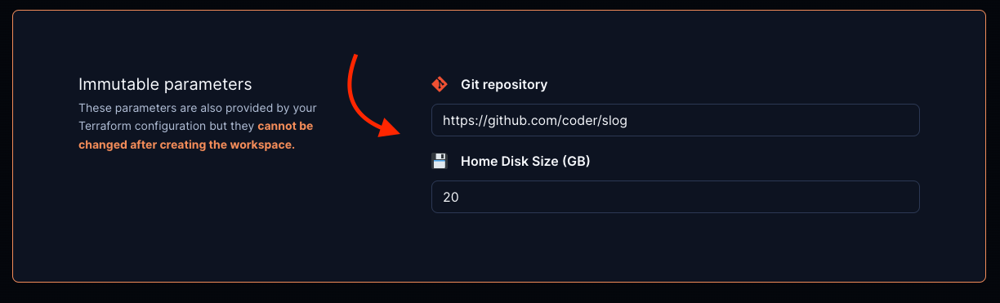

# Open in Coder

An "Open in Coder" button can be embedded into your git repos or internal wikis to allow developers to quickly launch a new workspace.

<video autoplay playsinline loop>
  <source src="https://github.com/coder/coder/blob/main/docs/images/templates/open-in-coder.mp4?raw=true" type="video/mp4">
Your browser does not support the video tag.
</video>

## How it works

To support any infrastructure and software stack, Coder provides a generic approach for "Open in Coder" flows.

1. Set up [Git Authentication](../admin/git-providers.md#require-git-authentication-in-templates) in your Coder deployment

1. Modify your template to auto-clone repos:

   - If you want the template to clone a specific git repo

     ```hcl
     # Require git authentication to use this template
     data "coder_git_auth" "github" {
         id = "github"
     }

     resource "coder_agent" "dev" {
         # ...
         dir = "~/coder"
         startup_script =<<EOF

         # Clone repo from GitHub
         if [ ! -d "coder" ]
         then
             git clone https://github.com/coder/coder
         fi

         EOF
     }
     ```

   - If you want the template to support any repository via [parameters](./parameters.md)

     ```hcl
     # Require git authentication to use this template
     data "coder_git_auth" "github" {
         id = "github"
     }

     # Prompt the user for the git repo URL
     data "coder_parameter" "git_repo" {
         name     = "Git repository"
         default  = "https://github.com/coder/coder"
     }

     locals {
         folder_name = try(element(split("/", data.coder_parameter.git_repo.value), length(split("/", data.coder_parameter.git_repo.value)) - 1), "")
     }

     resource "coder_agent" "dev" {
         # ...
         dir = "~/${local.folder_name}"
         startup_script =<<EOF

         # Clone repo from GitHub
         if [ ! -d "${local.folder_name}" ]
         then
             git clone ${data.coder_parameter.git_repo.value}
         fi

         EOF
     }
     ```

1. Embed the "Open in Coder" button with Markdown

   ```md
   [](https://YOUR_ACCESS_URL/templates/YOUR_TEMPLATE/workspace)
   ```

   In Coder deployments v0.21.3 and above, the "Open in Coder" button is statically hosted at `http://YOUR_ACCESS_URL/open-in-coder.svg`

   > Be sure to replace `YOUR_ACCESS_URL` with your Coder access url (e.g. https://coder.example.com) and `YOUR_TEMPLATE` with the name of your template.

1. Optional: pre-fill parameter values in the "Create workspace" page

   This can be used to pre-fill the git repo URL, disk size, image, etc.

   ```md
   [](https://YOUR_ACCESS_URL/templates/YOUR_TEMPLATE/workspace?param.Git%20repository=https://github.com/coder/slog&param.Home%20Disk%20Size%20%28GB%29=20)
   ```

   

## Example: Kubernetes

For a full example of the Open in Coder flow in Kubernetes, check out [this example template](https://github.com/bpmct/coder-templates/tree/main/kubernetes-open-in-coder).

## Devcontainer support

Devcontainer support is on the roadmap. [Follow along here](https://github.com/coder/coder/issues/5559)
