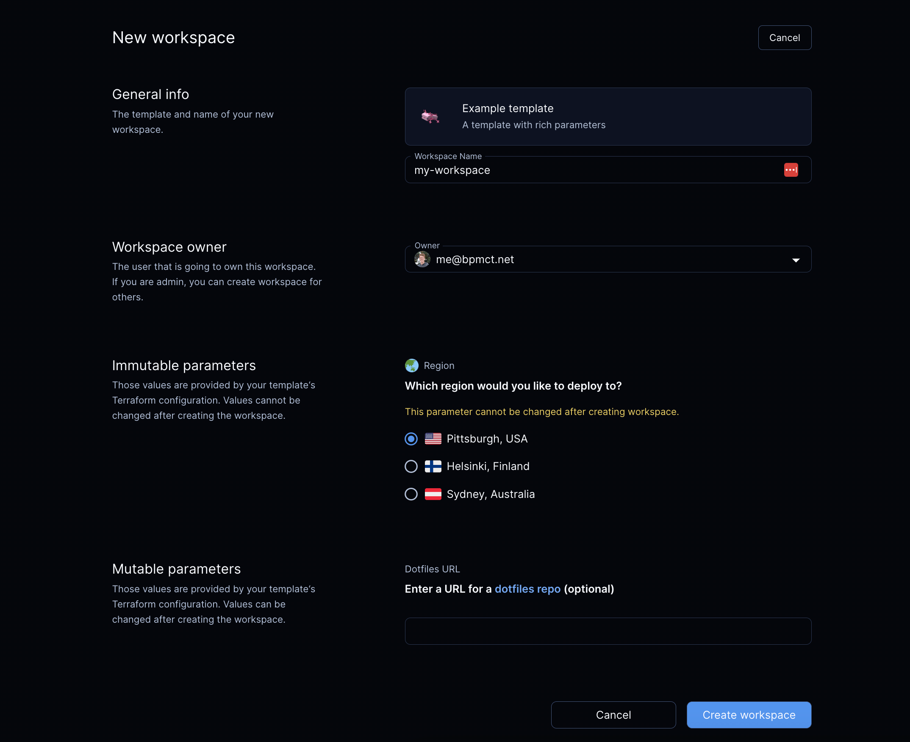

# Parameters (alpha)

> Parameters are an [alpha feature](../contributing/feature-stages.md#alpha-features). See the [Rich Parameters Milestone](https://github.com/coder/coder/milestone/11) for more details.

Templates can contain _parameters_, which allow prompting the user for additional information when creating workspaces in both the UI and CLI.



```hcl
data "coder_parameter" "docker_host" {
  name        = "Region"
  description = "Which region would you like to deploy to?"
  icon        = "/emojis/1f30f.png"
  type        = "string"
  default     = "tcp://100.94.74.63:2375"

  option {
    name = "Pittsburgh, USA"
    value = "tcp://100.94.74.63:2375"
    icon = "/emojis/1f1fa-1f1f8.png"
  }

  option {
    name = "Helsinki, Finland"
    value = "tcp://100.117.102.81:2375"
    icon = "/emojis/1f1eb-1f1ee.png"
  }

  option {
    name = "Sydney, Australia"
    value = "tcp://100.127.2.1:2375"
    icon = "/emojis/1f1e6-1f1f9.png"
  }
}
```

From there, parameters can be referenced during build-time:

```hcl
provider "docker" {
  host = data.coder_parameter.docker_host.value
}
```

> For a complete list of supported parameter properties, see the
> [coder_parameter Terraform reference](https://registry.terraform.io/providers/coder/coder/latest/docs/data-sources/parameter)

## Types

The following parameter types are supported: `string`, `list(string)`, `bool`, and `number`.

### List of strings

List of strings is a specific parameter type, that can't be easily mapped to the default value, which is string type.
Parameters with the `list(string)` type must be converted to JSON arrays using [jsonencode](https://developer.hashicorp.com/terraform/language/functions/jsonencode)
function.

```hcl
data "coder_parameter" "security_groups" {
  name        = "Security groups"
  icon        = "/icon/aws.png"
  type        = "list(string)"
  description = "Select appropriate security groups."
  mutable     = true
  default = jsonencode([
    "Web Server Security Group",
    "Database Security Group",
    "Backend Security Group"
  ])
}
```

## Options

A _string_ parameter can provide a set of options to limit the choice:

```hcl
data "coder_parameter" "docker_host" {
  name        = "Region"
  description = "Which region would you like to deploy to?"
  type        = "string"
  default     = "tcp://100.94.74.63:2375"

  option {
    name = "Pittsburgh, USA"
    value = "tcp://100.94.74.63:2375"
    icon = "/emojis/1f1fa-1f1f8.png"
  }

  option {
    name = "Helsinki, Finland"
    value = "tcp://100.117.102.81:2375"
    icon = "/emojis/1f1eb-1f1ee.png"
  }

  option {
    name = "Sydney, Australia"
    value = "tcp://100.127.2.1:2375"
    icon = "/emojis/1f1e6-1f1f9.png"
  }
}
```

## Required and optional parameters

A parameter is considered to be _required_ if it doesn't have the `default` property. The user **must** provide a value to this parameter before creating a workspace.

```hcl
data "coder_parameter" "account_name" {
  name        = "Account name"
  description = "Cloud account name"
  mutable     = true
}
```

If a parameter contains the `default` property, Coder will use this value
if the user does not specify any:

```hcl
data "coder_parameter" "base_image" {
  name        = "Base image"
  description = "Base machine image to download"
  default     = "ubuntu:latest"
}
```

Admins can also set the `default` property to an empty value so that the parameter field can remain empty:

```hcl
data "coder_parameter" "dotfiles_url" {
  name        = "dotfiles URL"
  description = "Git repository with dotfiles"
  mutable     = true
  default     = ""
}
```

## Mutability

Immutable parameters can be only set before workspace creation, or during update on the first usage to set the initial value for required parameters. The idea is to prevent users from modifying fragile or persistent workspace resources like volumes, regions, etc.:

```hcl
data "coder_parameter" "region" {
  name        = "Region"
  description = "Region where the workspace is hosted"
  mutable     = false
  default     = "us-east-1"
}
```

It is allowed to modify the mutability state anytime. In case of emergency, template authors can temporarily allow for changing immutable parameters to fix an operational issue, but it is not
advised to overuse this opportunity.

## Validation

Rich parameters support multiple validation modes - min, max, monotonic numbers, and regular expressions.

### Number

A _number_ parameter can be limited to boundaries - min, max. Additionally, the monotonicity (`increasing` or `decreasing`) between the current parameter value and the new one can be verified too.
Monotonicity can be enabled for resources that can't be shrunk without implications, for instance - disk volume size.

```hcl
data "coder_parameter" "instances" {
  name        = "Instances"
  type        = "number"
  description = "Number of compute instances"
  validation {
    min       = 1
    max       = 8
    monotonic = "increasing"
  }
}
```

### String

A _string_ parameter can have a regular expression defined to make sure that the parameter value matches the pattern. The `regex` property requires a corresponding `error` property.

```hcl
data "coder_parameter" "project_id" {
  name        = "Project ID"
  description = "Alpha-numeric project ID"
  validation {
    regex = "^[a-z0-9]+$"
    error = "Unfortunately, it isn't a valid project ID"
  }
}
```

## Legacy

Prior to Coder v0.16.0 (Jan 2023), parameters were defined via Terraform `variable` blocks. These "legacy parameters" can still be used in templates, but will be removed in April 2023.

```hcl
variable "use_kubeconfig" {
  sensitive   = true # Template-level parameter (not editable when creating a workspace)
  type        = bool
  description = <<-EOF
  Use host kubeconfig? (true/false)
  EOF
}

variable "cpu" {
  sensitive   = false # User (workspace-level) parameter
  description = "CPU (__ cores)"
  default     = 2
  validation {
    condition = contains([
      "2",
      "4",
      "6",
      "8"
    ], var.cpu)
    error_message = "Invalid cpu!"
  }
}
```

> ⚠️ Legacy (`variable`) parameters and rich parameters can't be used in the same template.

### Migration

Terraform variables shouldn't be used for workspace scoped parameters anymore, and it's recommended to convert variables to `coder_parameter` resources. To make the migration smoother, there is a special property introduced -
`legacy_variable` and `legacy_variable_name` , which can link `coder_parameter` with a legacy variable.

```hcl
variable "legacy_cpu" {
  sensitive   = false
  description = "CPU cores"
  default     = 2
}

data "coder_parameter" "cpu" {
  name        = "CPU cores"
  type        = "number"
  description = "Number of CPU cores"
  mutable     = true

  legacy_variable_name = "legacy_cpu"
  legacy_variable = var.legacy_cpu
}
```

#### Steps

1. Prepare and update a new template version:

   - Add `coder_parameter` resource matching the legacy variable to migrate.
   - Use `legacy_variable_name` and `legacy_variable` to link the `coder_parameter` to the legacy variable.
   - Mark the new parameter as `mutable`, so that Coder will not block updating existing workspaces.

2. Update all workspaces to the updated template version. Coder will populate the added `coder_parameter`s with values from legacy variables.
3. Prepare another template version:

   - Remove the migrated variables.
   - Remove properties `legacy_variable` and `legacy_variable_name` from `coder_parameter`s.

4. Update all workspaces to the updated template version (2nd).
5. Prepare a third template version:

   - Enable the `feature_use_managed_variables` provider flag to use managed Terraform variables for template customization. Once the flag is enabled, legacy variables won't be used.

6. Update all workspaces to the updated template version (3rd).
7. Delete legacy parameters.

As a template improvement, the template author can consider making some of the new `coder_parameter` resources `mutable`.

## Managed Terraform variables

As parameters are intended to be used only for workspace customization purposes, Terraform variables can be freely managed by the template author to build templates. Workspace users are not able to modify
template variables.

The template author can enable managed Terraform variables mode by specifying the following flag:

```hcl
provider "coder" {
  feature_use_managed_variables = "true"
}
```

Once it's defined, coder will allow for modifying variables by using CLI and UI forms, but it will not be possible to use legacy parameters.
