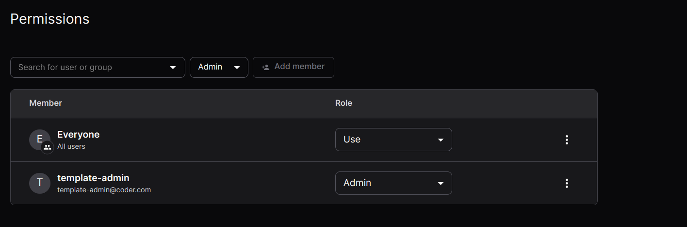

# Permissions

Permissions allow you to control who can use and modify the template. Both
individual user and groups can be added to the access list for a template.
Members can be assigned either a `Use` role, granting use of the template to
create workspaces, or `Admin`, allowing a user or members of a group to control
all aspects of the template. This offers a way to elevate the privileges of
ordinary users for specific templates without granting them the site-wide role
of `Template Admin`.

By default the `Everyone` group is assigned to each template meaning any Coder
user can use the template to create a workspace. To prevent this, disable the
`Allow everyone to use the template` setting when creating a template.

Permissions is an enterprise-only feature.
