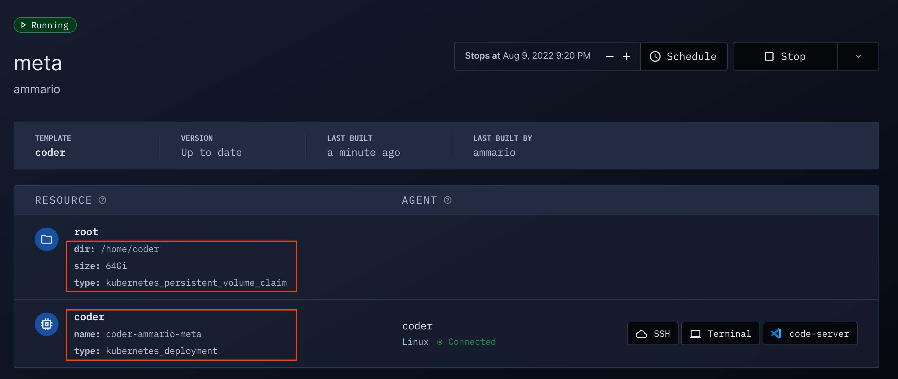

# Resource Metadata

Expose key workspace information to your user via the [`coder_metadata`](https://registry.terraform.io/providers/coder/coder/latest/docs/resources/metadata) resource in your template's code.



You can use `coder_metadata` to show

- Compute resources
- IP addresses
- [Secrets](../secrets.md#displaying-secrets)
- Important file paths

and anything else exposes by your Terraform resources.

## Example

I can expose the disk size, deployment name, and persistent
directory in a Kubernetes template with:

```hcl
resource "kubernetes_persistent_volume_claim" "root" {
    ...
}

resource "kubernetes_deployment" "coder" {
  # My deployment is ephemeral
  count = data.coder_workspace.me.start_count
  ...
}

resource "coder_metadata" "pvc" {
  resource_id = kubernetes_persistent_volume_claim.root.id
  item {
    key = "size"
    value = kubernetes_persistent_volume_claim.root.spec[0].resources[0].requests.storage
  }
  item {
    key = "dir"
    value = "/home/coder"
  }
}

resource "coder_metadata" "deployment" {
  count = data.coder_workspace.me.start_count
  resource_id = kubernetes_deployment.coder[0].id
  item {
    key = "name"
    value = kubernetes_deployment.coder[0].metadata[0].name
  }
}
```

## Up next

- Learn about [secrets](../secrets.md)
