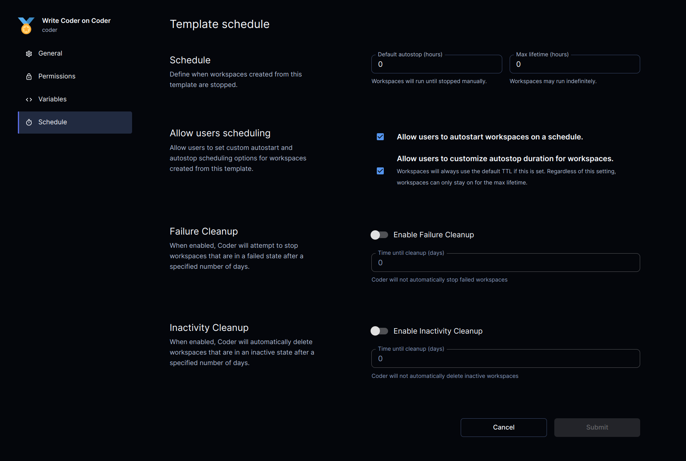

# Workspace Scheduling

Templates can configure various aspects of how its workspaces are started and
stopped, as well as manage the lifecycle of failed or inactive workspaces.

## Schedule

Template admins may define the default values for how long a workspace is
permitted to run without user activity before it is automatically stopped
as well as the maximum duration it may remain in a started state before
it is forcibly stopped.

### User scheduling

For templates where a uniform autostop duration is not appropriate, admins
may allow users to define their own autostart and autostop schedules.

## Failure Cleanup (alpha)

Failure cleanup defines how long a workspace is permitted to remain in the
failed state prior to being automatically stopped. 

## Dormancy Threshold (alpha)

Dormancy Threshold defines how long a workspace is allowed to remain inactive
before being moved into a dormant state. A workspace's inactivity is determined
by the time elapsed since a user last accessed the workspace. A workspace in 
the dormant state is not eligible for autostart and must be manually activated
by the user before being accessible. Inactive workspaces are stopped
during their transition to the dormant state if they are detected to be running.

## Dormancy Auto-Deletion (alpha)

Dormancy Auto-Deletion allows a template admin to dictate how long a
workspace is permitted to remain dormant before it is automatically deleted.
