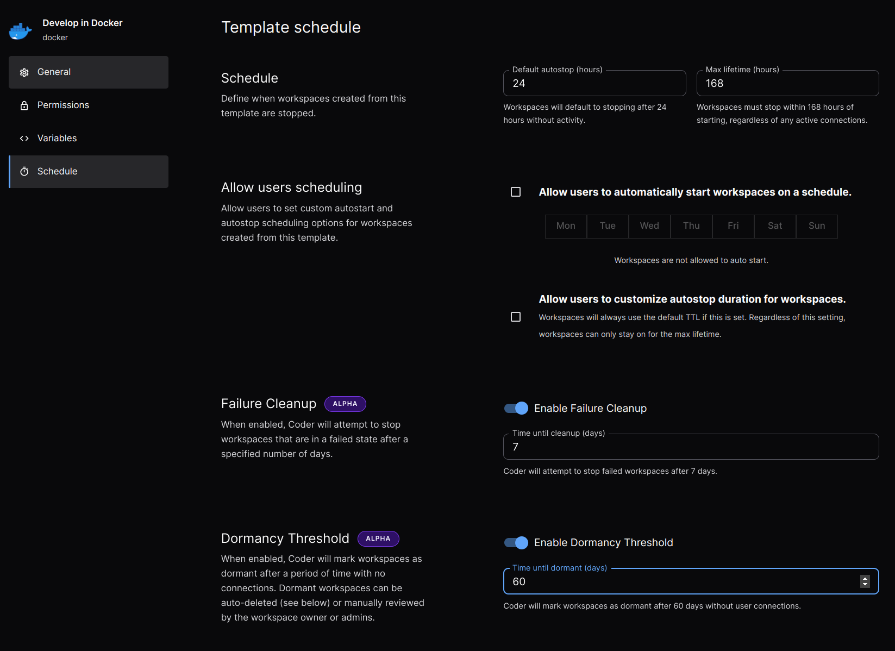

# Workspace Scheduling

Templates can configure various aspects of how its workspaces are started,
stopped, and moved into an pre-deletion state called [locked](../workspaces.md#Locking_workspaces).

## Schedule

Template admins may define the default values for how long a workspace is
permitted to run before it is automatically stopped as well as the maximum
duration for a workspace lifecycle.

### User scheduling

For templates where a uniform autostop duration is not appropriate, admins
may allow users to define their own autostart and autostop schedules.

## Failure Cleanup

Failure cleanup defines how long a workspace is permitted to remain in the
failed state prior to being automatically stopped.

## Inactivity Cleanup

Inactivity cleanup defines how long a workspace is allowed to remain inactive
before being moved in the locked state. A workspace's inactivity is determined
by the time elapsed since a user last accessed the workspace. A workspace in
the locked state is no longer accessible by the user and will be deleted if
it remains locked for longer than the duration permitted by the template (by
default 7 days). A template admin or higher is required to unlock a workspace.
