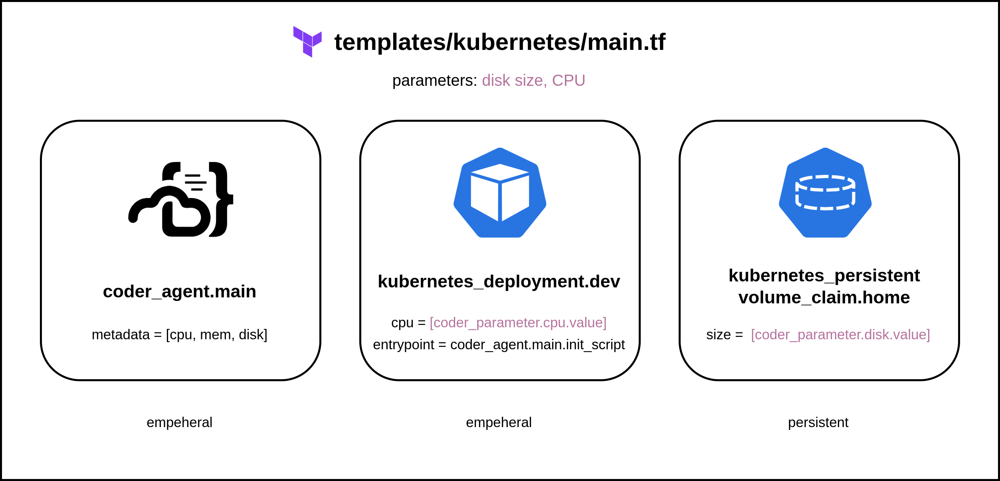

# A guided tour of a template

This guided tour introduces you to the different parts of a template
by showing you how to create a template from scratch.

In this tour, you'll write a simple template that will provision a workspace as a Docker
container with Ubuntu. This simple template is based on the same
Docker starter template that the [tutorial](./tutorial.md) uses.

## Before you start

To follow this guide, you'll need:

- A computer or cloud computing instance with both
[Docker](https://docs.docker.com/get-docker/) and
[Coder](../install/index.md) installed on it.

> When setting up your computer or computing instance, make sure to
> install Docker first, then Coder.

- Access to the command-line on this computer or instance.

- A text editor and a tar utility. This tour uses [GNU
nano](https://nano-editor.org/) and [GNU
tar](https://www.gnu.org/software/tar/).

> Haven't written Terraform before? Check out Hashicorp's [Getting Started Guides](https://developer.hashicorp.com/terraform/tutorials).

## What's in a template

The main part of a Coder template is a
[Terraform](https://terraform.io) `tf` file. A template often has
other files to configure other services that the template needs. In
this tour you'll also create a `Dockerfile`.

Coder can provision all Terraform modules, resources, and
properties. The Coder server essentially runs a `terraform apply`
every time a workspace is created, started, or stopped.

This is a simplified diagram of our [Kubernetes starter
template](https://github.com/coder/coder/blob/main/examples/templates/kubernetes/main.tf):




## 1. Create template files

On the command line, create a directory for your template and create the `Dockerfile`.

This is a simple `Dockerfile` that starts with the [official ubuntu image](https://hub.docker.com/_/ubuntu/).

```shell
mkdir scratch-template
cd scratch-template
mkdir build
nano build/Dockerfile
```

In the editor, enter and save the following text in `Dockerfile` then
exit the editor:

```dockerfile
FROM ubuntu

RUN apt-get update \
	&& apt-get install -y \
	sudo \
	curl \
	&& rm -rf /var/lib/apt/lists/*

ARG USER=coder
RUN useradd --groups sudo --no-create-home --shell /bin/bash ${USER} \
	&& echo "${USER} ALL=(ALL) NOPASSWD:ALL" >/etc/sudoers.d/${USER} \
	&& chmod 0440 /etc/sudoers.d/${USER}
USER ${USER}
WORKDIR /home/${USER}
```

Notice how `Dockerfile` adds a few things to the parent `ubuntu`
image, which we'll refer to later:

- It installs the `sudo` and `curl` packages.
- It adds a `coder` user, including a home directory.


## 2. Set up template providers

Now you can edit the Terraform file, which provisions the workspace's resources.

```shell
nano main.tf
```

We'll start by setting up our providers. At a minimum, we need the
`coder` provider. For this template, we also need the `docker`
provider:

```hcl
terraform {
  required_providers {
    coder = {
      source  = "coder/coder"
      version = "~> 0.8.3"
    }
    docker = {
      source  = "kreuzwerker/docker"
      version = "~> 3.0.1"
    }
  }
}

provider "coder" {
}

provider "docker" {
}

locals {
  username = data.coder_workspace.me.owner
}

data "coder_provisioner" "me" {
}

data "coder_workspace" "me" {
}

```

Notice that the `provider` blocks for `coder` and `docker` are empty.
In a more practical template, you would add arguments to these blocks
to configure the providers, if needed.

The `coder_workspace` data source provides details about the state of
a workspace, such as its name, owner, and so on. Its also lets us know
when a workspace is being started or stopped. We'll use this
information in later steps to make sure our workspace's home directory
is persistent.

## 3. coder_agent

All templates need to create and run a [Coder
agent](https://registry.terraform.io/providers/coder/coder/latest/docs/resources/agent).
This lets developers connect to their workspaces. The `coder_agent`
resource runs inside the compute aspect of your workspace, typically a
VM or container. In our case, it will run in Docker.

You do not need to have any open ports on the compute aspect, but the
agent needs `curl` access to the Coder server. Remember that we
install `curl` in `Dockerfile`, above.

This snippet creates the agent and specifies a startup script. This
script installs [code-server](https://coder.com/docs/code-server), a
browser-based [VS Code](https://code.visualstudio.com/) app that runs
in the workspace. We'll let users access code-server through
`coder_app`, later.

```hcl
resource "coder_agent" "main" {
  arch                   = data.coder_provisioner.me.arch
  os                     = "linux"
  startup_script_timeout = 180
  startup_script         = <<-EOT
    set -e

    # install and start code-server
    curl -fsSL https://code-server.dev/install.sh | sh -s -- --method=standalone --prefix=/tmp/code-server --version 4.11.0
    /tmp/code-server/bin/code-server --auth none --port 13337 >/tmp/code-server.log 2>&1 &
  EOT

  metadata {
    display_name = "CPU Usage"
    key          = "0_cpu_usage"
    script       = "coder stat cpu"
    interval     = 10
    timeout      = 1
  }

  metadata {
    display_name = "RAM Usage"
    key          = "1_ram_usage"
    script       = "coder stat mem"
    interval     = 10
    timeout      = 1
  }
}
```

Because Docker is running locally to the Coder server, there is no
need to authenticate `coder_agent`. But if your `coder_agent` were
running on a remote host, you would also refer to [authentication
credentials](./authentication.md).

Agents can also run startup scripts, set environment variables and
provide `metadata`.

Our template has [`metadata`](./agent-metadata.md) blocks for CPU and
RAM usage. Coder displays this information in the Coder dashboard.


## 4. coder_app

A
[`coder_app`](https://registry.terraform.io/providers/coder/coder/latest/docs/resources/app)
resource lets a developer use an app from the workspace's Coder
dashboard.


This is commonly used for [web IDEs](../ides/web-ides.md) such as
[code-server](https://coder.com/docs/code-server/latest), RStudio, and
JupyterLab.

To install and run an app in the workspace, add it to the
`startup_script` argument in `coder_agent` then add a `coder_app`
resource to make it available in the workspace. See [web
IDEs](../ides/web-ides.md) for some examples.

```hcl
resource "coder_app" "code-server" {
  agent_id     = coder_agent.main.id
  slug         = "code-server"
  display_name = "code-server"
  url          = "http://localhost:13337/?folder=/home/${local.username}"
  icon         = "/icon/code.svg"
  subdomain    = false
  share        = "owner"

  healthcheck {
    url       = "http://localhost:13337/healthz"
    interval  = 5
    threshold = 6
  }
}
```

You can also use a `coder_app` resource to link to
external apps, such as links to wikis or cloud consoles.

```hcl
resource "coder_app" "coder-server-doc" {
  agent_id     = coder_agent.main.id
  icon         = "/emojis/1f4dd.png"
  slug         = "getting-started"
  url          = "https://coder.com/docs/code-server"
  external     = true
}
```

## 5. Persistent storage

We want our workspace's home directory to persist after the workspace
is stopped so that a developer can continue their work when they start
the workspace again.

We do this in 2 parts:

- Our `docker_volume` resource uses the `lifecycle` block with `ignore_changes = all` argument to prevent accidental deletions.
- We use an immutable parameter like `data.coder_workspace.me.id` for volume names to prevent destroying them in case of a workspace name change.
- Later, our `docker_container` resource uses the Terraform [count](https://developer.hashicorp.com/terraform/language/meta-arguments/count)
meta-argument.

```hcl
resource "docker_volume" "home_volume" {
  name = "coder-${data.coder_workspace.me.id}-home"
  # Protect the volume from being deleted due to changes in attributes.
  lifecycle {
    ignore_changes = all
  }
}
```
For details, see [Resource persistence](./resource-persistence.md).

## 6. Set up the Docker container

Setting up our Docker container is straightfoward. The `docker_image` resource uses our `build/Dockerfile` we created earlier.

```hcl
resource "docker_image" "main" {
  name = "coder-${data.coder_workspace.me.id}"
  build {
    context = "./build"
    build_args = {
      USER = local.username
    }
  }
  triggers = {
    dir_sha1 = sha1(join("", [for f in fileset(path.module, "build/*") : filesha1(f)]))
  }
}
```

Our `docker_container` resource uses the `coder_workspace`
`start_count` to start and stop the Docker container:

```hcl
resource "docker_container" "workspace" {
  count = data.coder_workspace.me.start_count
  image = docker_image.main.name
  # Uses lower() to avoid Docker restriction on container names.
  name = "coder-${data.coder_workspace.me.owner}-${lower(data.coder_workspace.me.name)}"
  # Hostname makes the shell more user friendly: coder@my-workspace:~$
  hostname = data.coder_workspace.me.name
  # Use the docker gateway if the access URL is 127.0.0.1
  entrypoint = ["sh", "-c", replace(coder_agent.main.init_script, "/localhost|127\\.0\\.0\\.1/", "host.docker.internal")]
  env = [
    "CODER_AGENT_TOKEN=${coder_agent.main.token}",
  ]
  host {
    host = "host.docker.internal"
    ip   = "host-gateway"
  }
  volumes {
    container_path = "/home/${local.username}"
    volume_name    = docker_volume.home_volume.name
    read_only      = false
  }
}
```


## Next steps

- [Setting up templates](./best-practices.md)
- [Customizing templates](./customizing.md)

