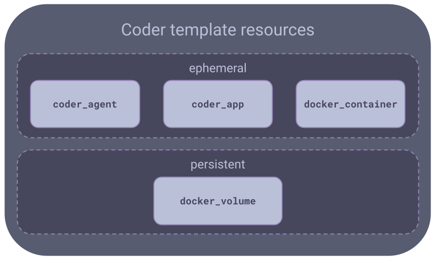
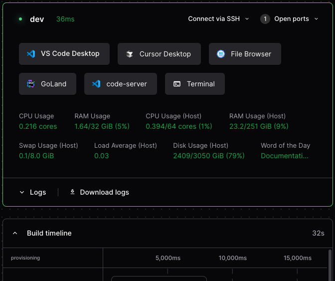
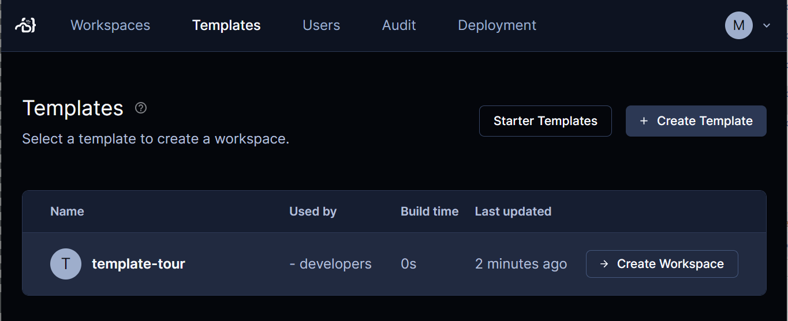

# A guided tour of a template

This guided tour introduces you to the different parts of a Coder template by
showing you how to create a template from scratch.

You'll write a simple template that provisions a workspace as a Docker container
with Ubuntu. This simple template is based on the same Docker starter template
that the [tutorial](./tutorial.md) uses.

## Before you start

To follow this guide, you'll need:

- A computer or cloud computing instance with both
  [Docker](https://docs.docker.com/get-docker/) and [Coder](../install/index.md)
  installed on it.

> When setting up your computer or computing instance, make sure to install
> Docker first, then Coder.

- The URL for your Coder instance. If you're running Coder locally, the default
  URL is [http://127.0.0.1:3000](http://127.0.0.1:3000).

- A text editor. For this tour, we use [GNU nano](https://nano-editor.org/).

> Haven't written Terraform before? Check out Hashicorp's
> [Getting Started Guides](https://developer.hashicorp.com/terraform/tutorials).

## What's in a template

The main part of a Coder template is a [Terraform](https://terraform.io) `tf`
file. A Coder template often has other files to configure the other resources
that the template needs. In this tour you'll also create a `Dockerfile`.

Coder can provision all Terraform modules, resources, and properties. The Coder
server essentially runs a `terraform apply` every time a workspace is created,
started, or stopped.

Here's a simplified diagram that shows the main parts of the template we'll
create.



## 1. Create template files

On your local computer, create a directory for your template and create the
`Dockerfile`.

```shell
mkdir template-tour
cd template-tour
mkdir build
nano build/Dockerfile
```

You'll enter a simple `Dockerfile` that starts with the
[official Ubuntu image](https://hub.docker.com/_/ubuntu/). In the editor, enter
and save the following text in `Dockerfile` then exit the editor:

```dockerfile
FROM ubuntu

RUN apt-get update \
	&& apt-get install -y \
	sudo \
	curl \
	&& rm -rf /var/lib/apt/lists/*

ARG USER=coder
RUN useradd --groups sudo --no-create-home --shell /bin/bash ${USER} \
	&& echo "${USER} ALL=(ALL) NOPASSWD:ALL" >/etc/sudoers.d/${USER} \
	&& chmod 0440 /etc/sudoers.d/${USER}
USER ${USER}
WORKDIR /home/${USER}

```

Notice how `Dockerfile` adds a few things to the parent `ubuntu` image, which
your template needs later:

- It installs the `sudo` and `curl` packages.
- It adds a `coder` user, including a home directory.

## 2. Set up template providers

Now you can edit the Terraform file, which provisions the workspace's resources.

```shell
nano main.tf
```

We'll start by setting up our providers. At a minimum, we need the `coder`
provider. For this template, we also need the `docker` provider:

```hcl
terraform {
  required_providers {
    coder = {
      source  = "coder/coder"
      version = "~> 0.8.3"
    }
    docker = {
      source  = "kreuzwerker/docker"
      version = "~> 3.0.1"
    }
  }
}

provider "coder" {
}

provider "docker" {
}

locals {
  username = data.coder_workspace.me.owner
}

data "coder_provisioner" "me" {
}

data "coder_workspace" "me" {
}

```

Notice that the `provider` blocks for `coder` and `docker` are empty. In a more
practical template, you would add arguments to these blocks to configure the
providers, if needed.

The
[`coder_workspace`](https://registry.terraform.io/providers/coder/coder/latest/docs/data-sources/workspace)
data source provides details about the state of a workspace, such as its name,
owner, and so on. The data source also lets us know when a workspace is being
started or stopped. We'll take advantage of this information in later steps to
do these things:

- Set some environment variables based on the workspace owner.
- Manage ephemeral and persistent storage.

## 3. coder_agent

All templates need to create and run a
[Coder agent](https://registry.terraform.io/providers/coder/coder/latest/docs/resources/agent).
This lets developers connect to their workspaces. The `coder_agent` resource
runs inside the compute aspect of your workspace, typically a VM or container.
In our case, it will run in Docker.

You do not need to have any open ports on the compute aspect, but the agent
needs `curl` access to the Coder server. Remember that we installed `curl` in
`Dockerfile`, earlier.

This snippet creates the agent:

```hcl
resource "coder_agent" "main" {
  arch                   = data.coder_provisioner.me.arch
  os                     = "linux"
  startup_script_timeout = 180
  startup_script         = <<-EOT
    set -e

    # install and start code-server
    curl -fsSL https://code-server.dev/install.sh | sh -s -- --method=standalone --prefix=/tmp/code-server --version 4.11.0
    /tmp/code-server/bin/code-server --auth none --port 13337 >/tmp/code-server.log 2>&1 &
  EOT

  env = {
    GIT_AUTHOR_NAME = "${data.coder_workspace.me.owner}"
    GIT_COMMITTER_NAME = "${data.coder_workspace.me.owner}"
    GIT_AUTHOR_EMAIL = "${data.coder_workspace.me.owner_email}"
    GIT_COMMITTER_EMAIL = "${data.coder_workspace.me.owner_email}"
  }

  metadata {
    display_name = "CPU Usage"
    key          = "0_cpu_usage"
    script       = "coder stat cpu"
    interval     = 10
    timeout      = 1
  }

  metadata {
    display_name = "RAM Usage"
    key          = "1_ram_usage"
    script       = "coder stat mem"
    interval     = 10
    timeout      = 1
  }
}

```

Because Docker is running locally in the Coder server, there is no need to
authenticate `coder_agent`. But if your `coder_agent` were running on a remote
host, your template would need
[authentication credentials](./authentication.md).

This template's agent also runs a startup script, sets environment variables,
and provides metadata.

The
[`startup script`](https://registry.terraform.io/providers/coder/coder/latest/docs/resources/agent#startup_script)
installs [code-server](https://coder.com/docs/code-server), a browser-based
[VS Code](https://code.visualstudio.com/) app that runs in the workspace. We'll
give users access to code-server through `coder_app`, later.

The
[`env`](https://registry.terraform.io/providers/coder/coder/latest/docs/resources/agent#env)
block sets environments variables for the workspace. We use the data source from
`coder_workspace` to set the environment variables based on the workspace's
owner. This way, the owner can make git commits immediately without any manual
configuration.

Your template can use metadata to show information to the workspace owner. Coder
displays this metadata in the Coder dashboard. Our template has
[`metadata`](./agent-metadata.md) blocks for CPU and RAM usage.

## 4. coder_app

A
[`coder_app`](https://registry.terraform.io/providers/coder/coder/latest/docs/resources/app)
resource lets a developer use an app from the workspace's Coder dashboard.



This is commonly used for [web IDEs](../ides/web-ides.md) such as
[code-server](https://coder.com/docs/code-server/latest), RStudio, and
JupyterLab.

To install and code-server in the workspace, remember that we installed it in
the `startup_script` argument in `coder_agent`. We make it available from a
workspace with a `coder_app` resource. See [web IDEs](../ides/web-ides.md) for
more examples.

```hcl
resource "coder_app" "code-server" {
  agent_id     = coder_agent.main.id
  slug         = "code-server"
  display_name = "code-server"
  url          = "http://localhost:13337/?folder=/home/${local.username}"
  icon         = "/icon/code.svg"
  subdomain    = false
  share        = "owner"

  healthcheck {
    url       = "http://localhost:13337/healthz"
    interval  = 5
    threshold = 6
  }
}

```

You can also use a `coder_app` resource to link to external apps, such as links
to wikis or cloud consoles.

```hcl
resource "coder_app" "coder-server-doc" {
  agent_id     = coder_agent.main.id
  icon         = "/emojis/1f4dd.png"
  slug         = "getting-started"
  url          = "https://coder.com/docs/code-server"
  external     = true
}

```

## 5. Persistent and ephemeral resources

Managing the lifecycle of template resources is important. We want to make sure
that workspaces use computing, storage, and other services efficiently.

We want our workspace's home directory to persist after the workspace is stopped
so that a developer can continue their work when they start the workspace again.

We do this in 2 parts:

- Our `docker_volume` resource uses the `lifecycle` block with the
  `ignore_changes = all` argument to prevent accidental deletions.
- To prevent Terraform from destroying persistent Docker volumes in case of a
  workspace name change, we use an immutable parameter, like
  `data.coder_workspace.me.id`.

You'll see later that we make sure that our Docker container is ephemeral with
the Terraform
[count](https://developer.hashicorp.com/terraform/language/meta-arguments/count)
meta-argument.

```hcl
resource "docker_volume" "home_volume" {
  name = "coder-${data.coder_workspace.me.id}-home"
  # Protect the volume from being deleted due to changes in attributes.
  lifecycle {
    ignore_changes = all
  }
}

```

For details, see [Resource persistence](./resource-persistence.md).

## 6. Set up the Docker container

To set up our Docker container, our template has a `docker_image` resource that
uses `build/Dockerfile`, which we created earlier.

```hcl
resource "docker_image" "main" {
  name = "coder-${data.coder_workspace.me.id}"
  build {
    context = "./build"
    build_args = {
      USER = local.username
    }
  }
  triggers = {
    dir_sha1 = sha1(join("", [for f in fileset(path.module, "build/*") : filesha1(f)]))
  }
}

```

Our `docker_container` resource uses `coder_workspace` `start_count` to start
and stop the Docker container:

```hcl
resource "docker_container" "workspace" {
  count = data.coder_workspace.me.start_count
  image = docker_image.main.name
  # Uses lower() to avoid Docker restriction on container names.
  name = "coder-${data.coder_workspace.me.owner}-${lower(data.coder_workspace.me.name)}"
  # Hostname makes the shell more user friendly: coder@my-workspace:~$
  hostname = data.coder_workspace.me.name
  # Use the docker gateway if the access URL is 127.0.0.1
  entrypoint = ["sh", "-c", replace(coder_agent.main.init_script, "/localhost|127\\.0\\.0\\.1/", "host.docker.internal")]
  env = [
    "CODER_AGENT_TOKEN=${coder_agent.main.token}",
  ]
  host {
    host = "host.docker.internal"
    ip   = "host-gateway"
  }
  volumes {
    container_path = "/home/${local.username}"
    volume_name    = docker_volume.home_volume.name
    read_only      = false
  }
}

```

## 7. Create the template in Coder

Save `main.tf` and exit the editor.

Now that we've created the files for our template, we can add them to our Coder
deployment.

We can do this with the Coder CLI or the Coder dashboard. For this tour, we'll
use the Coder CLI.

First, you'll need to log in to your Coder deployment from the CLI. This is
where you need the URL for your deployment:

```console
$ coder login https://coder.example.com
Your browser has been opened to visit:

        https://coder.example.com/cli-auth

> Paste your token here:
```

In your web browser, enter your credentials:


Copy the session token into the clipboard:


And paste it into the CLI:

```
> Welcome to Coder, marc! You're authenticated.
$
```

Now you can add your template files to your Coder deployment:

```console
$ pwd
/home/marc/template-tour
$ coder templates create
> Upload "."? (yes/no) yes
```

The Coder CLI tool gives progress information then prompts you to confirm:

```console
> Confirm create? (yes/no) yes

The template-tour template has been created! Developers can provision a workspace with this template using:

   coder create --template="template-tour" [workspace name]
```

In your web browser, log in to your Coder dashboard, select **Templates**. Your
template is ready to use for new workspaces.



## Next steps

- [Setting up templates](./best-practices.md)
- [Customizing templates](./customizing.md)
- [Troubleshooting template](./troubleshooting.md)
