# Your first template

A common way to create a template is to begin with a starter template then
modify it for your needs. Coder makes this easy with starter templates for
popular development targets like Docker, Kubernetes, Azure, and so on. Once your
template is up and running, you can edit it in the Coder dashboard. Coder even
handles versioning for you so you can publish official updates or revert to
previous versions.

In this tutorial, you'll create your first template from the Docker starter
template.

## Before you start

You'll need a computer or cloud computing instance with both
[Docker](https://docs.docker.com/get-docker/) and [Coder](../install/index.md)
installed on it.

> When setting up your computer or computing instance, make sure to install
> Docker first, then Coder.

## 1. Log in to Coder

In your web browser, go to your Coder dashboard to log in.

## 2. Choose a starter template

Select **Templates** > **Starter Templates**.

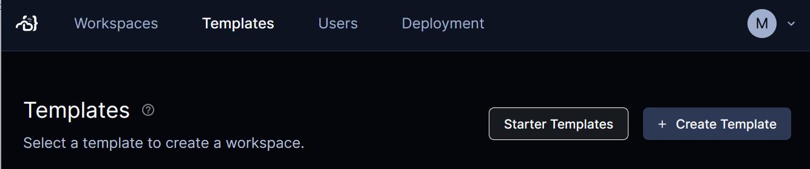

In **Filter**, select **Docker** then select **Develop in Docker**.

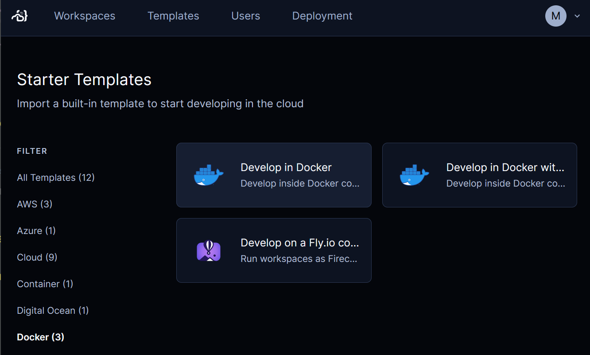

Select **Use template**.

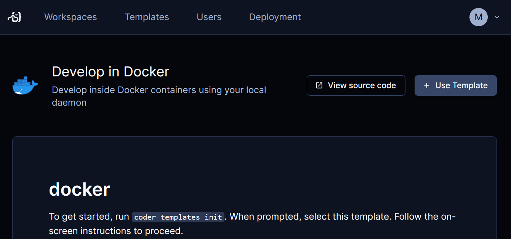

## 3. Create your template

In **Create template**, fill in **Name** and **Display name**,then scroll down
and select **Create template**.

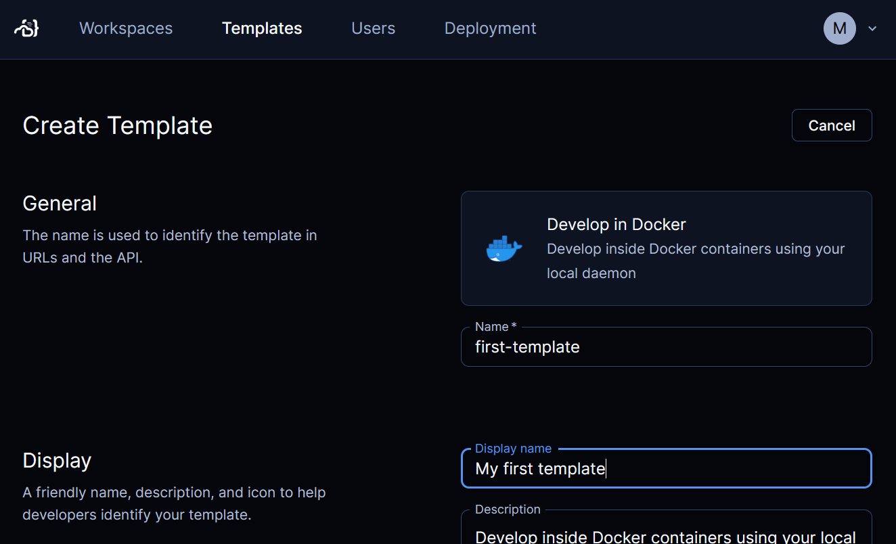

## 4. Create a workspace from your template

When the template is ready, select **Create Workspace**.

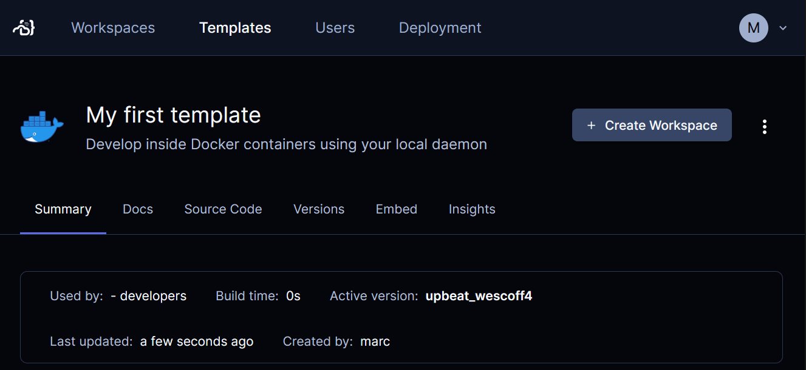

In **New workspace**, fill in **Name** then scroll down to select **Create
Workspace**.

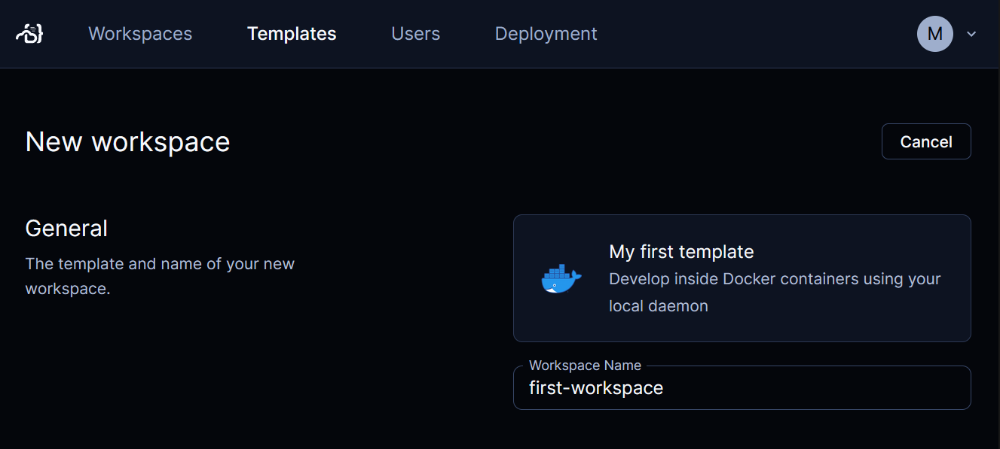

Coder starts your new workspace from your template.

After a few seconds, your workspace is ready to use.

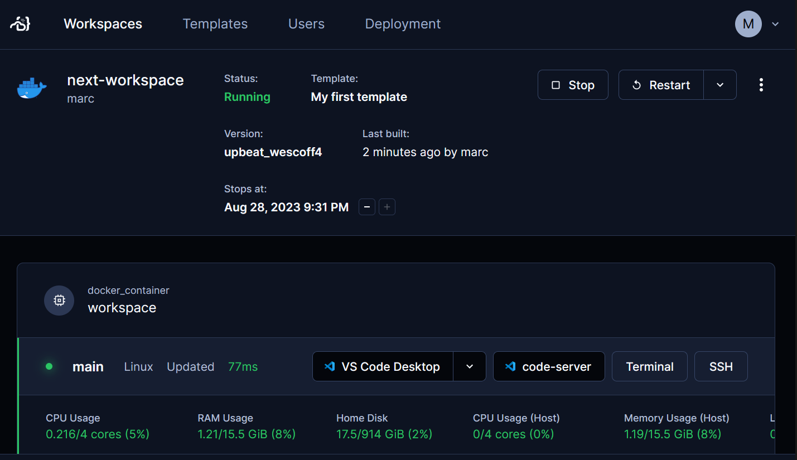

## 5. Try out your new workspace

This starter template lets you connect to your workspace in a few ways:

- VS Code Desktop: Loads your workspace into
  [VS Code Desktop](https://code.visualstudio.com/Download) installed on your
  local computer.
- code-server: Opens [browser-based VS Code](../ides/web-ides.md) with your
  workspace.
- Terminal: Opens a browser-based terminal with a shell in the workspace's
  Docker instance.
- SSH: Use SSH to log in to the workspace from your local machine. If you
  haven't already, you'll have to install Coder on your local machine to
  configure your SSH client.

> **Tip**: You can edit the template to let developers connect to a workspace in
> [a few more ways](../ides.md).

When you're done, you can stop the workspace.

## 6. Modify your template

Now you can modify your template to suit your team's needs.

Let's replace the `golang` package in the Docker image with the `python3`
package. You can do this by editing the template's `Dockerfile` directly in your
web browser.

In the Coder dashboard, select **Templates** then your first template.

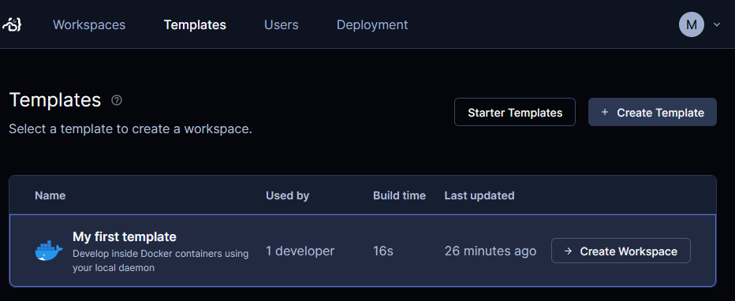

In the drop-down menu, select **Edit files**.

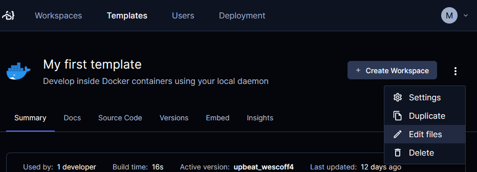

Expand the **build** directory and select **Dockerfile**.

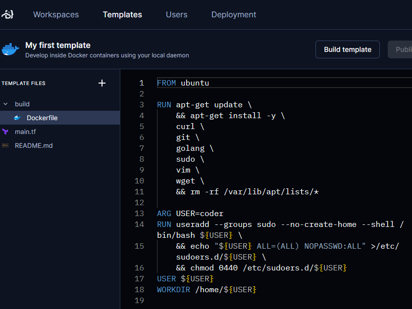

Edit `build/Dockerfile` to replace `golang` with `python3`.

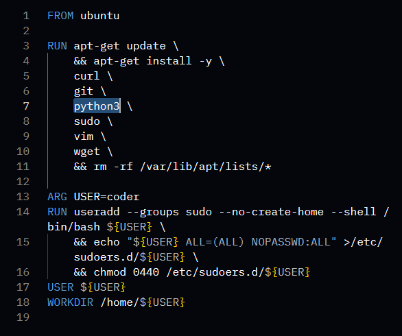

Select **Build template** and wait for Coder to prepare the template for
workspaces.

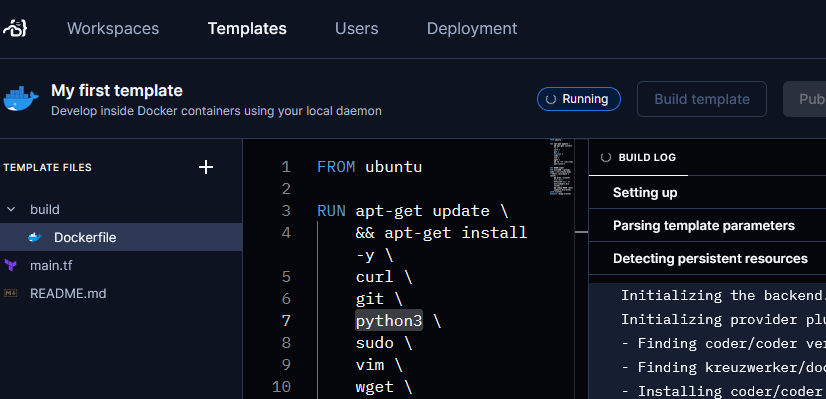

Select **Publish version**. In the **Publish new version** dialog, make sure
**Promote to default version** is checked then select **Publish**.

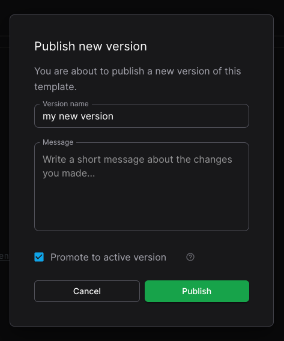

Now when developers create a new workspace from this template, they can use
Python 3 instead of Go.

For developers with workspaces that were created with a previous version of your
template, Coder will notify them that there's a new version of the template.

You can also handle [change management](./change-management.md) through your own
repo and continuous integration.

## Next steps

- [Write your own template](./tour.md)
- [Setting up templates](./best-practices.md)
