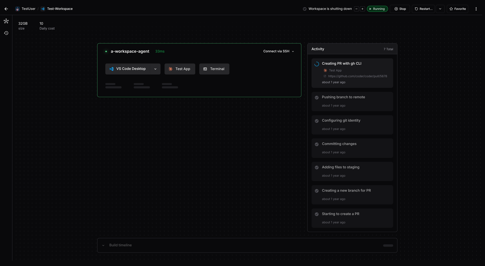

# Run AI Agents in Coder (Early Access)

> [!NOTE]
>
> This functionality is in early access and subject to change. Do not run in
> production as it is unstable. Instead, deploy these changes into a demo or
> staging environment.
>
> Join our [Discord channel](https://discord.gg/coder) or
> [contact us](https://coder.com/contact) to get help or share feedback.

AI Coding Agents such as [Claude Code](https://docs.anthropic.com/en/docs/agents-and-tools/claude-code/overview), [Goose](https://block.github.io/goose/), and [Aider](https://github.com/paul-gauthier/aider) are becoming increasingly popular for:

- Protyping web applications or landing pages
- Researching / onboarding to a codebase
- Assisting with lightweight refactors
- Writing tests and documentation
- Small, well-defined chores

With Coder, you can self-host AI agents in isolated development environments with proper context and tooling around your existing developer workflows. Whether you are a regulated enterprise or an individual developer, running AI agents at scale with Coder is much more productive and secure than running them locally.

## Prerequisites

Coder is free and open source for developers, with a [premium plan](https://coder.com/pricing) for enterprises. You can self-host a Coder deployment in your own cloud provider.

- A [Coder deployment](../../install/) with v2.21.0 or later
- A Coder [template](../../admin/templates/) for your project(s).
- Access to at least one ML model (e.g. Anthropic Claude, Google Gemini, OpenAI)
  - Cloud Model Providers (AWS Bedrock, GCP Vertex AI, Azure OpenAI) are supported with some agents
  - Self-hosted models (e.g. llama3) and AI proxies (OpenRouter) are supported with some agents

## Table of Contents

<children></chilren>
