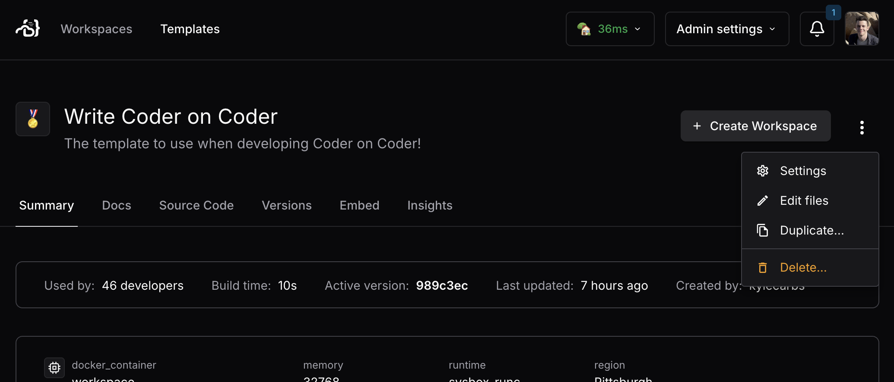

# Create a Coder template for agents

> [!NOTE]
>
> This functionality is in early access and subject to change. Do not run in
> production as it is unstable. Instead, deploy these changes into a demo or
> staging environment.
>
> Join our [Discord channel](https://discord.gg/coder) or
> [contact us](https://coder.com/contact) to get help or share feedback.

## Overview

This tutorial will guide you through the process of creating a Coder template
for agents.

## Prerequisites

- A Coder deployment with v2.21 or later
- A template that is pre-configured for your projects
- You have selected an [agent](./agents.md) based on your needs

## 1. Duplicate an existing template

It is best to create a seperate template for AI agents based on an existing
template that has all of the tools and dependencies installed.

This can be done in the Coder UI:

## 2. Add a module for supported agents

We currently publish a module for Claude Code and Goose. Additional modules are
[coming soon](./agents.md).

- [Add the Claude Code module](https://registry.coder.com/modules/claude-code)
- [Add the Goose module](https://registry.coder.com/modules/goose)

Follow the instructions in the Coder Registry to install the module. Be sure to
enable the `experiment_use_screen` and `experiment_report_tasks` variables to
report status back to the Coder control plane.

> Alternatively, you can report status from a custom agent back to the Coder
> control plane via our MCP server. For more information,
> [join our Discord](https://discord.gg/coder) or
> [contact us](https://coder.com/contact).

## 3. Confirm tasks are streaming in the Coder UI

The Coder dashboard should now show tasks being reported by the agent.

## Next Steps

- [Integrate with your issue tracker](./issue-tracker.md)
