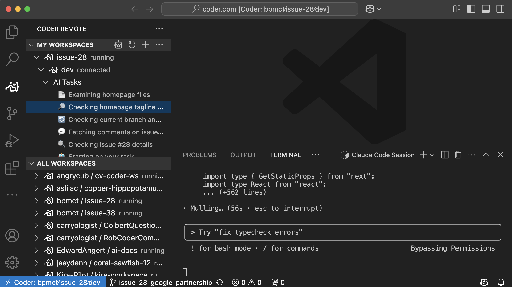

> [!NOTE]
>
> This functionality is in early access and subject to change. Do not run in
> production as it is unstable. Instead, deploy these changes into a demo or
> staging environment.
>
> Join our [Discord channel](https://discord.gg/coder) or
> [contact us](https://coder.com/contact) to get help or leave feedback.

## Prerequisites

- A Coder deployment with v2.21 or later
- A [template configured for AI agents](./create-template.md)
- VS Code, Windsurf, or Cursor IDE with the
  [Coder Extension](https://github.com/coder/vscode-coder/releases) v1.6.0+

## Overview

Once you have an agent running and reporting activity to Coder, you view status
and switch between workspaces from the IDE. This can be very helpful for
reviewing code, working along with the agent, and more.

## Next Steps

- [Programatically manage agents](./headless.md)
- [Securing Agents with Boundaries](./securing.md)
