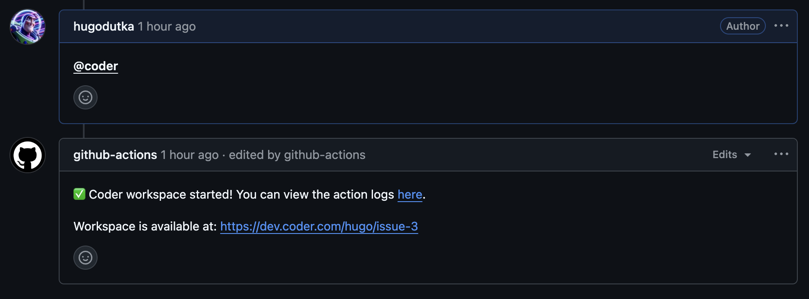
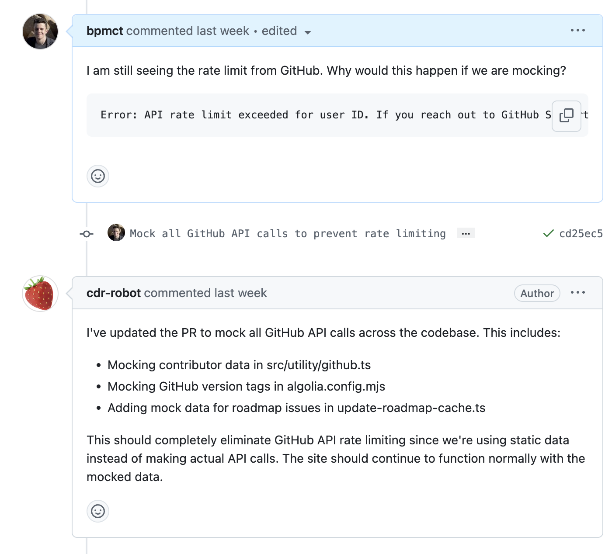

# Create a Coder template for agents

> [!NOTE]
>
> This functionality is in early access and subject to change. Do not run in
> production as it is unstable. Instead, deploy these changes into a demo or
> staging environment.
>
> Join our [Discord channel](https://discord.gg/coder) or
> [contact us](https://coder.com/contact) to get help or share feedback.

## Overview

Coder has first-class support for GitHub issues and pull requests, but can also
integrate with other issue trackers.

## Prerequisites

- A Coder deployment with v2.21 or later
- A [template configured for AI agents](./create-template.md)

## GitHub

### GitHub Action

The [start-workspace](https://github.com/coder/start-workspace-action) GitHub
action will create a Coder workspace based on a specific comment (e.g.
`@coder`).

When properly configured with an [AI template](./create-template.md), the agent
will begin working on the issue.

### Pull Request Support (Coming Soon)

We're working on adding support for an agent automatically creating pull
requests and responding to your comments. Check back soon or
[join our Discord](https://discord.gg/coder) to stay updated.

## Integrating with Other Issue Trackers

While support for other issue trackers is under consideration, you can can use
the [REST API](../../reference/api/) or [CLI](../../reference/cli/) to integrate
with other issue trackers or CI pipelines.

In addition, an [Open in Coder](../../admin/templates/open-in-coder.md) flow can
be used to generate a URL and/or markdown button in your issue tracker to
automatically create a workspace with specific parameters.

## Next Steps

- [Best practices & adding tools via MCP](./best-practices.md)
- [Supervise Agents in the UI](./coder-dashboard.md)
- [Supervise Agents in the IDE](./ide-integration.md)
- [Supervise Agents Programatically](./headless.md)
- [Securing Agents with Boundaries](./securing.md)
