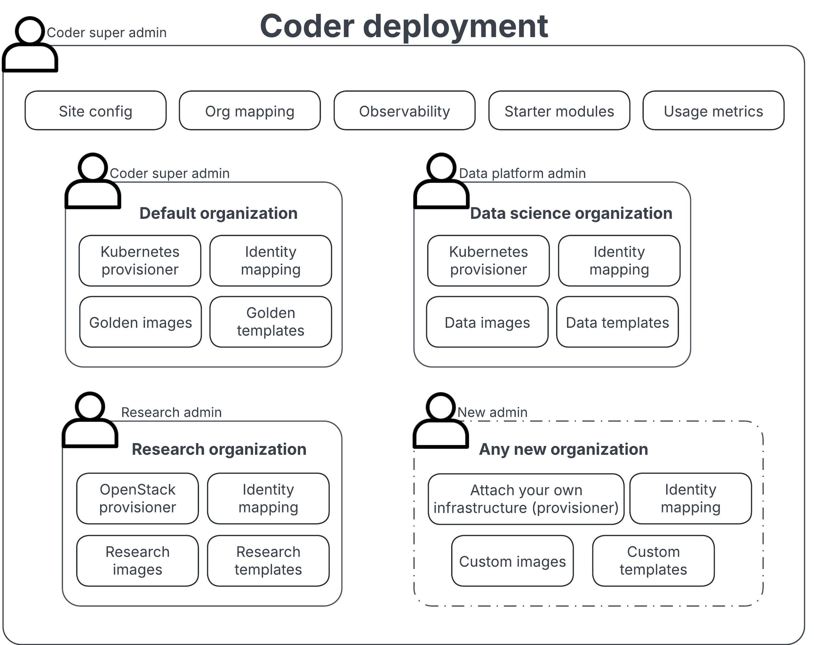

# Organizations - best practices

---

Coder [Organizations](../../admin/users/organizations.md) allow administrators
finer control over groups, templates, workspaces, and provisioners within their
Coder deployment.

Organizations allow multiple platform teams to offer templates and
infrastructure to their users instead of having them entirely managed in a
centralized fashion.

Each organization can have its own unique admin and users can belong to multiple
organizations, but every organization must have separate templates,
provisioners, groups, and workspaces.

On this best practice page, we cover some of the ways you can use Organizations
to make it easier to manage your groups smoothly.

## How Coder organizations work

Organizations are the hierarchical parent for templates, groups, and
provisioners. Every new organization must have separate templates, provisioners,
and groups.

Users can belong to multiple organizations while templates and provisioners
cannot.

## When to use organizations

Organizations increase the maintenance overhead of a Coder deployment, so we
recommend that you only use them when necessary.

Use organizations when a separate group of users needs to manage their own
templates and underlying infrastructure. If a group of users already has a
separate, functional platform team willing to write templates or manage
clusters, organizations may be a good fit.

### Organization use case examples

Here are a few examples for a fictional organization called MegaCo. It is
deployed with Coder and has 1000 users in production. Today, MegaCo has a single
(default) organization and a central platform team but is evaluating whether to
use organizations for several use cases.

| **Use Case**                                                                         | **Description**                                                                                                                                                                                                                                                                                                                                                                 | **Good fit for organizations?**                                                                        |
|--------------------------------------------------------------------------------------|---------------------------------------------------------------------------------------------------------------------------------------------------------------------------------------------------------------------------------------------------------------------------------------------------------------------------------------------------------------------------------|--------------------------------------------------------------------------------------------------------|
| Mergers and acquisitions                                                             | Raptix, a 180-person startup recently acquired by MegaCo, has an independent cloud account, platform team, and Terraform modules and pipelines for deploying their code. They want to use Coder.                                                                                                                                                                                | ✅ Organizations                                                                                        |
| Independent cloud-native teams that manage their namespaces, images, and/or clusters | MegaCo has six teams responsible for their own dev, staging, and production Kubernetes clusters and frequently deploy & test their work with `kubectl` and `helm`.  They wish to hook up Coder to their cluster so they can write and manage IDE templates for connecting to the cluster with their IDE                                                                 | ✅ Organizations                                                                                        |
| Java monolith                                                                        | MegaCo has identified that anyone developing the Java monolith is best served with a VM instead of a container/cloud-native environment.  However, the Java team is supported by MegaCo's central platform team.                                                                                                                                                        | ❌ Use instead: A separate template and/or groups                                                   |
| Off-shore contractors                                                                | MegaCo employs off-shore contractors but has not onboarded them onto Coder due to privacy concerns, data sovereignty rules, and latency considerations.  They considered a minimal, localized second deployment of Coder, but decided against it due to maintenance overhead.                                                                                           | ✅ Organizations + Workspace Proxies                                                                    |
| Dev teams                                                                            | Dev teams often need to bring their requirements for dev environments, such as specific repositories and tools                                                                                                                                                                                                                                                                  | ❌ Use instead: Parameters, dev containers, and/or groups                                           |
| ML Platform Team & ML Developers                                                     | MegaCo's data platform team maintains a homegrown "MLBox" product for data environments with a GPU, Jupyter, etc.  This team is interested in migrating to Coder for improved cost-saving and auditing of environments, but they need to hook up their own cluster and cloud accounts. They also want their templates only to be accessible to a specific set of users. | ✅ Organizations                                                                                        |
| Supporting developers in various regions                                             | MegaCo's central platform team supports developers connecting from the East Coast, the West Coast, and Australia. These developers are working on the same projects but need low-latency access to their environments.                                                                                                                                                          | ❌ Use instead: Provisioners and workspace proxies to support multiple regions on a single template |

## How to migrate to organizations

Since templates and workspaces cannot be moved nor can they belong to multiple
organizations, we recommend that you deprecate your template
[through the API](../../reference/api/templates.md#update-template-metadata-by-id)
or [through the Coder CLI](../../reference/cli/templates_edit.md#--deprecated).
When a template is deprecated, the admin prevents new workspaces from being
created and developers are notified with a deprecation message which can link to
an external wiki page on migration instructions.

Users can use a file transfer tool such as
[rsync](https://linux.die.net/man/1/rsync) to migrate their files from one
workspace to another.

## Provisioner Isolation and Zero Trust

In the organizations model, provisioners run in a separate
cluster/infrastructure and have an isolated key to authenticate back with Coder.
The provisioners have access to separate cloud resources that the control plane
cannot access. Instead, the control plane sends simple "provisioner jobs" to the
provisioner and the provisioner is responsible for executing the Terraform.

There are planned improvements to the troubleshooting provisioners process.
Follow this GitHub issue for more details:

- [coder/coder#15192](https://github.com/coder/coder/issues/15192)

## Identity Provider (SSO) Sync

While the Coder UI or API can be used to assign specific users to organizations,
this is discouraged. Instead, we recommend syncing the state from your identity
provider such as Okta. A single claim from the identity provider (like
`memberOf`) can be used to sync site-wide roles, organizations, groups, and
organization roles.

Regex filters and mapping can be configured to ensure the proper resources are
allocated in Coder. Learn more about [IDP sync](../../admin/users/idp-sync.md).

## Custom Roles

Custom roles are organization-scoped and can be used to limit access controls
within an organization. Custom roles can be applied to the default organization.

Some examples of custom roles that can be created:

### Provisioner Admin

- The user can deploy provisioners but not manage templates. This may be useful
  if automation is used to create and update templates in the organization.

### Template Editor

- Inverse of provisioner admin: User can manage templates but not deploy
  provisioners. This may be useful if the provisioner and template are deployed
  via automation and users are allowed to edit them.

### Template Pusher

- A system account that can push new templates from a git repo but cannot manage
  users or delete templates.

We’re interested in identifying new use cases for custom roles. Please
[create a GitHub issue](https://github.com/coder/internal/issues/new?title=request%28orgs%29%3A+request+title+here&labels=["customer-feedback"]&body=please+enter+your+request+here)
with your suggestion or request.

## Managing Organizations at Scale

Using ClickOps to onboard new organizations, set quotas, and SSO sync can be
cumbersome, especially if you want to "seed" organizations with provisioners and
starter templates.

Support for managing Organizations via the coderd Terrafom provider is planned
so that this can be done declaratively and bulk updates to things like templates
and quotas can be performed easily:

- Issue
  [coder/terraform-provider-coderd#39](https://github.com/coder/terraform-provider-coderd/issues/39)
