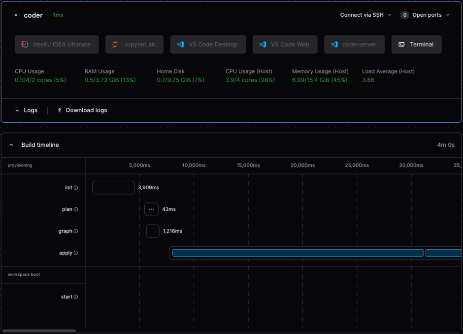

# Speed up your Coder templates and workspaces

October 31, 2024

---

If it takes your workspace a long time to start, find out why and make some
changes to your Coder templates to help speed things up.

## Monitoring

You can monitor [Coder logs](../../admin/monitoring/logs.md) through the
system-native tools on your deployment platform, or stream logs to tools like
Splunk, Datadog, Grafana Loki, and others.

### Workspace build timeline

Use the **Build timeline** to monitor the time it takes to start specific
workspaces. Identify long scripts, resources, and other things you can
potentially optimize within the template.



You can also retrieve this detail programmatically from the API:

```shell
curl -X GET https://coder.example.com/api/v2/workspacebuilds/{workspacebuild}/timings \
  -H 'Accept: application/json' \
  -H 'Coder-Session-Token: API_KEY'
```

Visit the
[API documentation](../../reference/api/builds.md#get-workspace-build-timings-by-id)
for more information.

### Coder Observability Chart

Use the [Observability Helm chart](https://github.com/coder/observability) for a
pre-built set of dashboards to monitor your Coder deployments over time. It
includes pre-configured instances of Grafana, Prometheus, Loki, and Alertmanager
to ingest and display key observability data.

We recommend that all administrators deploying on Kubernetes or on an existing
Prometheus or Grafana stack set the observability bundle up with the control
plane from the start. For installation instructions, visit the
[observability repository](https://github.com/coder/observability?tab=readme-ov-file#installation),
or our [Kubernetes installation guide](../../install/kubernetes.md).

### Enable Prometheus metrics for Coder

Coder exposes a variety of
[application metrics](../../admin/integrations/prometheus.md#available-metrics),
such as `coderd_provisionerd_job_timings_seconds` and
`coderd_agentstats_startup_script_seconds`, which measure how long the
workspaces take to provision and how long the startup scripts take.

To make use of these metrics, you will need to
[enable Prometheus metrics](../../admin/integrations/prometheus.md#enable-prometheus-metrics)
exposition.

If you are not using the [Observability Chart](#coder-observability-chart), you
will need to install Prometheus and configure it to scrape the metrics from your
Coder installation.

## Provisioners

`coder server` by default provides three built-in provisioner daemons
(controlled by the
[`CODER_PROVISIONER_DAEMONS`](../../reference/cli/server.md#--provisioner-daemons)
config option). Each provisioner daemon can handle one single job (such as
start, stop, or delete) at a time and can be resource intensive. When all
provisioners are busy, workspaces enter a "pending" state until a provisioner
becomes available.

### Increase provisioner daemons

Provisioners are queue-based to reduce unpredictable load to the Coder server.
If you require a higher bandwidth of provisioner jobs, you can do so by
increasing the
[`CODER_PROVISIONER_DAEMONS`](../../reference/cli/server.md#--provisioner-daemons)
config option.

You risk overloading Coder if you use too many built-in provisioners, so we
recommend a maximum of five built-in provisioners per `coderd` replica. For more
than five provisioners, we recommend that you move to
[External Provisioners](../../admin/provisioners/index.md) and also consider
[High Availability](../../admin/networking/high-availability.md) to run multiple
`coderd` replicas.

Visit the
[CLI documentation](../../reference/cli/server.md#--provisioner-daemons) for
more information about increasing provisioner daemons, configuring external
provisioners, and other options.

### Adjust provisioner CPU/memory

We recommend that you deploy Coder to its own respective Kubernetes cluster,
separate from production applications. Keep in mind that Coder runs development
workloads, so the cluster should be deployed as such, without production-level
configurations.

Adjust the CPU and memory values as shown in
[Helm provisioner values.yaml](https://github.com/coder/coder/blob/main/helm/provisioner/values.yaml#L134-L141):

```yaml
…
  resources:
    limits:
      cpu: "0.25"
      memory: "1Gi"
    requests:
      cpu: "0.25"
      memory: "1Gi"
…
```

Visit the
[validated architecture documentation](../../admin/infrastructure/validated-architectures/index.md#workspace-nodes)
for more information.

## Set up Terraform provider caching

### Template lock file

On each workspace build, Terraform will examine the providers used by the
template and attempt to download the latest version of each provider unless it
is constrained to a specific version. Terraform exposes a mechanism to build a
static list of provider versions, which improves cacheability.

Without caching, Terraform will download each provider on each build, and this
can create unnecessary network and disk I/O.

`terraform init` generates a `.terraform.lock.hcl` which instructs Coder
provisioners to cache specific versions of your providers.

To use `terraform init` to build the static provider version list:

1. Pull your template to your local device:

   ```shell
   coder templates pull <template>
   ```

1. Run `terraform init` inside the template directory to build the lock file:

   ```shell
   terraform init
   ```

1. Push the templates back to your Coder deployment:

   ```shell
   coder templates push <template>
   ```

This bundles up your template and the lock file and uploads it to Coder. The
next time the template is used, Terraform will attempt to cache the specific
provider versions.

### Cache directory

Coder will instruct Terraform to cache its downloaded providers in the
configured [`CODER_CACHE_DIRECTORY`](../../reference/cli/server.md#--cache-dir)
directory.

Ensure that this directory is set to a location on disk which will persist
across restarts of Coder or
[external provisioners](../../admin/provisioners/index.md), if you're using them.
