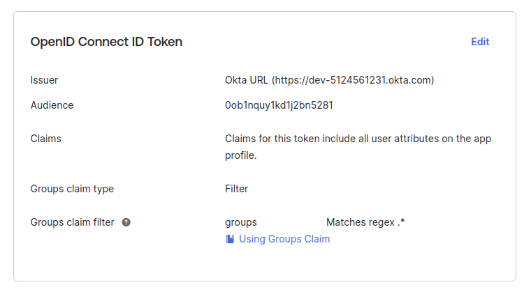
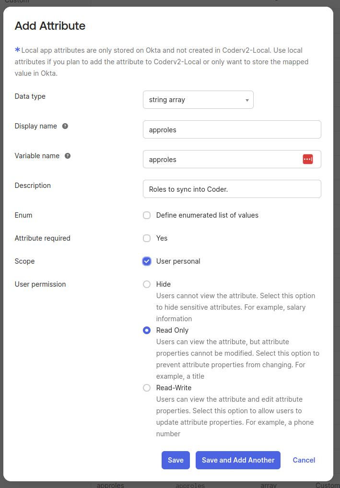
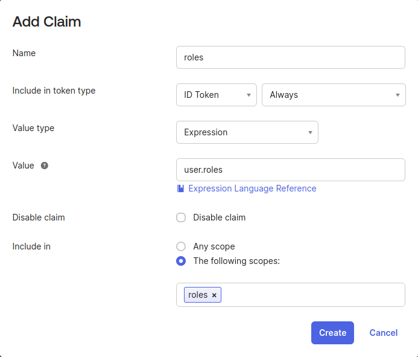
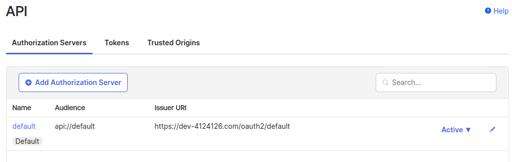
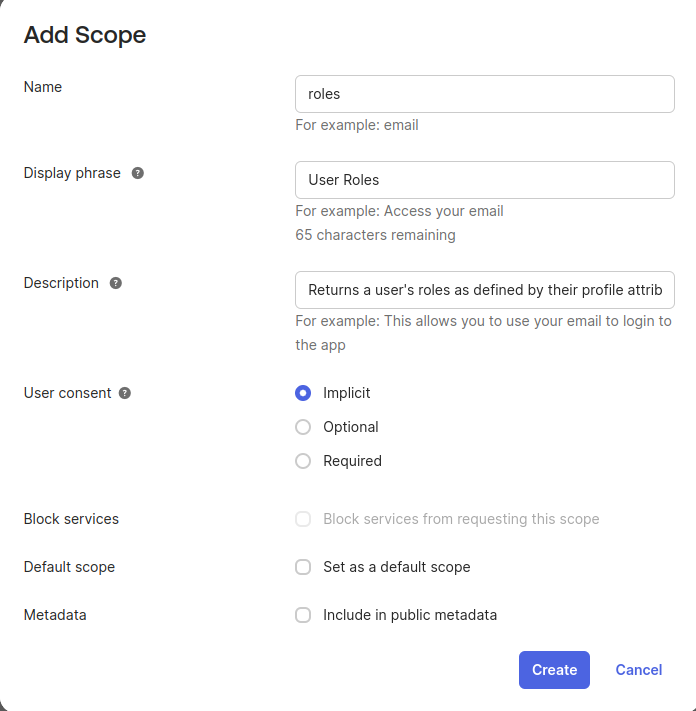
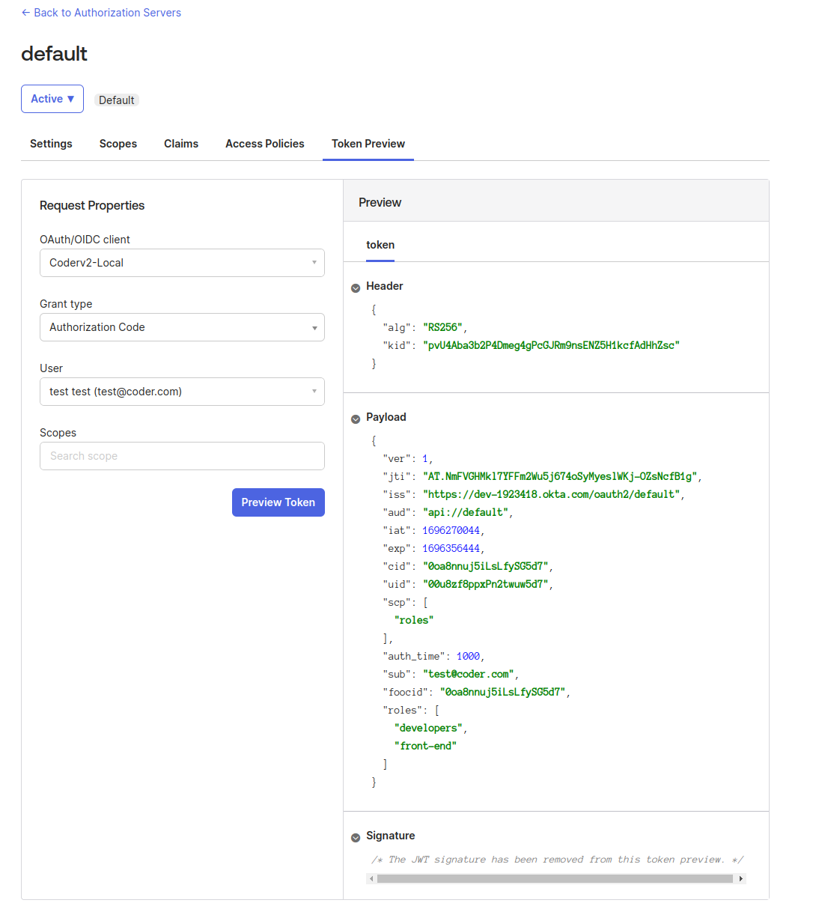

# Configuring Custom Claims/Scopes with Okta for group/role

<div style="pad: 0px; margin: 0px;">
  <span style="vertical-align:middle;">Author: </span>
  <a href="https://github.com/Emyrk" style="text-decoration: none; color: inherit; margin-bottom: 0px;">
    <span style="vertical-align:middle;">Steven Masley</span>
    
  </a>
</div>
December 13, 2023

---

Okta is an identity provider that can be used for OpenID Connect (OIDC) Single
Sign On (SSO) on Coder.

To configure custom claims in Okta to support syncing roles and groups with
Coder, you must first have setup an Okta application with
[OIDC working with Coder](../admin/users/oidc-auth.md).
From here, we will add additional claims for Coder to use for syncing groups and
roles.

You may use a hybrid of the following approaches.

## (Easiest) Sync using Okta Groups

If the Coder roles & Coder groups can be inferred from
[Okta groups](https://help.okta.com/en-us/content/topics/users-groups-profiles/usgp-about-groups.htm),
Okta has a simple way to send over the groups as a `claim` in the `id_token`
payload.

In Okta, go to the application “Sign On” settings page.

Applications > Select Application > General > Sign On

In the “OpenID Connect ID Token” section, turn on “Groups Claim Type” and set
the “Claim name” to `groups`. Optionally configure a filter for which groups to
be sent.

> [!IMPORTANT]
> If the user does not belong to any groups, the claim will not be sent. Make
> sure the user authenticating for testing is in at least one group. Defer to
> [troubleshooting](../admin/users/index.md) with issues.



Configure Coder to use these claims for group sync. These claims are present in
the `id_token`. See all configuration options for group sync in the
[docs](https://coder.com/docs/admin/auth#group-sync-enterprise).

```bash
# Add the 'groups' scope.
CODER_OIDC_SCOPES=openid,profile,email,groups
# This name needs to match the "Claim name" in the configuration above.
CODER_OIDC_GROUP_FIELD=groups
```

These groups can also be used to configure role syncing based on group
membership.

```bash
# Requires the "groups" scope
CODER_OIDC_SCOPES=openid,profile,email,groups
# This name needs to match the "Claim name" in the configuration above.
CODER_OIDC_USER_ROLE_FIELD=groups
# Example configuration to map a group to some roles
CODER_OIDC_USER_ROLE_MAPPING='{"admin-group":["template-admin","user-admin"]}'
```

## (Easy) Mapping Okta profile attributes

If roles or groups cannot be completely inferred from Okta group memberships,
another option is to source them from a user’s attributes. The user attribute
list can be found in “Directory > Profile Editor > User (default)”.

Coder can query an Okta profile for the application from the `/userinfo` OIDC
endpoint. To pass attributes to Coder, create the attribute in your application,
then add a mapping from the Okta profile to the application.

“Directory > Profile Editor > {Your Application} > Add Attribute”

Create the attribute for the roles, groups, or both. **Make sure the attribute
is of type `string array`.**



On the “Okta User to {Your Application}” tab, map a `roles` or `groups`
attribute you have configured to the application.



Configure using these new attributes in Coder.

```bash
# This must be set to false. Coder uses this endpoint to grab the attributes.
CODER_OIDC_IGNORE_USERINFO=false
# No custom scopes are required.
CODER_OIDC_SCOPES=openid,profile,email
# Configure the group/role field using the attribute name in the application.
CODER_OIDC_USER_ROLE_FIELD=approles
# See our docs for mapping okta roles to coder roles.
CODER_OIDC_USER_ROLE_MAPPING='{"admin-group":["template-admin","user-admin"]}'

# If you added an attribute for groups, set that here.
# CODER_OIDC_GROUP_FIELD=...
```

## (Advanced) Custom scopes to retrieve custom claims

Okta does not support setting custom scopes and claims in the default
authorization server used by your application. If you require this
functionality, you must create (or modify) an authorization server.

To see your custom authorization servers go to “Security > API”. Note the
`default` authorization server **is not the authorization server your app is
using.** You can configure this default authorization server, or create a new
one specifically for your application.

Authorization servers also give more refined controls over things such as
token/session lifetimes.



To get custom claims working, we should map them to a custom scope. Click the
authorization server you wish to use (likely just using the default).

Go to “Scopes”, and “Add Scope”. Feel free to create one for roles, groups, or
both.



Now create the claim to go with the said scope. Go to “Claims”, then “Add
Claim”. Make sure to select **ID Token** for the token type. The **Value**
expression is up to you based on where you are sourcing the role information.
Lastly, configure it to only be a claim with the requested scope. This is so if
other applications exist, we do not send them information they do not care
about.


Now we have a custom scope + claim configured under an authorization server, we
need to configure coder to use this.

```bash
# Grab this value from the Authorization Server > Settings > Issuer
# DO NOT USE the application issuer URL. Make sure to use the newly configured
# authorization server.
CODER_OIDC_ISSUER_URL=https://dev-12222860.okta.com/oauth2/default
# Add the new scope you just configured
CODER_OIDC_SCOPES=openid,profile,email,roles
# Use the claim you just configured
CODER_OIDC_USER_ROLE_FIELD=roles
# See our docs for mapping okta roles to coder roles.
CODER_OIDC_USER_ROLE_MAPPING='{"admin-group":["template-admin","user-admin"]}'
```

You can use the “Token Preview” page to verify it has been correctly configured
and verify the `roles` is in the payload.


