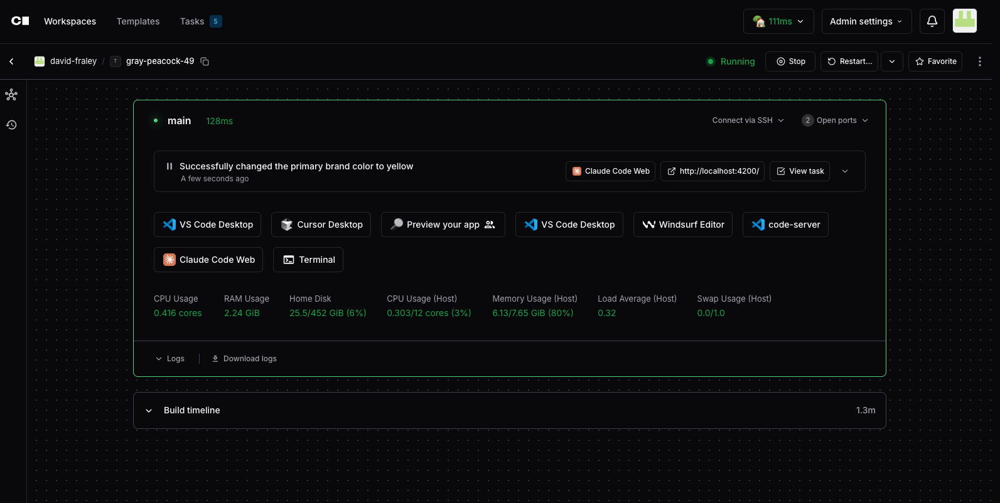

# Quickstart

Get your first Coder workspace running in under 10 minutes.

## Prerequisites

- A machine with 2+ CPU cores and 4GB+ RAM
- Docker installed and running

## Step 1: Install Docker

<div class="tabs">

### Linux/macOS

1. Install Docker:

   ```bash
   curl -sSL https://get.docker.com | sh
   ```

1. Add your user to the Docker group:

   ```shell
   sudo usermod -aG docker $USER && newgrp docker
   ```

### Windows

1. [Install Docker Desktop](https://docs.docker.com/desktop/install/windows-install/).

1. Install the
   [Visual C++ Runtime](https://learn.microsoft.com/en-US/cpp/windows/latest-supported-vc-redist#latest-microsoft-visual-c-redistributable-version)
   (required for the built-in PostgreSQL database).

</div>

## Step 2: Install & Start Coder

<div class="tabs">

### Linux/macOS

```shell
curl -L https://coder.com/install.sh | sh
coder server
```

For alternate installation methods, see the
[latest GitHub release](https://github.com/coder/coder/releases/latest).

### Windows

```powershell
winget install Coder.Coder
coder server
```

</div>

Open <http://localhost:3000> in your browser. If your server is on a remote
machine, find the tunnel URL in the terminal output
(`https://<ID>.try.coder.app`).

## Step 3: Create Your Admin Account

Create your first user account or select **Continue with GitHub**. The first
user is automatically granted admin permissions.


## Step 4: Create a Template and Workspace

1. Go to **Templates** → **New Template**.

1. Select **Docker Containers** and click **Use template**.

1. Name it (e.g. `quickstart`) and click **Save**.

   

1. Click **Create Workspace**, give it a name, and click **Create Workspace**.

   

## Step 5: Connect Your IDE

Click **VS Code Desktop** in the workspace dashboard to install the Coder
extension and connect. Once connected, use **Open Folder** or
**Clone Repository** to start working.


You're done! You now have a running Coder workspace accessible from VS Code.

## Optional: Run Coder Tasks with Claude Code

Coder Tasks let you run AI coding agents like Claude Code inside a workspace.

1. Get an [Anthropic API key](https://console.anthropic.com/).

1. Clone the registry and push the tasks template:

   ```shell
   git clone https://github.com/coder/registry.git
   cd registry/registry/coder-labs/templates/tasks-docker
   coder template push tasks-docker -d . --variable anthropic_api_key="your-api-key"
   ```

1. In your Coder deployment, go to **Tasks**, enter a prompt (e.g. "Make the
   background yellow"), select the **tasks-docker** template, and submit.

1. Click on your task to watch Claude Code work. You can interact with Claude
   Code in the left panel and preview the app on the right.

   

Learn more about [Coder Tasks](https://coder.com/docs/ai-coder/tasks) and
[best practices](https://coder.com/docs/ai-coder/best-practices).

## Next Steps

- [Workspace management](https://coder.com/docs/user-guides/workspace-management)
- [Monitoring your deployment](https://coder.com/docs/admin/monitoring)

## Troubleshooting

### Cannot connect to the Docker daemon

> Error: Cannot connect to the Docker daemon at
> unix:///var/run/docker.sock. Is the docker daemon running?

```shell
# Install Docker
curl -sSL https://get.docker.com | sh

# Run rootless setup
dockerd-rootless-setuptool.sh install

# Add user to docker group
sudo usermod -aG docker $USER
newgrp docker
```

### Address already in use

```shell
# Stop any existing Coder process
sudo systemctl stop coder

# Restart
coder server
```
