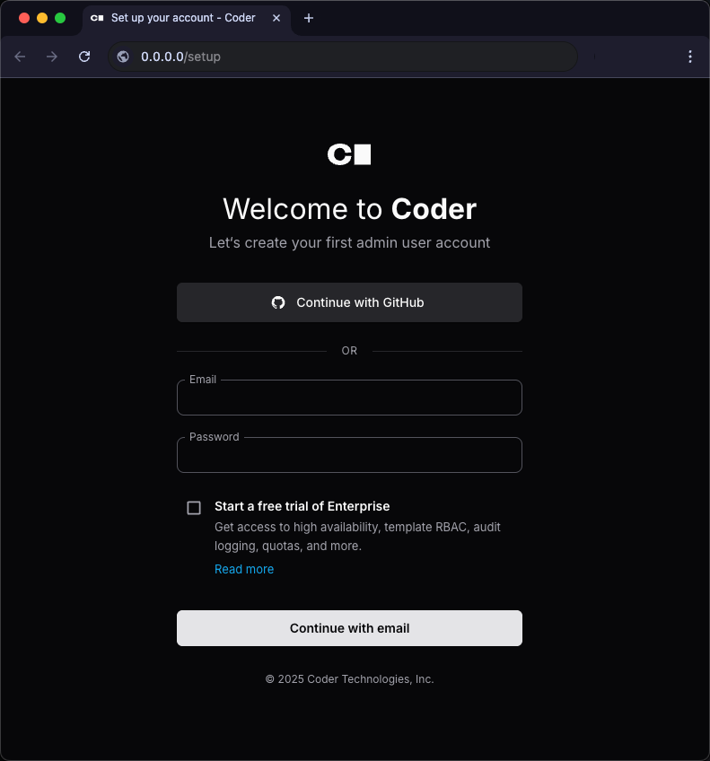
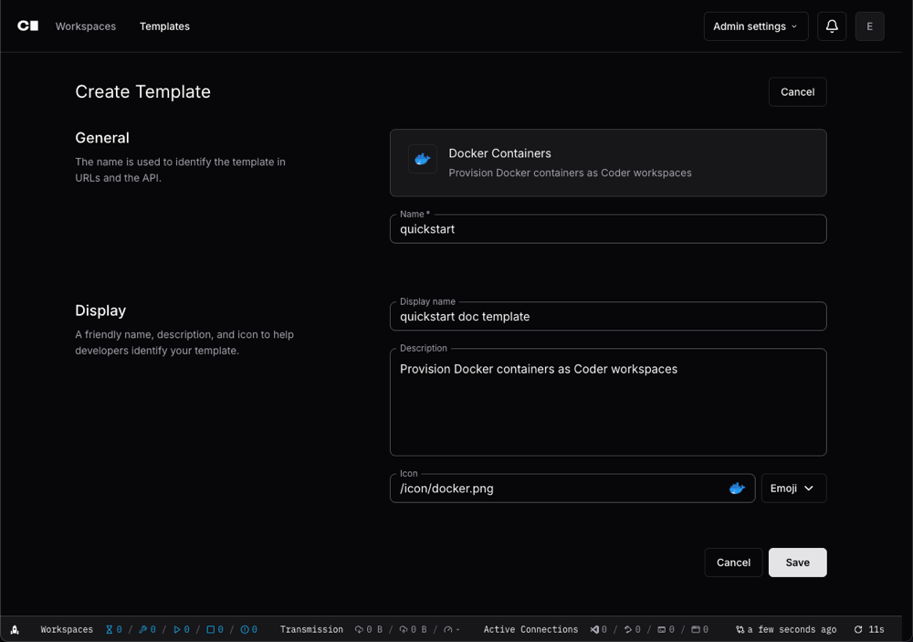
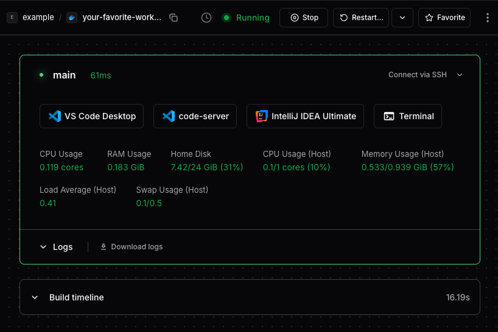
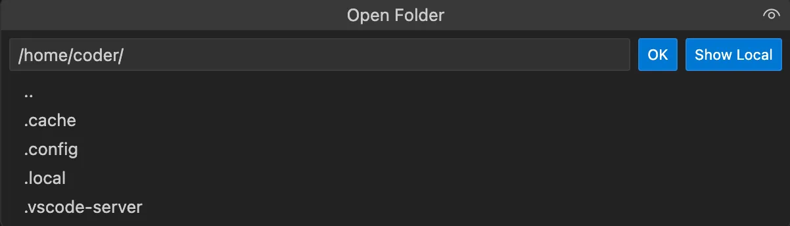

# Quickstart

Follow this guide to get your first Coder development environment
running in under 10 minutes. This guide covers the essential concepts and shows
you how to create your first workspace and run VS Code from it.

## What You'll Do

In this quickstart, you'll:

- ✅ Install Coder server
- ✅ Create a **template** (blueprint for dev environments)
- ✅ Launch a **workspace** (your actual dev environment)
- ✅ Connect from your favorite IDE

## Understanding Coder: 30-Second Overview

Before diving in, the following table breaks down the core concepts that power Coder,
explained through a cooking analogy:

| Component      | What It Is                                                                           | Real-World Analogy             |
|----------------|--------------------------------------------------------------------------------------|--------------------------------|
| **You**        | The engineer/developer/builder working                                               | The head chef cooking the meal |
| **Templates**  | A Terraform blueprint that defines your dev environment (OS, tools, resources)       | Recipe for a meal              |
| **Workspaces** | The actual running environment created from the template                             | The cooked meal                |
| **Users**      | A developer who launches the workspace from a template and does their work inside it | The people eating the meal     |

**Putting it Together:** Coder separates who _defines_ environments from who _uses_ them. Admins create and manage Templates, the recipes, while developers use those Templates to launch Workspaces, the meals.

## Prerequisites

- A machine with 2+ CPU cores and 4GB+ RAM
- Familiarity with running commands in the terminal
- 10 minutes of your time

## Step 1: Install Docker and Set Up Permissions

<div class="tabs">

### Linux

1. Install Docker:

   ```bash
   curl -sSL https://get.docker.com | sh
   ```

   For more details, visit [Docker's docs on installing Docker on Linux](https://docs.docker.com/desktop/install/linux-install/).

1. Assign your user to the Docker group:

   ```shell
   sudo usermod -aG docker $USER
   ```

1. Run `newgrp` to activate the groups changes:

   ```shell
   newgrp docker
   ```

   You might need to log out of and back into your machine or restart your
   machine for changes to take effect.

1. Launch the Docker daemon:

   ```shell
   sudo systemctl start docker
   ```

### macOS

1. [Install Docker](https://docs.docker.com/desktop/setup/install/mac-install/).
There is a Homebrew formula for the Docker command and a Homebrew cask of Docker
Desktop if you prefer:

   ```shell
   brew install --cask docker-desktop
   ```

1. Open Docker Desktop.

### Windows

If you plan to use the built-in PostgreSQL database, ensure that the
[Visual C++ Runtime](https://learn.microsoft.com/en-US/cpp/windows/latest-supported-vc-redist#latest-microsoft-visual-c-redistributable-version)
is installed.

1. [Install Docker](https://docs.docker.com/desktop/install/windows-install/).

1. Open Docker Desktop.

</div>

## Step 2: Install & Start Coder

Install the `coder` CLI to get started:

<div class="tabs">

### Linux/macOS

1. Install Coder:

   ```shell
   curl -L https://coder.com/install.sh | sh
   ```

   - For standalone binaries, system packages, or other alternate installation
     methods, refer to the
     [latest release on GitHub](https://github.com/coder/coder/releases/latest).

1. Start Coder:

   ```shell
   coder server
   ```

### Windows

If you plan to use the built-in PostgreSQL database, ensure that the
[Visual C++ Runtime](https://learn.microsoft.com/en-US/cpp/windows/latest-supported-vc-redist#latest-microsoft-visual-c-redistributable-version)
is installed.

1. Use the
   [`winget`](https://learn.microsoft.com/en-us/windows/package-manager/winget/#use-winget)
   package manager to install Coder:

   ```powershell
   winget install Coder.Coder
   ```

1. Start Coder:

   ```shell
   coder server
   ```

</div>

Coder will attempt to open the setup page in your browser. If it doesn't open
automatically, go to <http://localhost:3000>.

- If you get a browser warning similar to `Secure Site Not Available`, you can
  ignore the warning and continue to the setup page.

If your Coder server is on a network or cloud device, or you are having trouble
viewing the page, locate the web UI URL in Coder logs in your terminal. It looks
like `https://<CUSTOM-STRING>.<TUNNEL>.try.coder.app`. It's one of the first
lines of output, so you might have to scroll up to find it.

## Step 3: Initial Setup

1. Create your admin account:
   - Email: `your.email@example.com`
   - Password: Choose a strong password.

   You can also choose to **Continue with GitHub** instead of creating an admin
   account. Coder automatically grants admin permissions to the first user that signs in.

   

## Step 4: Create your First Template and Workspace

> [!TIP]
> If you use an AI coding assistant, the [coder-templates](https://github.com/coder/registry/blob/main/.agents/skills/coder-templates/SKILL.md) agent skill can guide you through creating and customizing templates with best practices built-in.

Templates define what's in your development environment. Let's start simple:

1. Click **"Templates"** → **"New Template"**

1. Choose a starter template:

   | Starter                             | Best For                                                | Includes                                               |
   |-------------------------------------|---------------------------------------------------------|--------------------------------------------------------|
   | **Docker Containers** (Recommended) | Getting started quickly, local development, prototyping | Ubuntu container with common dev tools, Docker runtime |
   | **Kubernetes (Deployment)**         | Cloud-native teams, scalable workspaces                 | Pod-based workspaces, Kubernetes orchestration         |
   | **AWS EC2 (Linux)**                 | Teams needing full VMs, AWS-native infrastructure       | Full EC2 instances with AWS integration                |

1. Click **"Use template"** on **Docker Containers**. **Note:** running this template requires Docker to be running in the background, so make sure Docker is running!

1. Name your template:
   - Name: `quickstart`
   - Display name: `quickstart doc template`
   - Description: `Provision Docker containers as Coder workspaces`

1. Click **"Save"**

   

**What just happened?** You defined a template — a reusable blueprint for dev
environments — in your Coder deployment. It's now stored in your organization's
template list, where you and any teammates in the same org can create workspaces
from it. Let's launch one.

## Step 5: Launch your Workspace

1. After the template is ready, select **Create Workspace**.

1. Give the workspace a name and select **Create Workspace**.

1. Coder starts your new workspace:

   _Workspace
   is running_

## Step 6: Connect your IDE

Select **VS Code Desktop** to install the Coder extension and connect to your
Coder workspace.

After VS Code loads the remote environment, you can select **Open Folder** to
explore directories in the Docker container or work on something new.



To clone an existing repository:

1. Select **Clone Repository** and enter the repository URL.

   For example, to clone the Coder repo, enter
   `https://github.com/coder/coder.git`.

   Learn more about how to find the repository URL in the
   [GitHub documentation](https://docs.github.com/en/repositories/creating-and-managing-repositories/cloning-a-repository).

1. Choose the folder to which VS Code should clone the repo. It will be in its
   own directory within this folder.

   Note that you cannot create a new parent directory in this step.

1. After VS Code completes the clone, select **Open** to open the directory.

1. You are now using VS Code in your Coder environment!

## Success! You're Coding in Coder

You now have:

- **Coder server** running locally
- **A template** defining your environment
- **A workspace** running that environment
- **IDE access** to code remotely

### What's Next?

Now that you have your own workspace running, you can start exploring more
advanced capabilities that Coder offers.

- [Try Coder Agents](../ai-coder/agents/getting-started.md), the chat
  interface and API for delegating development work to coding agents in your
  Coder deployment.

- [Read about managing Workspaces for your team](../user-guides/workspace-management.md)

- [Read about implementing monitoring tools for your Coder Deployment](../admin/monitoring/index.md)

## Troubleshooting

### Cannot connect to the Docker daemon on Linux

```text
Error: Error pinging Docker server: Cannot connect to the Docker daemon at unix:///var/run/docker.sock. Is the docker daemon running?
```

1. Install Docker for your system, if you haven't already done so:

   ```shell
   curl -sSL https://get.docker.com | sh
   ```

1. Set up the Docker daemon in rootless mode for your user to run Docker as a
   non-privileged user:

   ```shell
   dockerd-rootless-setuptool.sh install
   ```

   Depending on your system's dependencies, you might need to run other commands
   before you retry this step. Read the output of this command for further
   instructions.

1. Assign your user to the Docker group:

   ```shell
   sudo usermod -aG docker $USER
   ```

1. Confirm that the user has been added:

   ```console
   $ groups
   docker sudo users
   ```

   - Ubuntu users might not see the group membership update. In that case, run
     the following command or reboot the machine:

     ```shell
     newgrp docker
     ```

### Can't start Coder server: Address already in use

```shell
Encountered an error running "coder server", see "coder server --help" for more information
error: configure http(s): listen tcp 127.0.0.1:3000: bind: address already in use
```

Another process is already listening on port 3000. Identify and stop it,
then start the server again.

#### Linux

1. Stop the process:

   ```shell
   sudo systemctl stop coder
   ```

1. Start Coder:

   ```shell
   coder server
   ```

#### macOS

1. Identify the process using port 3000:

   ```shell
   lsof -i :3000
   ```

1. Stop the process using the PID from the previous command:

   ```shell
   kill <PID>
   ```

   If the process does not exit, force-kill it:

   ```shell
   kill -9 <PID>
   ```

1. Start Coder:

   ```shell
   coder server
   ```

#### Windows

1. Identify the process using port 3000 in PowerShell:

   ```powershell
   Get-NetTCPConnection -LocalPort 3000 | Select-Object OwningProcess
   ```

1. Stop the process using the PID from the previous command:

   ```powershell
   Stop-Process -Id <PID>
   ```

1. Start Coder:

   ```shell
   coder server
   ```
