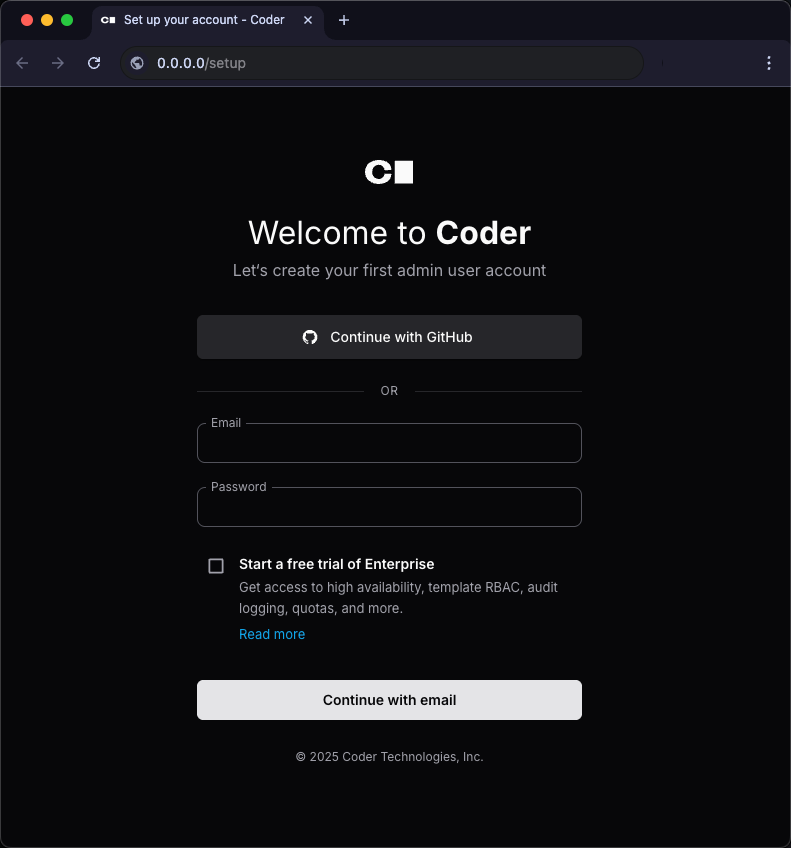
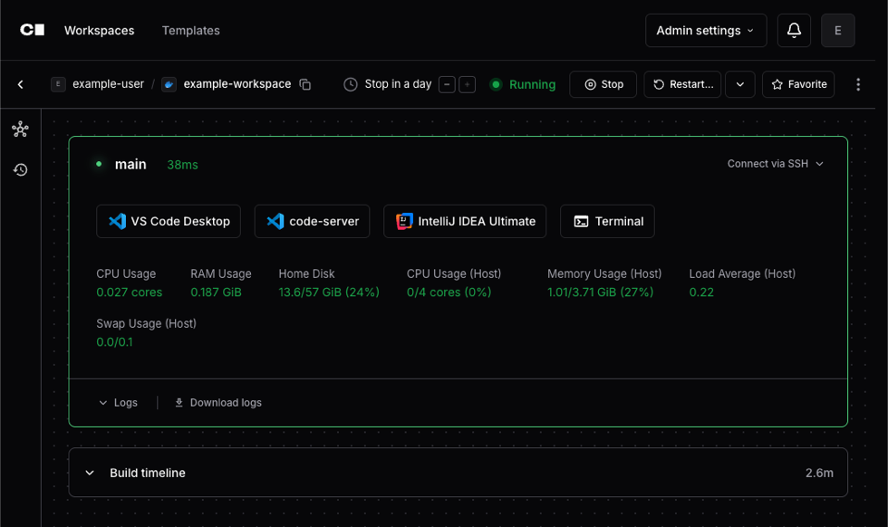

# Quickstart

Follow the steps in this guide to get your first Coder development environment
running in under 10 minutes. This guide covers the essential concepts and walks
you through creating your first workspace and running VS Code from it. You can
also get Claude Code up and running in the background!

## What You'll Build

In this quickstart, you'll:

- ✅ Install Coder server
- ✅ Create a **template** (blueprint for dev environments)
- ✅ Launch a **workspace** (your actual dev environment)
- ✅ Connect from your favorite IDE
- ✅ Optionally setup a **task** running Claude Code

## Understanding Coder: 30-Second Overview

Before diving in, here are the core concepts that power Coder explained through
a cooking analogy:

| Component      | What It Is                                                                           | Real-World Analogy                          |
|----------------|--------------------------------------------------------------------------------------|---------------------------------------------|
| **You**        | The engineer/developer/builder working                                               | The head chef cooking the meal              |
| **Templates**  | A Terraform blueprint that defines your dev environment (OS, tools, resources)       | Recipe for a meal                           |
| **Workspaces** | The actual running environment created from the template                             | The cooked meal                             |
| **Tasks**      | AI-powered coding agents that run inside a workspace                                 | Smart kitchen appliance that helps you cook |
| **Users**      | A developer who launches the workspace from a template and does their work inside it | The people eating the meal                  |

**Putting it Together:** Coder separates who _defines_ environments from who _uses_ them. Admins create and manage Templates, the recipes, while developers use those Templates to launch Workspaces, the meals. Inside those Workspaces, developers can also run Tasks, the smart kitchen appliance, to help speed up day-to-day work.

## Prerequisites

- A machine with 2+ CPU cores and 4GB+ RAM
- 10 minutes of your time

## Step 1: Install Docker and Setup Permissions

<div class="tabs">

### Linux/macOS

1. Install Docker:

   ```bash
   curl -sSL https://get.docker.com | sh
   ```

   For more details, visit:
   - [Linux instructions](https://docs.docker.com/desktop/install/linux-install/)
   - [Mac instructions](https://docs.docker.com/desktop/install/mac-install/)

1. Assign your user to the Docker group:

   ```shell
   sudo usermod -aG docker $USER
   ```

1. Run `newgrp` to activate the groups changes:

   ```shell
   newgrp docker
   ```

   You might need to log out and back in or restart the machine for changes to
   take effect.

### Windows

If you plan to use the built-in PostgreSQL database, ensure that the
[Visual C++ Runtime](https://learn.microsoft.com/en-US/cpp/windows/latest-supported-vc-redist#latest-microsoft-visual-c-redistributable-version)
is installed.

1. [Install Docker](https://docs.docker.com/desktop/install/windows-install/).

</div>

## Step 2: Install & Start Coder

Install the `coder` CLI to get started:

<div class="tabs">

### Linux/macOS

1. Install Coder:

   ```shell
   curl -L https://coder.com/install.sh | sh
   ```

   - For standalone binaries, system packages, or other alternate installation
     methods, refer to the
     [latest release on GitHub](https://github.com/coder/coder/releases/latest).

1. Start Coder:

   ```shell
   coder server
   ```

### Windows

If you plan to use the built-in PostgreSQL database, ensure that the
[Visual C++ Runtime](https://learn.microsoft.com/en-US/cpp/windows/latest-supported-vc-redist#latest-microsoft-visual-c-redistributable-version)
is installed.

1. Use the
   [`winget`](https://learn.microsoft.com/en-us/windows/package-manager/winget/#use-winget)
   package manager to install Coder:

   ```powershell
   winget install Coder.Coder
   ```

1. Start Coder:

   ```shell
   coder server
   ```

</div>

Coder will attempt to open the setup page in your browser. If it doesn't open
automatically, go to <http://localhost:3000>.

- If you get a browser warning similar to `Secure Site Not Available`, you can
  ignore the warning and continue to the setup page.

If your Coder server is on a network or cloud device, or you are having trouble
viewing the page, locate the web UI URL in Coder logs in your terminal. It looks
like `https://<CUSTOM-STRING>.<TUNNEL>.try.coder.app`. It's one of the first
lines of output, so you might have to scroll up to find it.

## Step 3: Initial Setup

1. **Create your admin account:**
   - Username: `yourname` (lowercase, no spaces)
   - Email: `your.email@example.com`
   - Password: Choose a strong password

   You can also choose to **Continue with GitHub** instead of creating an admin
   account. The first user that signs in is automatically granted admin
   permissions.

   

## Step 4: Create your First Template and Workspace

Templates define what's in your development environment. Let's start simple:

1. Click **"Templates"** → **"New Template"**

1. **Choose a starter template:**

   | Starter                             | Best For                                                | Includes                                               |
   |-------------------------------------|---------------------------------------------------------|--------------------------------------------------------|
   | **Docker Containers** (Recommended) | Getting started quickly, local development, prototyping | Ubuntu container with common dev tools, Docker runtime |
   | **Kubernetes (Deployment)**         | Cloud-native teams, scalable workspaces                 | Pod-based workspaces, Kubernetes orchestration         |
   | **AWS EC2 (Linux)**                 | Teams needing full VMs, AWS-native infrastructure       | Full EC2 instances with AWS integration                |

1. Click **"Use template"** on **Docker Containers**. Note: running this template requires Docker to be running in the background, so make sure Docker is running!

1. **Name your template:**
   - Name: `quickstart`
   - Display name: `quickstart doc template`
   - Description: `Provision Docker containers as Coder workspaces`

1. Click **"Save"**

   

**What just happened?** You defined a template — a reusable blueprint for dev
environments — in your Coder deployment. It's now stored in your organization's
template list, where you and any teammates in the same org can create workspaces
from it. Let's launch one.

## Step 5: Launch your Workspace

1. After the template is ready, select **Create Workspace**.

1. Give the workspace a name and select **Create Workspace**.

1. Coder starts your new workspace:

   _Workspace
   is running_

## Step 6: Connect your IDE

Select **VS Code Desktop** to install the Coder extension and connect to your
Coder workspace.

After VS Code loads the remote environment, you can select **Open Folder** to
explore directories in the Docker container or work on something new.


To clone an existing repository:

1. Select **Clone Repository** and enter the repository URL.

   For example, to clone the Coder repo, enter
   `https://github.com/coder/coder.git`.

   Learn more about how to find the repository URL in the
   [GitHub documentation](https://docs.github.com/en/repositories/creating-and-managing-repositories/cloning-a-repository).

1. Choose the folder to which VS Code should clone the repo. It will be in its
   own directory within this folder.

   Note that you cannot create a new parent directory in this step.

1. After VS Code completes the clone, select **Open** to open the directory.

1. You are now using VS Code in your Coder environment!

## Success! You're Coding in Coder

You now have:

- **Coder server** running locally
- **A template** defining your environment
- **A workspace** running that environment
- **IDE access** to code remotely

### What's Next?

Now that you have your own workspace running, you can start exploring more
advanced capabilities that Coder offers.

- [Learn more about running Coder Tasks and our recommended Best Practices](https://coder.com/docs/ai-coder/best-practices)

- [Read about managing Workspaces for your team](https://coder.com/docs/user-guides/workspace-management)

- [Read about implementing monitoring tools for your Coder Deployment](https://coder.com/docs/admin/monitoring)

### Get Coder Tasks Running

Coder Tasks is an interface that allows you to run and manage coding agents like
Claude Code within a given Workspace. Tasks become available when a Workspace Template has the `coder_ai_task` resource defined in its source code.
In other words, any existing template can become a Task template by adding in that
resource and parameter.

Coder maintains the [Tasks on Docker](https://registry.coder.com/templates/coder-labs/tasks-docker?_gl=1*19yewmn*_gcl_au*MTc0MzUwMTQ2NC4xNzU2MzA3MDkxLjk3NTM3MjgyNy4xNzU3Njg2NDY2LjE3NTc2ODc0Mzc.*_ga*NzUxMDI1NjIxLjE3NTYzMDcwOTE.*_ga_FTQQJCDWDM*czE3NTc3MDg4MDkkbzQ1JGcxJHQxNzU3NzA4ODE4JGo1MSRsMCRoMA..) template which has Anthropic's Claude Code agent built in with a sample application. Let's try using this template by pulling it from Coder's Registry of public templates, and pushing it to your local server:

1. In the upper right hand corner, click **Use this template**
1. Open a terminal on your machine
1. Ensure your CLI is authenticated with your Coder deployment by [logging in](https://coder.com/docs/reference/cli/login)
1. Create an [API Key with Anthropic](https://console.anthropic.com/)
1. Head to the [Tasks on Docker](https://registry.coder.com/templates/coder-labs/tasks-docker?_gl=1*19yewmn*_gcl_au*MTc0MzUwMTQ2NC4xNzU2MzA3MDkxLjk3NTM3MjgyNy4xNzU3Njg2NDY2LjE3NTc2ODc0Mzc.*_ga*NzUxMDI1NjIxLjE3NTYzMDcwOTE.*_ga_FTQQJCDWDM*czE3NTc3MDg4MDkkbzQ1JGcxJHQxNzU3NzA4ODE4JGo1MSRsMCRoMA..) template
1. Clone the Coder Registry repo to your local machine

   ```hcl
   git clone https://github.com/coder/registry.git
   ```

1. Switch to the template directory

   ```hcl
   cd registry/registry/coder-labs/templates/tasks-docker
   ```

1. Push the template to your Coder deployment. Note: this command differs from the registry since we're defining the Anthropic API Key as an environment variable

   ```hcl
   coder template push tasks-docker -d . --variable anthropic_api_key="your-api-key"
   ```

1. **Create the new Workspace**
   1. In your Coder Deployment, click **Workspaces** in the upper left hand corner
   1. Click **New workspace** and choose **tasks-docker**
   1. Fill in the Workspace name. Add in an AI Prompt for Claude Code like "Make the background yellow". Click **Create workspace**
1. **See Tasks in action**
   1. Once your workspace is running, click **View tasks** with your workspace. This will bring you to the Tasks view where you can see Claude Code (left panel), preview the sample application, and interact with the code in code-server. You might need to wait for Claude Code to finish changing the background color of the application.
   1. Navigate to the **Tasks** tab in the upper left hand corner
   1. Try typing in a new request to Claude Code: "make the background red"
   1. Let's exit out of this specific Task view, so we can see all the running tasks
   1. You can start a new task by prompting in the "Prompt your AI agent to start a task" box. You can select which template to run this from, so tasks-docker here, and that will spin up a new Workspace

   

Congratulation! You now have a Coder Task running. This demo has shown you how to spin up a task, and prompt Claude Code to change parts of your application. Learn more specifics about Coder Tasks [here](https://coder.com/docs/ai-coder/tasks).

## Troubleshooting

### Cannot connect to the Docker daemon

> Error: Error pinging Docker server: Cannot connect to the Docker daemon at
> unix:///var/run/docker.sock. Is the docker daemon running?

1. Install Docker for your system:

   ```shell
   curl -sSL https://get.docker.com | sh
   ```

1. Set up the Docker daemon in rootless mode for your user to run Docker as a
   non-privileged user:

   ```shell
   dockerd-rootless-setuptool.sh install
   ```

   Depending on your system's dependencies, you might need to run other commands
   before you retry this step. Read the output of this command for further
   instructions.

1. Assign your user to the Docker group:

   ```shell
   sudo usermod -aG docker $USER
   ```

1. Confirm that the user has been added:

   ```console
   $ groups
   docker sudo users
   ```

   - Ubuntu users might not see the group membership update. In that case, run
     the following command or reboot the machine:

     ```shell
     newgrp docker
     ```

### Can't start Coder server: Address already in use

```shell
Encountered an error running "coder server", see "coder server --help" for more information
error: configure http(s): listen tcp 127.0.0.1:3000: bind: address already in use
```

1. Stop the process:

   ```shell
   sudo systemctl stop coder
   ```

1. Start Coder:

   ```shell
   coder server
   ```
