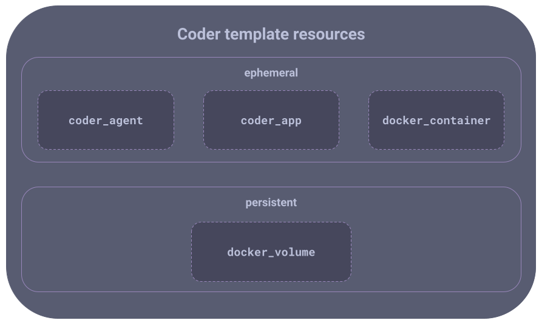
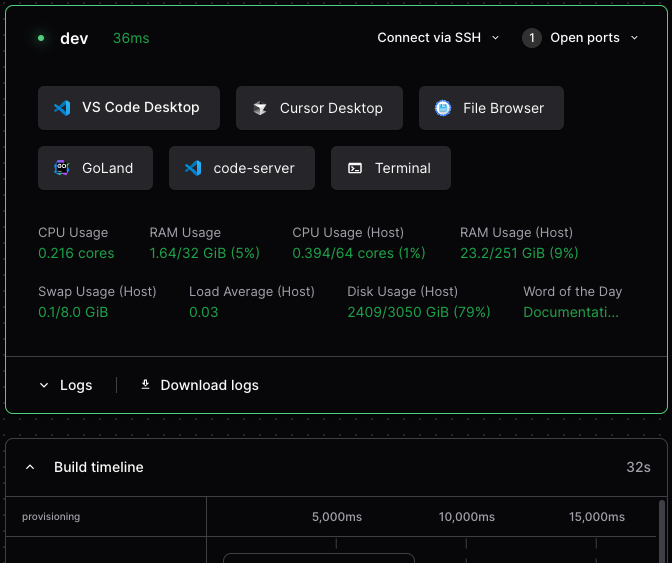
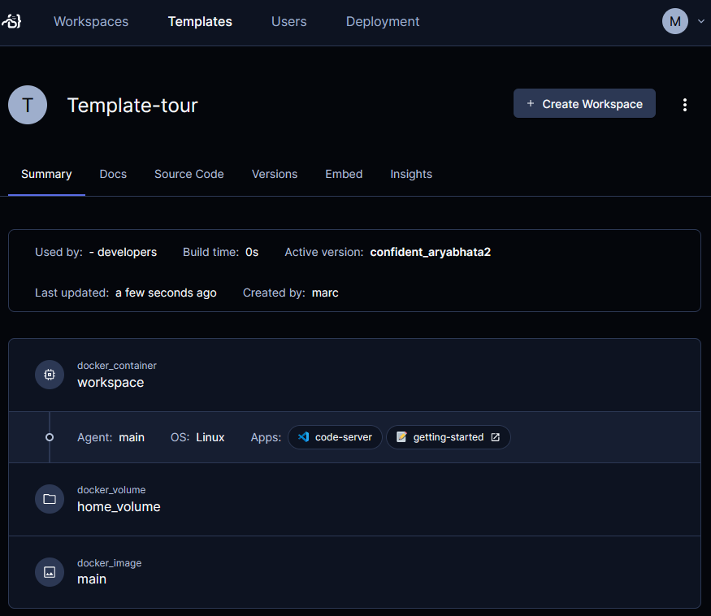
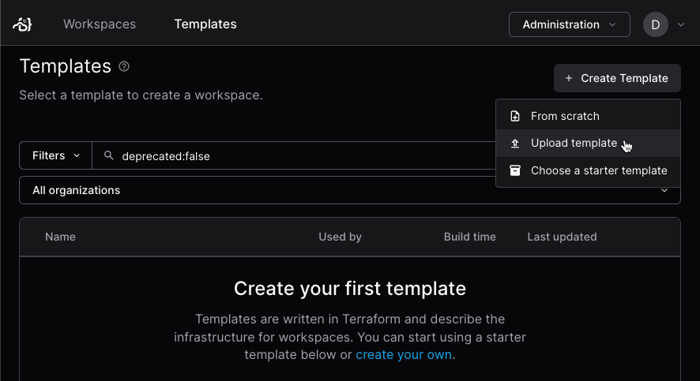
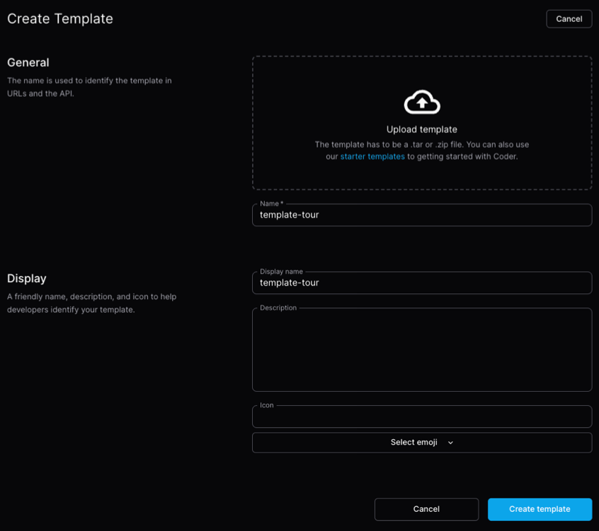

# Write a template from scratch

A template is a common configuration that you use to deploy workspaces.

This tutorial teaches you how to create a template that provisions a workspace
as a Docker container with Ubuntu.

## Before you start

You'll need a computer or cloud computing instance with both
[Docker](https://docs.docker.com/get-docker/) and [Coder](../install/index.md)
installed on it.

## What's in a template

The main part of a Coder template is a [Terraform](https://terraform.io) `tf`
file. A Coder template often has other files to configure the other resources
that the template needs. In this tour you'll also create a `Dockerfile`.

Coder can provision all Terraform modules, resources, and properties. The Coder
server essentially runs a `terraform apply` every time a workspace is created,
started, or stopped.

> [!TIP]
> Haven't written Terraform before? Check out Hashicorp's
> [Getting Started Guides](https://developer.hashicorp.com/terraform/tutorials).

Here's a simplified diagram that shows the main parts of the template we'll
create:



## 1. Create template files

On your local computer, create a directory for your template and create the
`Dockerfile`. You will upload the files to your Coder instance later.

```sh
mkdir -p template-tour/build && cd $_
```

Enter content into a `Dockerfile` that starts with the
[official Ubuntu image](https://hub.docker.com/_/ubuntu/). In your editor, enter
and save the following text in `Dockerfile` then exit the editor:

```dockerfile
FROM ubuntu

RUN apt-get update \
    && apt-get install -y \
    sudo \
    curl \
    && rm -rf /var/lib/apt/lists/*

ARG USER=coder
RUN useradd --groups sudo --no-create-home --shell /bin/bash ${USER} \
    && echo "${USER} ALL=(ALL) NOPASSWD:ALL" >/etc/sudoers.d/${USER} \
    && chmod 0440 /etc/sudoers.d/${USER}
USER ${USER}
WORKDIR /home/${USER}
```

`Dockerfile` adds a few things to the parent `ubuntu` image, which your template
needs later:

- It installs the `sudo` and `curl` packages.
- It adds a `coder` user, including a home directory.

## 2. Set up template providers

Edit the Terraform `main.tf` file to provision the workspace's resources.

Start by setting up the providers. At a minimum, we need the `coder` provider.
For this template, we also need the `docker` provider:

```tf
terraform {
  required_providers {
    coder = {
      source  = "coder/coder"
    }
    docker = {
      source  = "kreuzwerker/docker"
    }
  }
}

locals {
  username = data.coder_workspace_owner.me.name
}

data "coder_provisioner" "me" {
}

provider "docker" {
}

provider "coder" {
}

data "coder_workspace" "me" {
}

data "coder_workspace_owner" "me" {
}
```

Notice that the `provider` blocks for `coder` and `docker` are empty. In a more
practical template, you would add arguments to these blocks to configure the
providers, if needed.

The
[`coder_workspace`](https://registry.terraform.io/providers/coder/coder/latest/docs/data-sources/workspace)
data source provides details about the state of a workspace, such as its name,
owner, and so on. The data source also lets us know when a workspace is being
started or stopped. We'll use this information in later steps to:

- Set some environment variables based on the workspace owner.
- Manage ephemeral and persistent storage.

## 3. coder_agent

All templates need to create and run a
[Coder agent](https://registry.terraform.io/providers/coder/coder/latest/docs/resources/agent).
This lets developers connect to their workspaces. The `coder_agent` resource
runs inside the compute aspect of your workspace, typically a VM or container.
In our case, it will run in Docker.

You do not need to have any open ports on the compute aspect, but the agent
needs `curl` access to the Coder server.

Add this snippet after the last closing `}` in `main.tf` to create the agent:

```tf
resource "coder_agent" "main" {
  arch                   = data.coder_provisioner.me.arch
  os                     = "linux"
  startup_script         = <<-EOT
    set -e

    # install and start code-server
    curl -fsSL https://code-server.dev/install.sh | sh -s -- --method=standalone --prefix=/tmp/code-server
    /tmp/code-server/bin/code-server --auth none --port 13337 >/tmp/code-server.log 2>&1 &
  EOT

  env = {
    GIT_AUTHOR_NAME     = coalesce(data.coder_workspace_owner.me.full_name, data.coder_workspace_owner.me.name)
    GIT_AUTHOR_EMAIL    = "${data.coder_workspace_owner.me.email}"
    GIT_COMMITTER_NAME  = coalesce(data.coder_workspace_owner.me.full_name, data.coder_workspace_owner.me.name)
    GIT_COMMITTER_EMAIL = "${data.coder_workspace_owner.me.email}"
  }

  metadata {
    display_name = "CPU Usage"
    key          = "0_cpu_usage"
    script       = "coder stat cpu"
    interval     = 10
    timeout      = 1
  }

  metadata {
    display_name = "RAM Usage"
    key          = "1_ram_usage"
    script       = "coder stat mem"
    interval     = 10
    timeout      = 1
  }
}
```

Because Docker is running locally in the Coder server, there is no need to
authenticate `coder_agent`. But if your `coder_agent` is running on a remote
host, your template will need
[authentication credentials](../admin/external-auth.md).

This template's agent also runs a startup script, sets environment variables,
and provides metadata.

- [`startup script`](https://registry.terraform.io/providers/coder/coder/latest/docs/resources/agent#startup_script)

  - Installs [code-server](https://coder.com/docs/code-server), a browser-based
    [VS Code](https://code.visualstudio.com/) app that runs in the workspace.

    We'll give users access to code-server through `coder_app`, later.

- [`env` block](https://registry.terraform.io/providers/coder/coder/latest/docs/resources/agent#env)

  - Sets environments variables for the workspace.

    We use the data source from `coder_workspace` to set the environment
    variables based on the workspace's owner. This way, the owner can make git
    commits immediately without any manual configuration.

- [`metadata`](../admin/templates/extending-templates/agent-metadata.md) blocks

  - Your template can use metadata to show information to the workspace owner
    Coder displays this metadata in the Coder dashboard.

    Our template has `metadata` blocks for CPU and RAM usage.

## 4. coder_app

A
[`coder_app`](https://registry.terraform.io/providers/coder/coder/latest/docs/resources/app)
resource lets a developer use an app from the workspace's Coder dashboard.



This is commonly used for
[web IDEs](../user-guides/workspace-access/web-ides.md) such as
[code-server](https://coder.com/docs/code-server), RStudio, and JupyterLab.

We installed code-server in the `startup_script` argument. To add code-server to
the workspace, make it available in the workspace with a `coder_app` resource.
See [web IDEs](../user-guides/workspace-access/web-ides.md) for more examples:

```tf
resource "coder_app" "code-server" {
  agent_id     = coder_agent.main.id
  slug         = "code-server"
  display_name = "code-server"
  url          = "http://localhost:13337/?folder=/home/${local.username}"
  icon         = "/icon/code.svg"
  subdomain    = false
  share        = "owner"

  healthcheck {
    url       = "http://localhost:13337/healthz"
    interval  = 5
    threshold = 6
  }
}
```

You can also use a `coder_app` resource to link to external apps, such as links
to wikis or cloud consoles:

```tf
resource "coder_app" "coder-server-doc" {
  agent_id     = coder_agent.main.id
  icon         = "/emojis/1f4dd.png"
  slug         = "getting-started"
  url          = "https://coder.com/docs/code-server"
  external     = true
}
```

## 5. Persistent and ephemeral resources

Managing the lifecycle of template resources is important. We want to make sure
that workspaces use computing, storage, and other services efficiently.

We want our workspace's home directory to persist after the workspace is stopped
so that a developer can continue their work when they start the workspace again.

We do this in 2 parts:

- Our `docker_volume` resource uses the `lifecycle` block with the
  `ignore_changes = all` argument to prevent accidental deletions.
- To prevent Terraform from destroying persistent Docker volumes in case of a
  workspace name change, we use an immutable parameter, like
  `data.coder_workspace.me.id`.

Later, we use the Terraform
[count](https://developer.hashicorp.com/terraform/language/meta-arguments/count)
meta-argument to make sure that our Docker container is ephemeral.

```tf
resource "docker_volume" "home_volume" {
  name = "coder-${data.coder_workspace.me.id}-home"
  # Protect the volume from being deleted due to changes in attributes.
  lifecycle {
    ignore_changes = all
  }
}
```

For details, see
[Resource persistence](../admin/templates/extending-templates/resource-persistence.md).

## 6. Set up the Docker container

To set up our Docker container, our template has a `docker_image` resource that
uses `build/Dockerfile`, which we created earlier:

```tf
resource "docker_image" "main" {
  name = "coder-${data.coder_workspace.me.id}"
  build {
    context = "./build"
    build_args = {
      USER = local.username
    }
  }
  triggers = {
    dir_sha1 = sha1(join("", [for f in fileset(path.module, "build/*") : filesha1(f)]))
  }
}
```

Our `docker_container` resource uses `coder_workspace` `start_count` to start
and stop the Docker container:

```tf
resource "docker_container" "workspace" {
  count = data.coder_workspace.me.start_count
  image = docker_image.main.name
  # Uses lower() to avoid Docker restriction on container names.
  name = "coder-${data.coder_workspace_owner.me.name}-${lower(data.coder_workspace.me.name)}"
  # Hostname makes the shell more user friendly: coder@my-workspace:~$
  hostname = data.coder_workspace.me.name
  # Use the docker gateway if the access URL is 127.0.0.1
  entrypoint = ["sh", "-c", replace(coder_agent.main.init_script, "/localhost|127\\.0\\.0\\.1/", "host.docker.internal")]
  env = [
    "CODER_AGENT_TOKEN=${coder_agent.main.token}",
  ]
  host {
    host = "host.docker.internal"
    ip   = "host-gateway"
  }
  volumes {
    container_path = "/home/${local.username}"
    volume_name    = docker_volume.home_volume.name
    read_only      = false
  }
}
```

## 7. Create the template in Coder

Save `main.tf` and exit the editor.

Now that we've created the files for our template, we can add them to our Coder
deployment.

We can do this with the Coder CLI or the Coder dashboard. In this example, we'll
use the Coder CLI.

1. Log in to your Coder deployment from the CLI. This is where you need the URL
   for your deployment:

   ```console
   $ coder login https://coder.example.com
   Attempting to authenticate with config URL: 'https://coder.example.com'
   Open the following in your browser:

       https://coder.example.com/cli-auth

   > Paste your token here:
   ```

1. In your web browser, enter your credentials:

   <Image height="412px" src="../images/templates/coder-login-web.png" alt="Log in to your Coder deployment" align="center" />

1. Copy the session token to the clipboard:

   <Image height="472px" src="../images/templates/coder-session-token.png" alt="Copy session token" align="center" />

1. Paste it into the CLI:

   ```output
   > Welcome to Coder, marc! You're authenticated.
   $
   ```

### Add the template files to Coder

Add your template files to your Coder deployment. You can upload the template
through the CLI, or through the Coder dashboard:

<div class="tabs">

#### CLI

1. Run `coder templates create` from the directory with your template files:

   ```console
   $ pwd
   /home/docs/template-tour
   $ coder templates push
   > Upload "."? (yes/no) yes
   ```

1. The Coder CLI tool gives progress information then prompts you to confirm:

   ```console
   > Confirm create? (yes/no) yes

   The template-tour template has been created! Developers can provision a workspace with this template using:

   coder create --template="template-tour" [workspace name]
   ```

1. In your web browser, log in to your Coder dashboard, select **Templates**.

1. Once the upload completes, select **Templates** from the top to deploy it to
   a new workspace.

   

#### Dashboard

1. Create a `.zip` of the template files.

   - On Mac or Windows, highlight the files and then right click. A "compress"
     option is available through the right-click context menu.

   - To zip the files through the command line:

     ```shell
     zip templates.zip Dockerfile main.tf
     ```

1. Select **Templates** from the top of the Coder dashboard, then **Create
   Template**.
1. Select **Upload template**:

   

1. Drag the `.zip` file into the **Upload template** section and fill out the
   details, then select **Create template**.

   

1. Once the upload completes, select **Templates** from the top to deploy it to
   a new workspace.

   

</div>

### Next steps

- [Setting up templates](../admin/templates/index.md)
- [Customizing templates](../admin/templates/extending-templates/index.md)
- [Troubleshooting template](../admin/templates/troubleshooting.md)
