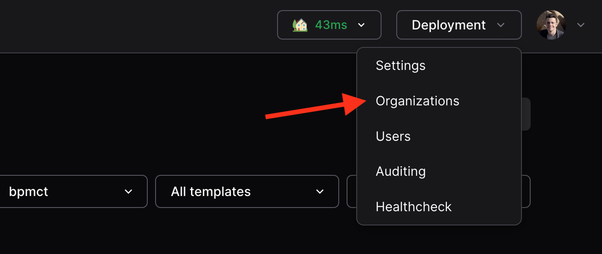
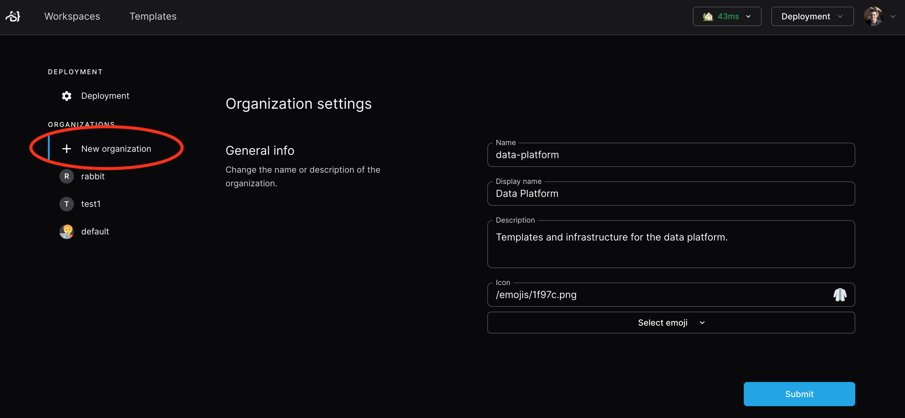
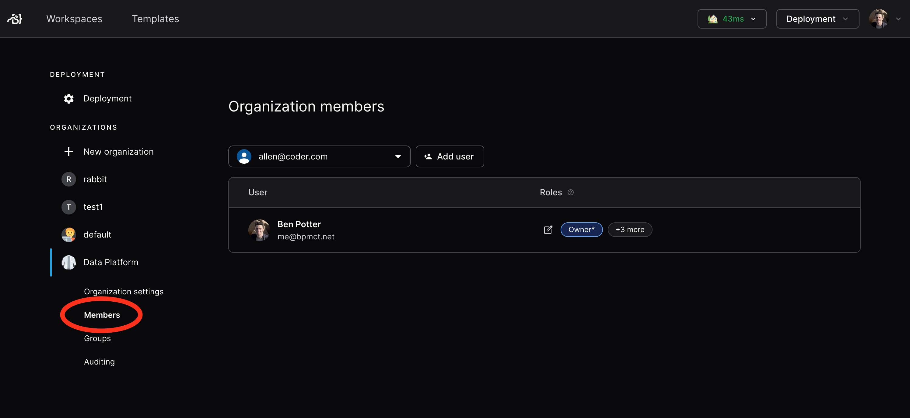

# Using Organizations

> Note: Organizations is still under active development and requires a
> non-standard enterprise license to use. Do not use organizations on your
> production instance!
>
> For more details, [contact your account team](https://coder.com/contact).

Organizations allow you to run a Coder deployment with multiple platform teams,
all with uniquely scoped templates, provisioners, users, groups, and workspaces.

## Prerequisites

- Coder deployment with non-standard license with Organizations enabled
  ([contact your account team](https://coder.com/contact))
- User with `Owner` role
- Coder CLI installed on local machine

## Switch to the preview image and enable the experiment

To try the latest organizations features, switch to a preview image in your Helm
chart and enable the
[experimental flag](../reference/cli/server.md#--experiments).

For example, with Kubernetes, set the following in your `values.yaml`:

```yaml
coderd:
  image:
    repo: ghcr.io/coder/coder-preview
    tag: orgs-preview-aug-16
  env:
    - name: CODER_EXPERIMENTS
      value: multi-organization
```

> See all
> [preview images](https://github.com/coder/coder/pkgs/container/coder-preview)
> in GitHub. Preview images prefixed with `main-` expire after a week.

Then, upgrade your deployment:

```sh
helm upgrade coder coder-v2/coder -f values.yaml
```

## The default organization

All Coder deployments start with one organization called `Default`.

To edit the organization details, navigate to `Deployment -> Organizations` in
the top bar:



From there, you can manage the name, icon, description, users, and groups:


## Guide: Your first organization

### 1. Create the organization

Within the sidebar, click `New organization` to create an organization. In this
example, we'll create the `data-platform` org.



From there, let's deploy a provisioner and template for this organization.

### 2. Deploy a provisioner

[Provisioners](../admin/provisioners.md) are organization-scoped and are
responsible for executing Terraform/OpenTofu to provision the infrastructure for
workspaces and testing templates. Before creating templates, we must deploy at
least one provisioner as the built-in provisioners are scoped to the default
organization.

using Coder CLI, run the following command to create a key that will be used to
authenticate the provisioner:

```sh
coder provisioner keys create data-cluster-key --org data-platform
Successfully created provisioner key data-cluster! Save this authentication token, it will not be shown again.

< key omitted >
```

Next, start the provisioner with the key on your desired platform. In this
example, we'll start it using the Coder CLI on a host with Docker. For
instructions on using other platforms like Kubernetes, see our
[provisioner documentation](../admin/provisioners.md).

```sh
export CODER_URL=https://<your-coder-url>
export CODER_PROVISIONER_DAEMON_KEY=<key>
coder provisionerd start --org <org-name>
```

### 3. Create a template

Once you've started a provisioner, you can create a template. You'll notice the
"Create Template" screen now has an organization dropdown:


### 5. Add members

Navigate to `Deployment->Organizations` to add members to your organization.
Once added, they will be able to see the organization-specific templates.



### 6. Create a workspace

Now, users in the data platform organization will see the templates related to
their organization. Users can be in multiple organizations.


## Planned work

Organizations is under active development. The work is planned before
organizations is generally available:

- View provisioner health via the Coder UI
- Custom Role support in Coder UI
- Per-organization quotas
- Improved visibility of organization-specific resources throughout the UI
- Sync OIDC claims to auto-assign users to organizations / roles + SCIM support

## Support & Feedback

[Contact your account team](https://coder.com/contact) if you have any questions
or feedback.
