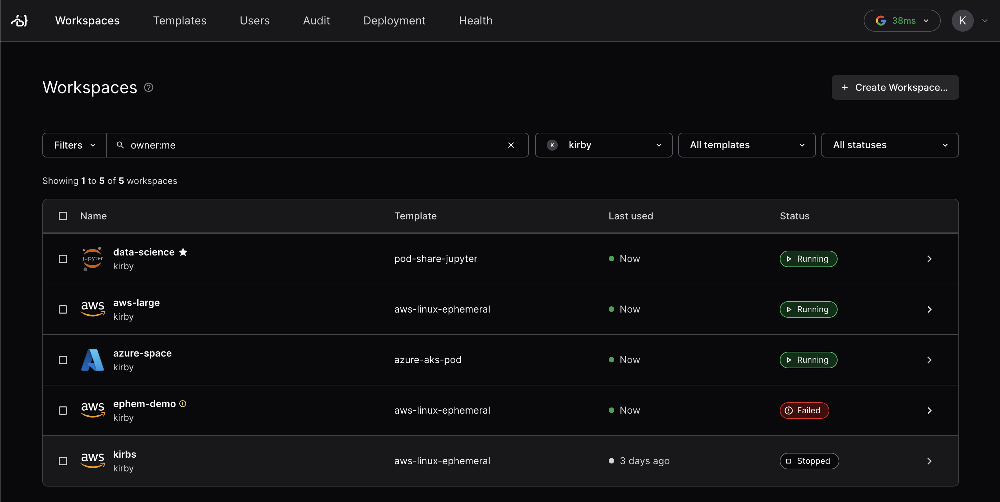

# Workspaces

### What is a Workspace?

At the highest level, a workspace is a set of cloud resources. These resources
can be VMs, Kubernetes clusters, storage buckets, or whatever else [Terraform](https://developer.hashicorp.com/terraform/docs)
lets you dream up.

The resources that run the agent are described as _computational resources_,
while those that don't are called _peripheral resources_.

Each resource may also be _persistent_ or _ephemeral_ depending on whether
they're destroyed on workspace stop.

Coder Workspaces are connected to via the workspace agent, which is the primary process which facilitates [connections](./workspace-access.md).

## Viewing workspaces

You can manage your existing workspaces in the **Workspaces** tab. The name, associated template, and status are shown for each workspace. You can pin workspaces to the top of this UI by marking them as "favorite."



## Creating workspaces

You can create a workspace in the UI. Log in to your Coder instance, go to the
**Templates** tab, find the template you need, and select **Create Workspace**.


When you create a workspace, you will be prompted to give it a name. You might
also be prompted to set some [parameters](#workspace-parameters) that the template provides.

You can also create a workspace from the command line:

Each Coder user has their own workspaces created from
[shared templates](./admin/templates/README.md):

```shell
# create a workspace from the template; specify any variables
coder create --template="<templateName>" <workspaceName>

# show the resources behind the workspace and how to connect
coder show <workspace-name>
```

## Workspace filtering

In the Coder UI, you can filter your workspaces using pre-defined filters or
Coder's filter query. For example, you can find the workspaces that you own or
that are currently running.

The following filters are supported:

- `owner` - Represents the `username` of the owner. You can also use `me` as a
  convenient alias for the logged-in user.
- `template` - Specifies the name of the template.
- `status` - Indicates the status of the workspace. For a list of supported
  statuses, see
  [WorkspaceStatus documentation](https://pkg.go.dev/github.com/coder/coder/codersdk#WorkspaceStatus).

## Bulk operations (enterprise)

Enterprise users may apply bulk operations (update, delete, start, stop) in the **Workspaces** tab.

Select the workspaces you'd like to modify with the checkboxes on the left, then use the top-right **Actions** dropdown to apply the operation.


## Next steps
- [Access your workspace](./workspace-access.md)
- [Learn about templates](./admin/templates/README.md)
- [Try Coder](../start/coder-tour.md)
