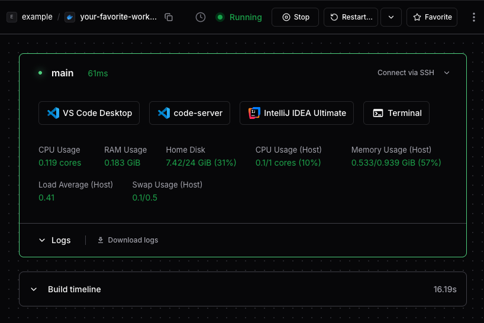

# Coder Desktop

Use Coder Desktop to work on your workspaces as though they're on your LAN, no
port-forwarding required.

## Install Coder Desktop

<div class="tabs">

You can install Coder Desktop on macOS or Windows.

### macOS

1. Use [Homebrew](https://brew.sh/) to install Coder Desktop:

   ```shell
   brew install --cask coder/coder/coder-desktop
   ```

1. Open Coder Desktop from the Applications directory and when macOS asks if you want to open it, select **Open**.

1. The application is treated as a VPN. macOS will prompt you to confirm with:

   **"Coder Desktop" would like to use a new network extension**

   Select **Open System Settings**.

1. In the **Network Extensions** system settings, enable the Coder Desktop extension.

1. Continue to the [configuration section](#configure).

### Windows

1. Download the latest `CoderDesktop` executable (`.exe`) from the [coder-desktop-windows repository](https://github.com/coder/coder-desktop-windows/).

   Choose the architecture that fits your Windows system, ARM or x64.

1. Open the `.exe` files, acknowledge the license terms and conditions, and select **Install**.

1. Windows asks if you "want to allow this app from an unknown publisher to make changes to your device?"

   Select **Yes**.

1. The Coder Desktop installation creates a system restore point.
   Depending on your system, this step might take a while.

1. If .NET is not already installed, the installation might prompt you with the **Windows Desktop Runtime** installation.

   In that installation window, select **Install**. Select **Close** when the Runtime installation completes.

1. When the Coder Desktop installation completes, select **Close**.

1. Find and open **Coder Desktop** from your Start Menu.

1. Some systems require an additional Windows App Runtime.

   Select **Yes** if you are prompted to install it.
   This will open your default browser where you can download and install the latest stable release of Windows App SDK.
   
   Reopen Coder Desktop after you install Windows App SDK.

1. Coder Desktop starts minimized in the Windows System Tray.

   You might need to select the **^** in your system tray to show more icons.

1. Continue to the [configuration section](#configure).

</div>

## Configure

Before you can use Coder Desktop, you will need to log in.

1. Open the Desktop menu and select **Sign in**:

   <Image height="325px" src="../../images/user-guides/desktop/coder-desktop-pre-sign-in.png" alt="Coder Desktop menu before the user signs in" align="center" />

1. In the **Sign In** window, enter your Coder deployment's URL and select **Next**:

   

1. macOS: Select the link to your deployment's `/cli-auth` page to generate a [session token](../../admin/users/sessions-tokens.md).

   Windows: Select **Generate a token via the Web UI**.

1. In your web browser, enter your credentials:

   <Image height="412px" src="../../images/templates/coder-login-web.png" alt="Log in to your Coder deployment" align="center" />

1. Copy the session token to the clipboard:

   <Image height="350px" src="../../images/templates/coder-session-token.png" alt="Copy session token" align="center" />

1. Paste the token in the **Session Token** box of the **Sign In** screen, then select **Sign In**:

   

1. Allow the VPN configuration for Coder Desktop if your OS prompts you.

1. Coder Desktop is now running!

1. Select the Coder icon in the menu bar (macOS) or system tray (Windows) and enable **CoderVPN**.

## Workspaces from Coder Desktop


1. You can use `ping6` in your terminal to verify the connection to your workspace:

   ```shell
   ping6 -c 5 yourworkspacename.coder
   ```

1. Select your workspace from the Coder Desktop icon.

   Desktop opens the workspace in your browser.

   

1. Select the IDE you want to use and start working on your code.

## CoderVPN

Placeholder for some information about CoderVPN
