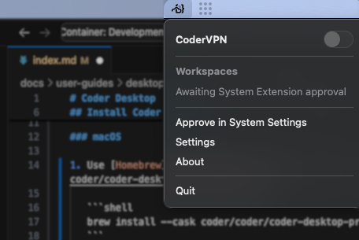
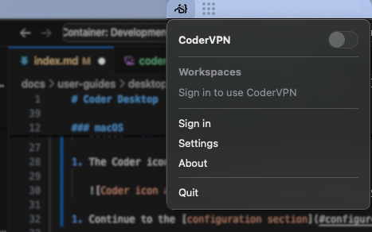

# Coder Desktop

Use Coder Desktop to work on your workspaces as though they're on your LAN, no
port-forwarding required.

## Install Coder Desktop

<div class="tabs">

You can install Coder Desktop on macOS or Windows.

### macOS

1. Use [Homebrew](https://brew.sh/) to install the Coder Desktop from [cask](https://github.com/coder/coder-desktop-macos/tree/main):

   ```shell
   brew install --cask coder/coder/coder-desktop
   ```

1. Open Coder Desktop from the Applications directory and when macOS asks if you want to open it, select **Open**.

1. The application can connect as a VPN. macOS will prompt you to confirm with:

   **"Coder Desktop" would like to use a new network extension**

   Select **OK**.

1. The Coder icon will appear in the macOS menu bar:

   

1. Continue to the [configuration section](#configure).

### Windows

Download from there.

</div>

## Configure

Before you can use Coder Desktop, you will need to approve the system extension and log in.

1. Select the Desktop menu bar icon, then **Approve in System Settings**.

1. Desktop opens your system settings. Enable the Coder Desktop extension.

1. Open the Desktop menu again and select **Sign in**:

   

1. In the **Sign In** window, enter your Coder deployment's URL and select **Next**:

   

1. Select the link to your deployment's `/cli-auth` page to generate a [session token](../../admin/users/sessions-tokens.md).

1. In your web browser, enter your credentials:

   <Image height="412px" src="../../images/templates/coder-login-web.png" alt="Log in to your Coder deployment" align="center" />

1. Copy the session token to the clipboard:

   <Image height="472px" src="../../images/templates/coder-session-token.png" alt="Copy session token" align="center" />

1. Paste the token in the **Session Token** box of the **Sign In** screen, then select **Sign In**:

   

1. Allow the VPN configuration for Coder Desktop if your OS prompts you.

1. Coder Desktop is now running!

   Select the Coder icon in the menu bar (macOS) or system tray (Windows) to enable [CoderVPN](#codervpn).

## Workspaces from Coder Desktop

Placeholder for what users can do with workspaces from Coder Desktop

## CoderVPN

Placeholder for some information about CoderVPN
