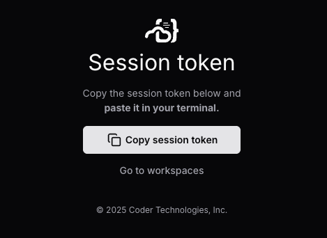

# Coder Desktop (Beta)

Use Coder Desktop to work on your workspaces as though they're on your LAN, no
port-forwarding required.

> [!NOTE]
> Coder Desktop requires a Coder deployment running [v2.20.0](https://github.com/coder/coder/releases/tag/v2.20.0) or later.

## Install Coder Desktop

<div class="tabs">

You can install Coder Desktop on macOS or Windows.

### macOS

1. Use [Homebrew](https://brew.sh/) to install Coder Desktop:

   ```shell
   brew install --cask coder/coder/coder-desktop
   ```

   Alternatively, you can manually install Coder Desktop from the [releases page](https://github.com/coder/coder-desktop-macos/releases).

1. Open **Coder Desktop** from the Applications directory.

1. The application is treated as a system VPN. macOS will prompt you to confirm with:

   **"Coder Desktop" would like to use a new network extension**

   Select **Open System Settings**.

1. In the **Network Extensions** system settings, enable the Coder Desktop extension.

1. Continue to the [configuration section](#configure).

> Do not install more than one copy of Coder Desktop.
>
> To avoid system VPN configuration conflicts, only one copy of `Coder Desktop.app` should exist on your Mac, and it must remain in `/Applications`.

### Windows

1. Download the latest `CoderDesktop` installer executable (`.exe`) from the [coder-desktop-windows release page](https://github.com/coder/coder-desktop-windows/releases).

   Choose the architecture that fits your Windows system, `x64` or `arm64`.

1. Open the `.exe` file, acknowledge the license terms and conditions, and select **Install**.

1. If a suitable .NET runtime is not already installed, the installation might prompt you with the **.NET Windows Desktop Runtime** installation.

   In that installation window, select **Install**. Select **Close** when the runtime installation completes.

1. When the Coder Desktop installation completes, select **Close**.

1. Find and open **Coder Desktop** from your Start Menu.

1. Some systems require an additional Windows App Runtime SDK.

   Select **Yes** if you are prompted to install it.
   This will open your default browser where you can download and install the latest stable release of the Windows App Runtime SDK.

   Reopen Coder Desktop after you install the runtime.

1. Coder Desktop starts minimized in the Windows System Tray.

   You might need to select the **^** in your system tray to show more icons.

1. Continue to the [configuration section](#configure).

</div>

## Configure

Before you can use Coder Desktop, you will need to sign in.

1. Open the Desktop menu and select **Sign in**:

   <div class="tabs">

   ## macOS

   

   ## Windows

   

   </div>

1. In the **Sign In** window, enter your Coder deployment's URL and select **Next**:

   

1. macOS: Select the link to your deployment's `/cli-auth` page to generate a [session token](../../admin/users/sessions-tokens.md).

   Windows: Select **Generate a token via the Web UI**.

1. In your web browser, you may be prompted to sign in to Coder with your credentials.

1. Copy the session token to the clipboard:

   

1. Paste the token in the **Session Token** field of the **Sign In** screen, then select **Sign In**:

   

1. macOS: Allow the VPN configuration for Coder Desktop if you are prompted:

   

1. Select the Coder icon in the menu bar (macOS) or system tray (Windows), and click the **Coder Connect** toggle to enable the connection.

   

   This may take a few moments, as Coder Desktop will download the necessary components from the Coder server if they have been updated.

1. macOS: You may be prompted to enter your password to allow Coder Connect to start.

1. Coder Connect is now running!

## Next Steps

- [Connect to and work on your workspace](./desktop-connect-sync.md)
