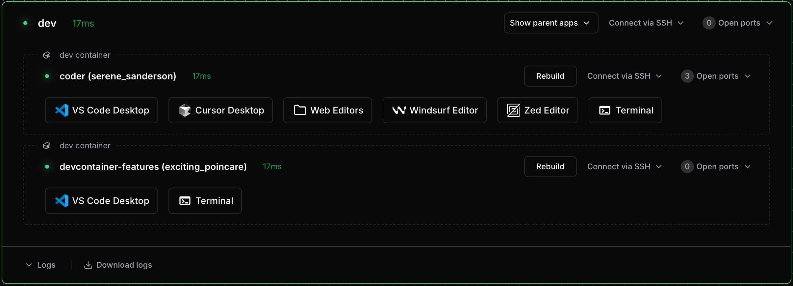
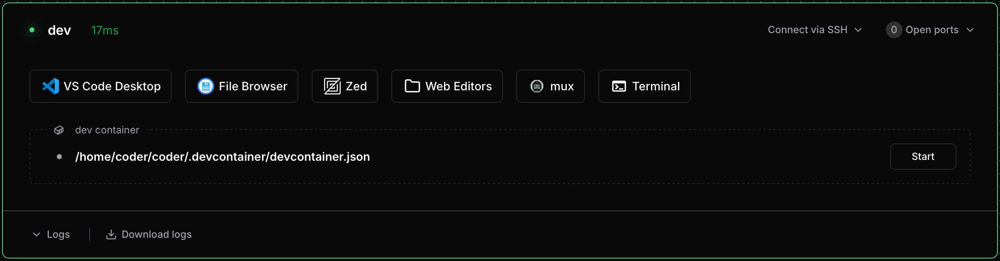

# Dev Containers

[Dev containers](https://containers.dev/) define your development environment
as code using a `devcontainer.json` file. Coder's Dev Containers integration
uses the [`@devcontainers/cli`](https://github.com/devcontainers/cli) and
[Docker](https://www.docker.com) to seamlessly build and run these containers,
with management in your dashboard.

This guide covers the Dev Containers integration. For workspaces without Docker,
administrators can configure
[Envbuilder](../../admin/integrations/devcontainers/envbuilder/index.md) instead,
which builds the workspace image itself from your dev container configuration.

_Dev containers appear as sub-agents with their own apps, SSH access, and port forwarding_

## Prerequisites

- Coder version 2.24.0 or later
- Docker available inside your workspace
- The `@devcontainers/cli` installed in your workspace

Dev Containers integration is enabled by default. Your workspace needs Docker
(via Docker-in-Docker or a mounted socket) and the devcontainers CLI. Most
templates with Dev Containers support include both. See
[Configure a template for dev containers](../../admin/integrations/devcontainers/integration.md)
for setup details.

## Features

- Automatic dev container detection from repositories
- Seamless container startup during workspace initialization
- Change detection with outdated status indicator
- On-demand container rebuild via dashboard button
- Integrated IDE experience with VS Code
- Direct SSH access to containers
- Automatic port detection

## Getting started

### Add a devcontainer.json

Add a `devcontainer.json` file to your repository. This file defines your
development environment. You can place it in:

- `.devcontainer/devcontainer.json` (recommended)
- `.devcontainer.json` (root of repository)
- `.devcontainer/<folder>/devcontainer.json` (for multiple configurations)

The third option allows monorepos to define multiple dev container
configurations in separate sub-folders. See the
[Dev Container specification](https://containers.dev/implementors/spec/#devcontainerjson)
for details.

Here's a minimal example:

```json
{
  "name": "My Dev Container",
  "image": "mcr.microsoft.com/devcontainers/base:ubuntu"
}
```

For more configuration options, see the
[Dev Container specification](https://containers.dev/).

### Start your dev container

Coder automatically discovers dev container configurations in your repositories
and displays them in your workspace dashboard. From there, you can start a dev
container with a single click.

_Coder detects dev container configurations and displays them with a Start button_

If your template administrator has configured automatic startup (via the
`coder_devcontainer` Terraform resource or autostart settings), your dev
container will build and start automatically when the workspace starts.

### Connect to your dev container

Once running, your dev container appears as a sub-agent in your workspace
dashboard. You can connect via:

- **Web terminal** in the Coder dashboard
- **SSH** using `coder ssh <workspace>.<agent>`
- **VS Code** using the "Open in VS Code Desktop" button

See [Working with dev containers](./working-with-dev-containers.md) for detailed
connection instructions.

## How it works

The Dev Containers integration uses the `devcontainer` command from
[`@devcontainers/cli`](https://github.com/devcontainers/cli) to manage
containers within your Coder workspace.

When a workspace with Dev Containers integration starts:

1. The workspace initializes the Docker environment.
1. The integration detects repositories with dev container configurations.
1. Detected dev containers appear in the Coder dashboard.
1. If auto-start is configured (via `coder_devcontainer` or autostart settings),
   the integration builds and starts the dev container automatically.
1. Coder creates a sub-agent for the running container, enabling direct access.

Without auto-start, users can manually start discovered dev containers from the
dashboard.

### Agent naming

Each dev container gets its own agent name, derived from the workspace folder
path. For example, a dev container with workspace folder `/home/coder/my-app`
will have an agent named `my-app`.

Agent names are sanitized to contain only lowercase alphanumeric characters and
hyphens. You can also set a
[custom agent name](./customizing-dev-containers.md#custom-agent-name)
in your `devcontainer.json`.

## Limitations

- **Linux only**: Dev Containers are currently not supported in Windows or
  macOS workspaces
- Changes to `devcontainer.json` require manual rebuild using the dashboard
  button
- The `forwardPorts` property in `devcontainer.json` with `host:port` syntax
  (e.g., `"db:5432"`) for Docker Compose sidecar containers is not yet
  supported. For single-container dev containers, use `coder port-forward` to
  access ports directly on the sub-agent.
- Some advanced dev container features may have limited support

## Next steps

- [Working with dev containers](./working-with-dev-containers.md) — SSH, IDE
  integration, and port forwarding
- [Customizing dev containers](./customizing-dev-containers.md) — Custom agent
  names, apps, and display options
- [Troubleshooting dev containers](./troubleshooting-dev-containers.md) —
  Diagnose common issues
- [Dev Container specification](https://containers.dev/) — Advanced
  configuration options
- [Dev Container features](https://containers.dev/features) — Enhance your
  environment with pre-built tools
