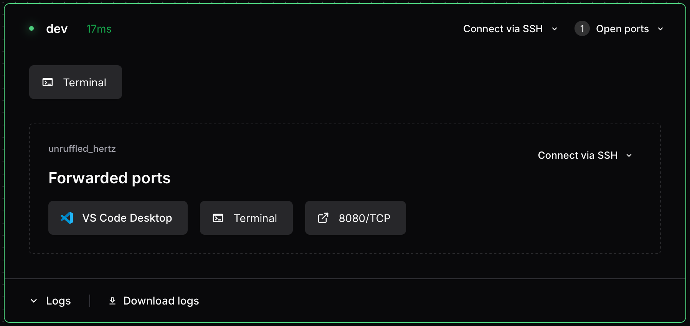
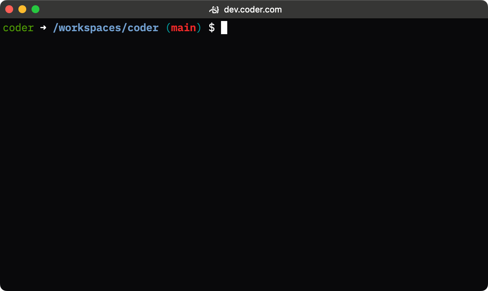

# Working with Dev Containers

The dev container integration appears in your Coder dashboard, providing a
visual representation of the running environment:



## SSH access

Each dev container has its own agent name, derived from the workspace folder
(e.g., `/home/coder/my-project` becomes `my-project`). You can find agent names
in your workspace dashboard, or see
[Agent naming](./index.md#agent-naming) for details on how names are generated.

### Using the Coder CLI

The simplest way to SSH into a dev container is using `coder ssh` with the
workspace and agent name:

```console
coder ssh <workspace>.<agent>
```

For example, to connect to a dev container with agent name `my-project` in
workspace `my-workspace`:

```console
coder ssh my-workspace.my-project
```

To SSH into the main workspace agent instead of the dev container:

```console
coder ssh my-workspace
```

### Using OpenSSH (config-ssh)

You can also use standard OpenSSH tools after generating SSH config entries with
`coder config-ssh`:

```console
coder config-ssh
```

This creates SSH host entries for all your workspaces and their agents,
including dev container sub-agents. You can then connect using the standard
`ssh` command:

```console
ssh <agent>.<workspace>.<owner>.coder
```

For example:

```console
ssh my-project.my-workspace.alice.coder
```

The hostname suffix defaults to `coder` but can be customized by your
deployment administrator via the
[`--workspace-hostname-suffix`](../../reference/cli/server.md#--workspace-hostname-suffix)
server option.

This method works with any SSH client, IDE remote extensions, `rsync`, `scp`,
and other tools that use SSH.

## Web terminal access

Once your workspace and dev container are running, you can use the web terminal
in the Coder interface to execute commands directly inside the dev container.



## IDE integration (VS Code)

You can open your dev container directly in VS Code by:

1. Selecting **Open in VS Code Desktop** from the dev container agent in the
   Coder web interface.
1. Using the Coder CLI:

   ```console
   coder open vscode <workspace>.<agent>
   ```

   For example:

   ```console
   coder open vscode my-workspace.my-project
   ```

VS Code will automatically detect the dev container environment and connect
appropriately.

While optimized for VS Code, other IDEs with dev container support may also
work.

## Port forwarding

Since dev containers run as sub-agents, you can forward ports directly to them
using standard Coder port forwarding:

```console
coder port-forward <workspace>.<agent> --tcp 8080
```

For example, to forward port 8080 from a dev container with agent name
`my-project`:

```console
coder port-forward my-workspace.my-project --tcp 8080
```

This forwards port 8080 on your local machine directly to port 8080 in the dev
container. Coder also automatically detects ports opened inside the container.

### Exposing ports on the parent workspace

If you need to expose dev container ports through the parent workspace agent
(rather than the sub-agent), you can use the
[`appPort`](https://containers.dev/implementors/json_reference/#image-specific)
property in your `devcontainer.json`:

```json
{
  "appPort": ["8080:8080", "4000:3000"]
}
```

This maps container ports to the parent workspace, which can then be forwarded
using the main workspace agent.

## Dev container features

You can use standard [dev container features](https://containers.dev/features)
in your `devcontainer.json` file. Coder also maintains a
[repository of features](https://github.com/coder/devcontainer-features) to
enhance your development experience.

Currently available Coder features include
[code-server](https://github.com/coder/devcontainer-features/blob/main/src/code-server):

```json
{
  "features": {
    "ghcr.io/coder/devcontainer-features/code-server:1": {
      "port": 13337,
      "host": "0.0.0.0"
    }
  }
}
```

## Rebuilding dev containers

When you modify your `devcontainer.json`, you need to rebuild the container for
changes to take effect. Coder detects changes and shows a **dirty state
indicator** next to the rebuild button.

The **Rebuild** button is always available for running dev containers. Click it
to recreate your dev container with the updated configuration.
