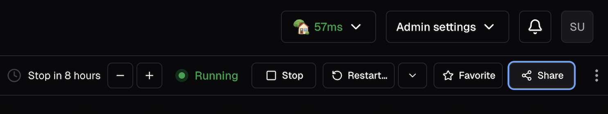
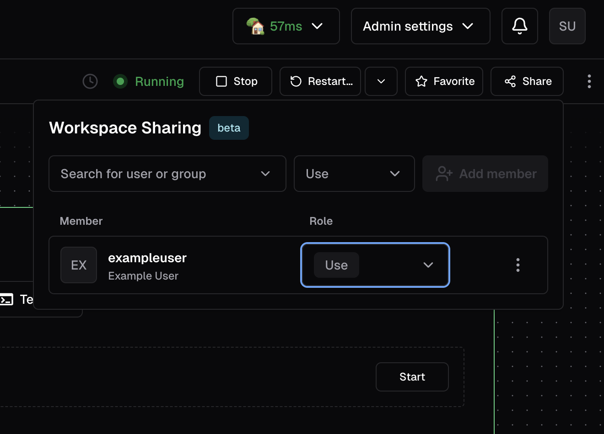
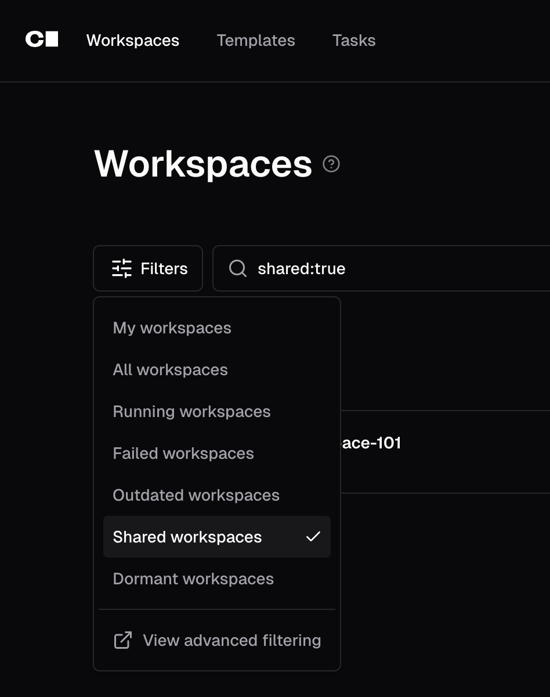

# Shared Workspaces

Multiple users can securely connect to a single Coder workspace for programming and debugging.

<!-- Insert screenshot of UI here -->

## Features

Workspace sharing is available to all Coder users by default, but platform admins with a Premium subscription can choose to disable sharing within their organizations or for their entire deployment.

Owners of a workspace can grant access to other users or groups with scoped roles.

This is helpful in a number of scenarios, including:

- Developers can do ad-hoc debugging or pair programming.
- A workspace can be owned by a group of users for QA, on-call rotations, or shared staging.
- AI workflows where an agent prepares a workspace and a developer takes over to review or finalize the work (ex. with [Coder Tasks](https://coder.com/docs/ai-coder/tasks).)

## Getting Started

Workspaces can be shared through either the Coder CLI or UI.

Before you begin, ensure that you have a version of Coder with workspace sharing enabled and that your account has permission to share workspaces. This is true by default if you are an OSS user, but deployments with Premium licenses may be restricted by admins.

### CLI

To share a workspace:

- `coder sharing share <workspace> --user alice`
  - Shares the workspace with a single user, `alice`, with `use` permissions
- `coder sharing share <workspace> --user alice:admin,bob`
  - Shares the workspace with two users - `alice` with `admin` permissions, and `bob` with `use` permissions
- `coder sharing share <workspace> --group contractor`
  - Shares the workspace with `contractor`, which is a group of users

To remove sharing from a workspace:

- `coder sharing remove <workspace> --user alice`
  - Workspace is no longer shared with the user `alice`.
- `coder sharing remove <workspace> --group contractor`
  - Workspace is no longer shared with the group `contractor`.

> [!Important]
> The workspace must be restarted for the user or group removal to take effect.

To show who a workspace is shared with:

- `coder sharing status <workspace>`

To list shared workspaces:

- `coder list --search shared:true`
- `coder list --search shared_with_user:<user>`
- `coder list --search shared_with_group:<group>`

### UI

#### Sharing your Workspace

1. Open a workspace that you own.

1. Locate and click the 'Share' button.



1. Add the users or groups that you want to share the workspace with. For each one, select a role.



- `use` allows for connection via SSH and apps, the ability to start and stop the workspace, view logs and stats, and update on start when required.
- `admin` allows for all of the above, as well as the ability to rename the workspace, update at any time, and invite others with the `use` role.
- Neither role allows for the user to delete the workspace.
- After removing a user/group, a workspace restart is required for the removal to take effect.

#### Using a shared workspace

Once a workspace is shared, you can find the shared workspace by filtering for "Shared" in the Workspaces page.



#### Accessing workspace apps in shared workspaces

Sharing a workspace grants SSH and terminal access to other users. However,
workspace apps like code-server may return a **404 page** for non-owners
depending on how the app is routed.

By default, workspace apps that don't set `subdomain = true` use **path-based
routing** (e.g., `coder.example.com/@user/workspace/apps/code-server/`).
Path-based apps share the same origin as the Coder dashboard, so Coder blocks
non-owners from accessing them to prevent
[cross-site scripting risks](../tutorials/best-practices/security-best-practices.md#disable-path-based-apps).
This restriction applies even when the user has been granted access through
workspace sharing.

To allow other users to access workspace apps, configure subdomain-based access:

1. Set a
   [wildcard access URL](../admin/networking/wildcard-access-url.md)
   on your deployment
   (e.g., `CODER_WILDCARD_ACCESS_URL=*.coder.example.com`).
2. Set `subdomain = true` on the workspace app. For example, if you use the
   [code-server module](https://registry.coder.com/modules/coder/code-server):

   ```hcl
   module "code-server" {
     source    = "registry.coder.com/coder/code-server/coder"
     agent_id  = coder_agent.main.id
     subdomain = true
     # ...
   }
   ```

Subdomain-based apps run in an isolated browser security context, so Coder
allows other users to access them without additional configuration.
