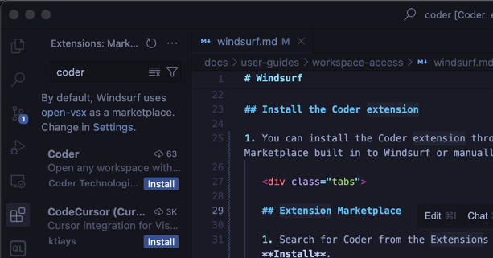

# Devin Desktop

[Devin Desktop](https://devin.ai/desktop) is Cognition's AI-powered code editor designed for AI-assisted development.
Cognition, the maker of the Devin autonomous coding agent, rebranded the Windsurf Editor (formerly Codeium) as Devin Desktop on June 2, 2026.
If you installed Windsurf before that date, it updated to Devin Desktop automatically, and your plan, extensions, and settings were carried over.

Follow this guide to use Devin Desktop to access your Coder workspaces.

If your team uses Devin Desktop regularly, ask your Coder administrator to add Devin Desktop as a workspace application in your template.
You can also use the [devin-desktop module](https://registry.coder.com/modules/coder/devin-desktop) to easily add Devin Desktop to your Coder templates.

## Install Devin Desktop

Devin Desktop can connect to your Coder workspaces via SSH:

1. [Install Devin Desktop](https://docs.devin.ai/desktop/install) on your local machine.

1. Open Devin Desktop and select **Get started**.

   Import your settings from another IDE, or select **Start fresh**.

1. Complete the setup flow and [log in to Devin](https://app.devin.ai/auth/login) or [create a Devin account](https://app.devin.ai/auth/signup) if you don't have one already.

## Install the Coder extension

1. You can install the Coder extension through the Marketplace built in to Devin Desktop or manually.

   

   ## Extension Marketplace

   Search for Coder from the Extensions Pane and select **Install**.

   ## Manually

   1. Download the [latest vscode-coder extension](https://github.com/coder/vscode-coder/releases/latest) `.vsix` file.

   1. Drag the `.vsix` file into the extensions pane of Devin Desktop.

      Alternatively:

      1. Open the Command Palette
         (<kbd>Ctrl</kbd>+<kbd>Shift</kbd>+<kbd>P</kbd> or <kbd>Cmd</kbd>+<kbd>Shift</kbd>+<kbd>P</kbd>) and search for `vsix`.

      1. Select **Extensions: Install from VSIX** and select the vscode-coder extension you downloaded.

   

## Open a workspace in Devin Desktop

1. From the Devin Desktop Command Palette (<kbd>Ctrl</kbd>+<kbd>Shift</kbd>+<kbd>P</kbd> or <kbd>Cmd</kbd>+<kbd>Shift</kbd>+<kbd>P</kbd>),
   enter `coder` and select **Coder: Login**.

1. Follow the prompts to login and copy your session token.

   Paste the session token in the **Coder API Key** dialogue in Devin Desktop.

1. Devin Desktop prompts you to open a workspace, or you can use the Command Palette to run **Coder: Open Workspace**.
