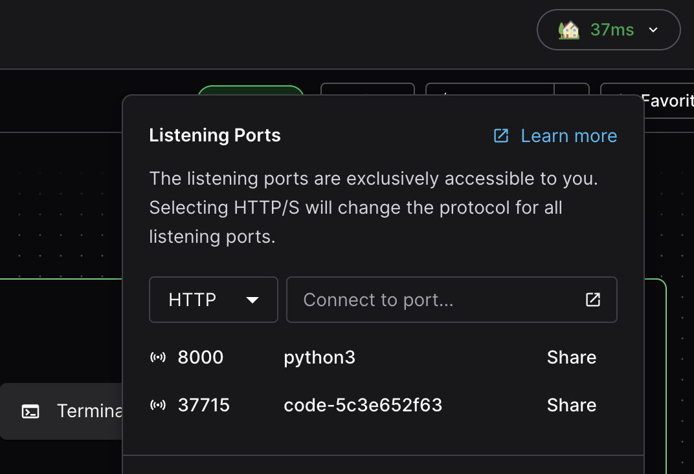

# Access your workspace

There are many ways to connect to your workspace, the options are only limited
by the template configuration.

Deployment operators can learn more about different types of workspace
connections and performance in our
[networking docs](../../admin/infrastructure/index.md).

You can see the primary methods of connecting to your workspace in the workspace
dashboard.


## Terminal

The terminal is implicitly enabled in Coder and allows you to access your
workspace through the shell environment set by your template.


## SSH

### Through with the CLI

Coder will use the optimal path for an SSH connection (determined by your
deployment's [networking configuration](../../admin/infrastructure/index.md))
when using the CLI:

```console
coder ssh my-workspace
```

Or, you can configure plain SSH on your client below.

### Configure SSH

Coder generates [SSH key pairs](../../admin/security/secrets.md#ssh-keys) for
each user to simplify the setup process.

1. Use your terminal to authenticate the CLI with Coder web UI and your workspaces:

   ```bash
   coder login <accessURL>
   ```

1. Access Coder via SSH:

   ```shell
   coder config-ssh
   ```

1. Run `coder config-ssh --dry-run` if you'd like to see the changes that will be
   before you proceed:

   ```shell
   coder config-ssh --dry-run
   ```

1. Confirm that you want to continue by typing **yes** and pressing enter. If
successful, you'll see the following message:

   ```console
   You should now be able to ssh into your workspace.
   For example, try running:
   
   $ ssh coder.<workspaceName>
   ```

Your workspace is now accessible via `ssh coder.<workspace_name>`
(for example, `ssh coder.myEnv` if your workspace is named `myEnv`).

## Visual Studio Code

You can develop in your Coder workspace remotely with
[VSCode](https://code.visualstudio.com/download). We support connecting with the
desktop client and VSCode in the browser with [code-server](#code-server).


Read more details on [using VSCode in your workspace](./vscode.md).

## Cursor

[Cursor](https://cursor.sh/) is an IDE built on VS Code with enhanced AI capabilities.
Cursor connects using the Coder extension.

Read more about [using Cursor with your workspace](./cursor.md).

## Windsurf

[Windsurf](./windsurf.md) is Codeium's code editor designed for AI-assisted development.
Windsurf connects using the Coder extension.

## JetBrains IDEs

We support JetBrains IDEs using
[Gateway](https://www.jetbrains.com/remote-development/gateway/). The following
IDEs are supported for remote development:

- IntelliJ IDEA
- CLion
- GoLand
- PyCharm
- Rider
- RubyMine
- WebStorm
- [JetBrains Fleet](./jetbrains/index.md#jetbrains-fleet)

Read our [docs on JetBrains Gateway](./jetbrains/index.md) for more information
on connecting your JetBrains IDEs.

## code-server

[code-server](https://github.com/coder/code-server) is our supported method of
running VS Code in the web browser. You can read more in our
[documentation for code-server](https://coder.com/docs/code-server/latest).


## Other Web IDEs

We support a variety of other browser IDEs and tools to interact with your
workspace. Each of these can be configured by your template admin using our
[Web IDE guides](../../admin/templates/extending-templates/web-ides.md).

Supported IDEs:

- VS Code Web
- JupyterLab
- RStudio
- Airflow
- File Browser

Our [Module Registry](https://registry.coder.com/modules) also hosts a variety
of tools for extending the capability of your workspace. If you have a request
for a new IDE or tool, please file an issue in our
[Modules repo](https://github.com/coder/modules/issues).

## Ports and Port forwarding

You can manage listening ports on your workspace page through with the listening
ports window in the dashboard. These ports are often used to run internal
services or preview environments.

You can also [share ports](./port-forwarding.md#sharing-ports) with other users,
or [port-forward](./port-forwarding.md#the-coder-port-forward-command) through
the CLI with `coder port forward`. Read more in the
[docs on workspace ports](./port-forwarding.md).



## Remote Desktops

Coder also supports connecting with an RDP solution, see our
[RDP guide](./remote-desktops.md) for details.
