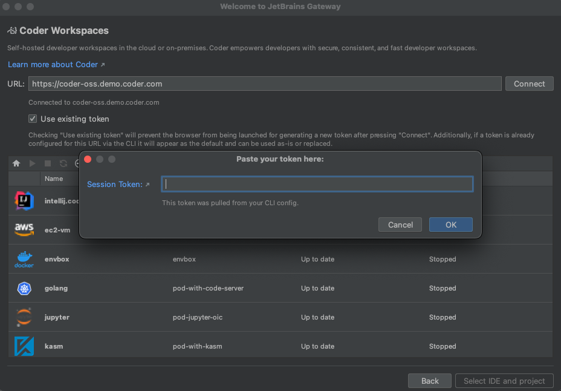
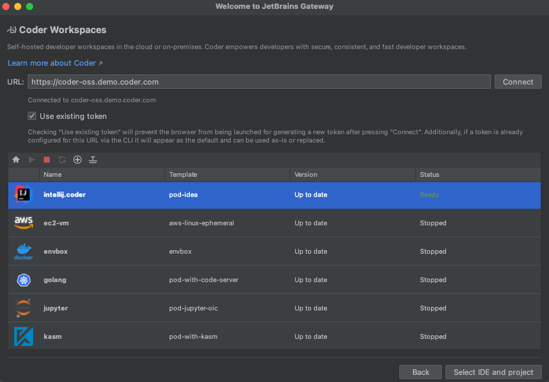
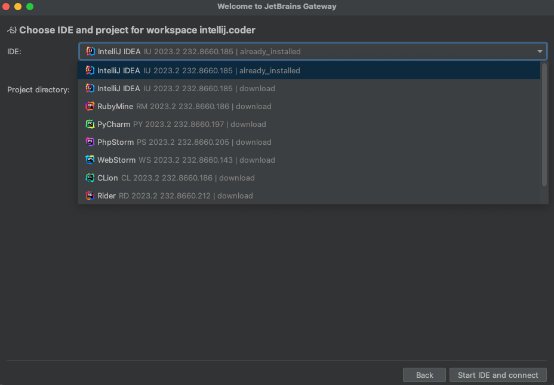

# JetBrains IDEs

Coder supports JetBrains IDEs using
[Gateway](https://www.jetbrains.com/remote-development/gateway/). The following
IDEs are supported for remote development:

- IntelliJ IDEA
- CLion
- GoLand
- PyCharm
- Rider
- RubyMine
- WebStorm
- PhpStorm
- RustRover
- [JetBrains Fleet](#jetbrains-fleet)

## JetBrains Gateway

JetBrains Gateway is a compact desktop app that allows you to work remotely with
a JetBrains IDE without downloading one. Visit the
[JetBrains Gateway website](https://www.jetbrains.com/remote-development/gateway/)
to learn more about Gateway.

Gateway can connect to a Coder workspace using Coder's Gateway plugin or through a
manually configured SSH connection.

You can [pre-install the JetBrains Gateway backend](../../../admin/templates/extending-templates/jetbrains-gateway.md) in a template to help JetBrains load faster in workspaces.

### How to use the plugin

> If you experience problems, please
> [create a GitHub issue](https://github.com/coder/coder/issues) or share in
> [our Discord channel](https://discord.gg/coder).

1. [Install Gateway](https://www.jetbrains.com/help/idea/jetbrains-gateway.html)
   and open the application.
1. Under **Install More Providers**, find the Coder icon and click **Install**
   to install the Coder plugin.
1. After Gateway installs the plugin, it will appear in the **Run the IDE
   Remotely** section.

   Click **Connect to Coder** to launch the plugin:

   

1. Enter your Coder deployment's
   [Access Url](../../../admin/setup/index.md#access-url) and click **Connect**.

   Gateway opens your Coder deployment's `cli-auth` page with a session token.
   Click the copy button, paste the session token in the Gateway **Session
   Token** window, then click **OK**:

   

1. To create a new workspace:

   Click the <kbd>+</kbd> icon to open a browser and go to the templates page in
   your Coder deployment to create a workspace.

1. If a workspace already exists but is stopped, select the workspace from the
   list, then click the green arrow to start the workspace.

1. When the workspace status is **Running**, click **Select IDE and Project**:

   

1. Select the JetBrains IDE for your project and the project directory then
   click **Start IDE and connect**:

   

   Gateway connects using the IDE you selected:

   

   The JetBrains IDE is remotely installed into `~/.cache/JetBrains/RemoteDev/dist`.

### Update a Coder plugin version

1. Click the gear icon at the bottom left of the Gateway home screen, then
   **Settings**.

1. In the **Marketplace** tab within Plugins, enter Coder and if a newer plugin
   release is available, click **Update** then **OK**:

   

### Configuring the Gateway plugin to use internal certificates

When you attempt to connect to a Coder deployment that uses internally signed
certificates, you might receive the following error in Gateway:

```console
Failed to configure connection to https://coder.internal.enterprise/: PKIX path building failed: sun.security.provider.certpath.SunCertPathBuilderException: unable to find valid certification path to requested target
```

To resolve this issue, you will need to add Coder's certificate to the Java
trust store present on your local machine as well as to the Coder plugin settings.

1. Add the certificate to the Java trust store:

   <div class="tabs">

   #### Linux

   ```none
   <Gateway installation directory>/jbr/lib/security/cacerts
   ```

   Use the `keytool` utility that ships with Java:

   ```shell
   keytool -import -alias coder -file <certificate> -keystore /path/to/trust/store
   ```

   #### macOS

   ```none
   <Gateway installation directory>/jbr/lib/security/cacerts
   /Library/Application Support/JetBrains/Toolbox/apps/JetBrainsGateway/ch-0/<app-id>/JetBrains Gateway.app/Contents/jbr/Contents/Home/lib/security/cacerts # Path for Toolbox installation
   ```

   Use the `keytool` included in the JetBrains Gateway installation:

   ```shell
   keytool -import -alias coder -file cacert.pem -keystore /Applications/JetBrains\ Gateway.app/Contents/jbr/Contents/Home/lib/security/cacerts
   ```

   #### Windows

   ```none
   C:\Program Files (x86)\<Gateway installation directory>\jre\lib\security\cacerts\%USERPROFILE%\AppData\Local\JetBrains\Toolbox\bin\jre\lib\security\cacerts # Path for Toolbox installation
   ```

   Use the `keytool` included in the JetBrains Gateway installation:

   ```powershell
   & 'C:\Program Files\JetBrains\JetBrains Gateway <version>/jbr/bin/keytool.exe' 'C:\Program Files\JetBrains\JetBrains Gateway <version>/jre/lib/security/cacerts' -import -alias coder -file <cert>

   # command for Toolbox installation
   & '%USERPROFILE%\AppData\Local\JetBrains\Toolbox\apps\Gateway\ch-0\<VERSION>\jbr\bin\keytool.exe' '%USERPROFILE%\AppData\Local\JetBrains\Toolbox\bin\jre\lib\security\cacerts' -import -alias coder -file <cert>
   ```

   </div>

1. In JetBrains, go to **Settings** > **Tools** > **Coder**.

1. Paste the path to the certificate in **CA Path**.

## Manually Configuring A JetBrains Gateway Connection

This is in lieu of using Coder's Gateway plugin which automatically performs these steps.

1. [Install Gateway](https://www.jetbrains.com/help/idea/jetbrains-gateway.html).

1. [Configure the `coder` CLI](../../../user-guides/workspace-access/index.md#configure-ssh).

1. Open Gateway, make sure **SSH** is selected under **Remote Development**.

1. Click **New Connection**:

   

1. In the resulting dialog, click the gear icon to the right of **Connection**:

   

1. Click <kbd>+</kbd> to add a new SSH connection:

   

1. For the Host, enter `coder.<workspace name>`

1. For the Port, enter `22` (this is ignored by Coder)

1. For the Username, enter your workspace username.

1. For the Authentication Type, select **OpenSSH config and authentication
   agent**.

1. Make sure the checkbox for **Parse config file ~/.ssh/config** is checked.

1. Click **Test Connection** to validate these settings.

1. Click **OK**:

   

1. Select the connection you just added:

   

1. Click **Check Connection and Continue**:

   

1. Select the JetBrains IDE for your project and the project directory. SSH into
   your server to create a directory or check out code if you haven't already.

   

   The JetBrains IDE is remotely installed into `~/.cache/JetBrains/RemoteDev/dist`

1. Click **Download and Start IDE** to connect.

   

## Using an existing JetBrains installation in the workspace

For JetBrains IDEs, you can use an existing installation in the workspace.
Please ask your administrator to install the JetBrains Gateway backend in the workspace by following the [pre-install guide](../../../admin/templates/extending-templates/jetbrains-gateway.md).

> [!NOTE]
> Gateway only works with paid versions of JetBrains IDEs so the script will not
> be located in the `bin` directory of JetBrains Community editions.

[Here is the JetBrains article](https://www.jetbrains.com/help/idea/remote-development-troubleshooting.html#setup:~:text=Can%20I%20point%20Remote%20Development%20to%20an%20existing%20IDE%20on%20my%20remote%20server%3F%20Is%20it%20possible%20to%20install%20IDE%20manually%3F)
explaining this IDE specification.

## JetBrains Toolbox Integration

JetBrains Toolbox helps you manage JetBrains products and includes remote development capabilities for connecting to Coder workspaces.

### Before you begin

- Install [JetBrains Toolbox](https://www.jetbrains.com/toolbox-app/) version 2.6.0.40284 or later
- Ensure your Coder workspace [has the necessary IDE backends installed](../../../admin/templates/extending-templates/jetbrains-gateway.md)

### Install the Coder plugin for Toolbox

1. Open Toolbox and navigate to the **Remote Development** section.
1. Install the Coder plugin using one of these methods:
   - Search for `Coder` in the **Remote Development** plugins section.
   - Use this URI to install directly: `jetbrains://gateway/com.coder.toolbox`.
   - Download from [JetBrains Marketplace](https://plugins.jetbrains.com/).

### Use URI parameters

For direct connections or creating bookmarks, use custom URI links with parameters:

```shell
jetbrains://gateway/com.coder.toolbox?url=https://coder.example.com&workspace=my-workspace
```

Required parameters:

- `url`: Your Coder deployment URL
- `workspace`: Name of your workspace

Optional parameters:

- `token`: Authentication token (use only in secure environments)
- `folder`: Specific project folder path to open
- `product`: Specific IDE product code (e.g., "IU" for IntelliJ IDEA Ultimate)

### Configure internal certificates

When connecting to a Coder deployment with internal certificates, follow the same procedure described in the [JetBrains Gateway](#configuring-the-gateway-plugin-to-use-internal-certificates) section above, but use the Toolbox installation paths:

<div class="tabs">

#### Linux

```shell
keytool -import -alias coder -file <path-to-certificate> -keystore "<toolbox-installation>/jbr/lib/security/cacerts"
```

#### macOS

```shell
keytool -import -alias coder -file <path-to-certificate> -keystore "$HOME/Library/Application Support/JetBrains/Toolbox/jbr/Contents/Home/lib/security/cacerts"
```

#### Windows

```shell
keytool -import -alias coder -file <path-to-certificate> -keystore "%USERPROFILE%\AppData\Local\JetBrains\Toolbox\jbr\lib\security\cacerts"
```

</div>

## JetBrains Fleet

JetBrains Fleet is a code editor and lightweight IDE designed to support various
programming languages and development environments.

[See JetBrains's website](https://www.jetbrains.com/fleet/) to learn more about Fleet.

To connect Fleet to a Coder workspace:

1. [Install Fleet](https://www.jetbrains.com/fleet/download)

1. Install Coder CLI

   ```shell
   curl -L https://coder.com/install.sh | sh
   ```

1. Login and configure Coder SSH.

   ```shell
   coder login coder.example.com
   coder config-ssh
   ```

1. Connect via SSH with the Host set to `coder.workspace-name`
   

If you experience any issues, please
[create a GitHub issue](https://github.com/coder/coder/issues) or share in
[our Discord channel](https://discord.gg/coder).
