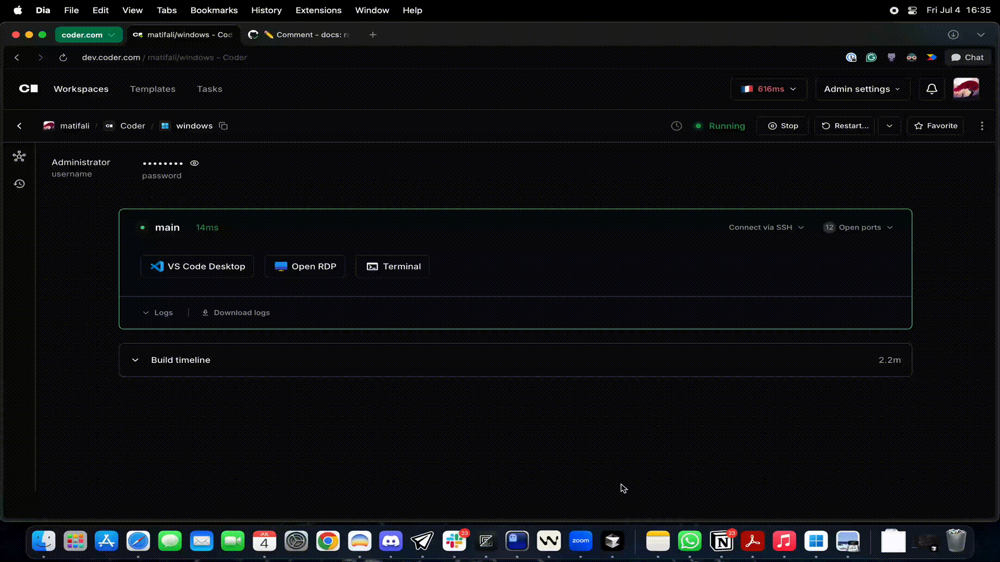
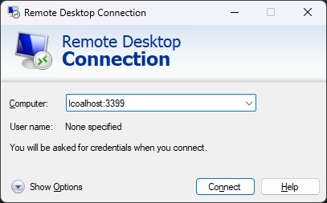
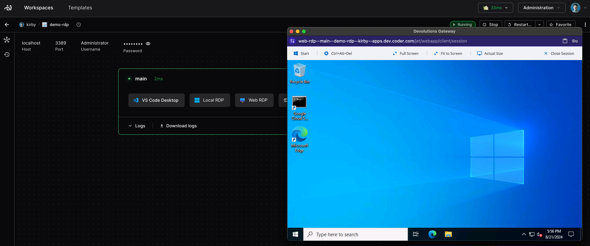
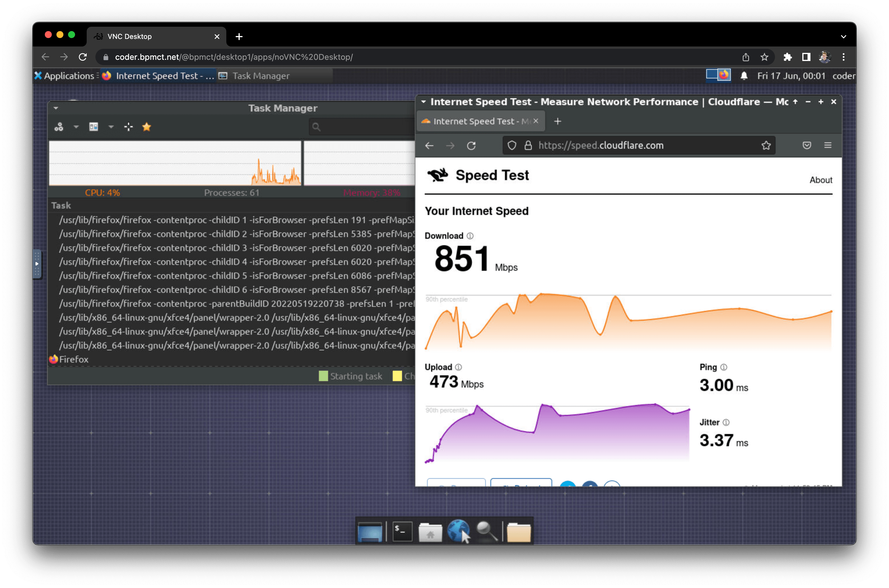

# Remote Desktops

## RDP

The most common way to get a GUI-based connection to a Windows workspace is by using Remote Desktop Protocol (RDP).

<div class="tabs">

### Desktop Client

To use RDP with Coder, you'll need to install an
[RDP client](https://docs.microsoft.com/en-us/windows-server/remote/remote-desktop-services/clients/remote-desktop-clients)
on your local machine, and enable RDP on your workspace.

<div class="tabs">

#### Coder Desktop

[Coder Desktop](../desktop/index.md)'s **Coder Connect** feature creates a connection to your workspaces in the background. Use your favorite RDP client to connect to `<workspace-name>.coder`.

You can use the [RDP Desktop](https://registry.coder.com/modules/coder/local-windows-rdp) module to add a single-click button to open an RDP session in the browser.



You can also use a URI handler to launch an RDP session directly.

The URI format is:

```text
coder://<your Coder server name>/v0/open/ws/<workspace name>/agent/<agent name>/rdp?username=<username>&password=<password>
```

For example:

```text
coder://coder.example.com/v0/open/ws/myworkspace/agent/main/rdp?username=Administrator&password=coderRDP!
```

To include a Coder Desktop button on the workspace dashboard page, add a `coder_app` resource to the template:

```tf
locals {
  server_name = regex("https?:\\/\\/([^\\/]+)", data.coder_workspace.me.access_url)[0]
}

resource "coder_app" "rdp-coder-desktop" {
  agent_id     = resource.coder_agent.main.id
  slug         = "rdp-desktop"
  display_name = "RDP Desktop"
  url          = "coder://${local.server_name}/v0/open/ws/${data.coder_workspace.me.name}/agent/main/rdp?username=Administrator&password=coderRDP!"
  icon         = "/icon/desktop.svg"
  external     = true
}
```

#### CLI

Use the following command to forward the RDP port to your local machine:

```console
coder port-forward <workspace-name> --tcp 3399:3389
```

Then, connect to your workspace via RDP at `localhost:3399`.


</div>

> [!NOTE]
> Some versions of Windows, including Windows Server 2022, do not communicate correctly over UDP when using Coder Connect because they do not respect the maximum transmission unit (MTU) of the link. When this happens, the RDP client will appear to connect, but displays a blank screen.
>
> To avoid this error, Coder's [Windows RDP](https://registry.coder.com/modules/windows-rdp) module [disables RDP over UDP automatically](https://github.com/coder/registry/blob/b58bfebcf3bcdcde4f06a183f92eb3e01842d270/registry/coder/modules/windows-rdp/powershell-installation-script.tftpl#L22).
>
> To disable RDP over UDP manually, run the following in PowerShell:
>
> ```powershell
> New-ItemProperty -Path 'HKLM:\SOFTWARE\Policies\Microsoft\Windows NT\Terminal Services' -Name "SelectTransport" -Value 1 -PropertyType DWORD -Force
> Restart-Service -Name "TermService" -Force
> ```

### Browser

Our [RDP Web](https://registry.coder.com/modules/windows-rdp) module in the Coder Registry adds a one-click button to open an RDP session in the browser. This requires just a few lines of Terraform in your template, see the documentation on our registry for setup.



</div>

> [!NOTE]
> The default username is `Administrator` and the password is `coderRDP!`.

## Amazon DCV

Our [Amazon DCV Windows](https://registry.coder.com/modules/amazon-dcv-windows) installs and configures the Amazon DCV server for seamless remote desktop access. It allows connecting through the both the [Amazon DCV desktop clients](https://docs.aws.amazon.com/dcv/latest/userguide/using-connecting.html) and a [web browser](https://docs.aws.amazon.com/dcv/latest/userguide/using-connecting-browser-connect.html).

<div class="tabs">

### Desktop Client

Connect using the [Amazon DCV Desktop client](https://docs.aws.amazon.com/dcv/latest/userguide/using-connecting.html) by forwarding the DCV port to your local machine:

<div class="tabs">

#### Coder Desktop

[Coder Desktop](../desktop/index.md)'s **Coder Connect** feature creates a connection to your workspaces in the background. Use DCV client to connect to `<workspace-name>.coder:8443`.

#### CLI

Use the following command to forward the DCV port to your local machine:

```console
coder port-forward <workspace-name> --tcp 8443:8443
```

</div>

### Browser

Our [Amazon DCV Windows](https://registry.coder.com/modules/amazon-dcv-windows) module adds a one-click button to open an Amazon DCV session in the browser. This requires just a few lines of Terraform in your template, see the documentation on our registry for setup.

</div>


## VNC

The common way to connect to a desktop session of a Linux workspace is to use a VNC client. The VNC client can be installed on your local machine or accessed through a web browser. There is an additional requirement to install the VNC server on the workspace.

Installation instructions vary depending on your workspace's operating system, platform, and build system. Refer to the [enterprise-desktop](https://github.com/coder/images/tree/main/images/desktop) image for a starting point which can be used to provision a Dockerized workspace with the following software:

- Ubuntu 24.04
- XFCE Desktop
- KasmVNC Server and Web Client

<div class="tabs">

### Desktop Client

Use a VNC client (e.g., [TigerVNC](https://tigervnc.org/)) by forwarding the VNC port to your local machine.

<div class="tab">

#### Coder Desktop

[Coder Desktop](../desktop/index.md)'s **Coder Connect** feature allows you to connect to your workspace's VNC server at `<workspace-name>.coder:5900`.

#### CLI

Use the following command to forward the VNC port to your local machine:

```bash
coder port-forward <workspace-name> --tcp 5900:5900
```

Now you can connect to your workspace's VNC server using a VNC client at `localhost:5900`.

</div>

### Browser

The [KasmVNC module](https://registry.coder.com/modules/coder/kasmvnc) allows browser-based access to your workspace by installing and configuring the [KasmVNC](https://github.com/kasmtech/KasmVNC) server and web client.

</div>


