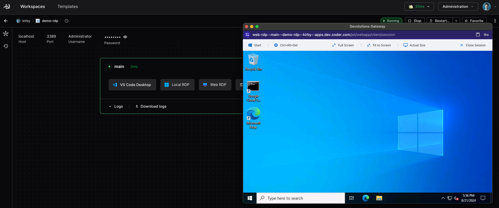
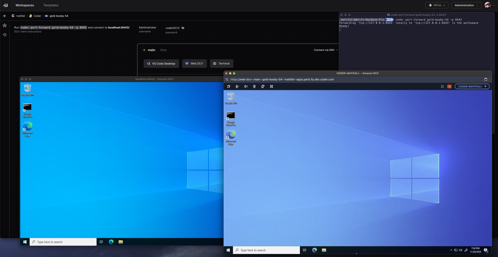

# Remote Desktops

## VNC Desktop

The common way to use remote desktops with Coder is through VNC.


Workspace requirements:

- VNC server (e.g. [tigervnc](https://tigervnc.org/))
- VNC client (e.g. [novnc](https://novnc.com/info.html))

Installation instructions vary depending on your workspace's operating system,
platform, and build system.

As a starting point, see the
[desktop-container](https://github.com/bpmct/coder-templates/tree/main/desktop-container)
community template. It builds and provisions a Dockerized workspace with the
following software:

- Ubuntu 20.04
- TigerVNC server
- noVNC client
- XFCE Desktop

## RDP Desktop

To use RDP with Coder, you'll need to install an
[RDP client](https://docs.microsoft.com/en-us/windows-server/remote/remote-desktop-services/clients/remote-desktop-clients)
on your local machine, and enable RDP on your workspace.

Use the following command to forward the RDP port to your local machine:

```console
coder port-forward <workspace-name> --tcp 3399:3389
```

Then, connect to your workspace via RDP:

```console
mstsc /v localhost:3399
```

Or use your favorite RDP client to connect to `localhost:3399`.


The default username is `Administrator` and password is `coderRDP!`.

### Coder Desktop URI Handling (Beta)

[Coder Desktop](../desktop) can use a URI handler to directly launch an RDP session without setting up port-forwarding.
The URI format is:

```text
coder://<your Coder server name>/v0/open/ws/<workspace name>/agent/<agent name>/rdp?username=<username>&password=<password>
```

For example:

```text
coder://coder.example.com/v0/open/ws/myworkspace/agent/main/rdp?username=Administrator&password=coderRDP!
```

To include a Coder Desktop button to the workspace dashboard page, add a `coder_app` resource to the template:

```tf
locals {
  server_name = regex("https?:\\/\\/([^\\/]+)", data.coder_workspace.me.access_url)[0]
}

resource "coder_app" "rdp-coder-desktop" {
  agent_id     = resource.coder_agent.main.id
  slug         = "rdp-desktop"
  display_name = "RDP with Coder Desktop"
  url          = "coder://${local.server_name}/v0/open/ws/${data.coder_workspace.me.name}/agent/main/rdp?username=Administrator&password=coderRDP!"
  icon         = "/icon/desktop.svg"
  external     = true
}
```

## RDP Web

Our [WebRDP](https://registry.coder.com/modules/windows-rdp) module in the Coder
Registry adds a one-click button to open an RDP session in the browser. This
requires just a few lines of Terraform in your template, see the documentation
on our registry for setup.



## Amazon DCV Windows

Our [Amazon DCV Windows](https://registry.coder.com/modules/amazon-dcv-windows)
module adds a one-click button to open an Amazon DCV session in the browser.
This requires just a few lines of Terraform in your template, see the
documentation on our registry for setup.


