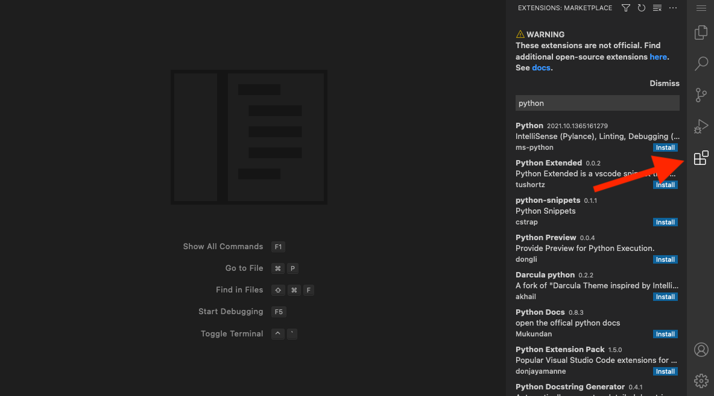
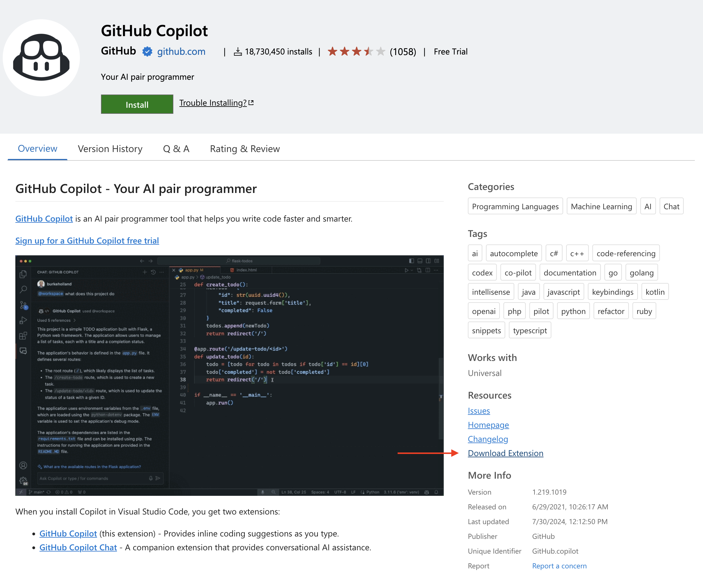

You can develop in your Coder workspace remotely with
[VS Code](https://code.visualstudio.com/download).
We support connecting with the desktop client and VS Code in the browser with
[code-server](https://github.com/coder/code-server).
Learn more about how VS Code Web and code-server compare in the
[code-server doc](./code-server.md).

## VS Code Desktop

VS Code desktop is a default app for workspaces.

Select **VS Code Desktop** in the dashboard to one-click enter a workspace.
This automatically installs the [Coder Remote](https://github.com/coder/vscode-coder) extension, authenticates with Coder, and connects to the workspace.


> [!NOTE]
> The `VS Code Desktop` button can be hidden by enabling
> [Browser-only connections](../../admin/networking/index.md#browser-only-connections).

### Manual Installation

You can install our extension manually in VS Code using the command palette.
Launch VS Code Quick Open (Ctrl+P), paste the following command, and press
enter.

```txt
ext install coder.coder-remote
```

Alternatively, manually install the VSIX from the
[latest release](https://github.com/coder/vscode-coder/releases/latest).

## Local telemetry

The Coder Remote extension records local telemetry to help diagnose extension
and workspace connection issues. Telemetry is stored on your machine. It is not
sent to Coder unless you export it or include it in a support bundle and share
that file.

Local telemetry is controlled by the VS Code setting `coder.telemetry.level`:

| Value   | Behavior                                                      |
|---------|---------------------------------------------------------------|
| `off`   | Disable extension telemetry collection.                       |
| `local` | Record telemetry events on this machine. This is the default. |

### Stored data

Telemetry can include diagnostic details such as extension version, VS Code
version, operating system, machine and session identifiers, deployment URL,
workspace and agent names, command outcomes, connection state, request routes,
timing, and error details. It does not intentionally collect source code,
terminal contents, tokens, or credentials.

### Tracked activity

The exact events vary by extension version. For a comprehensive list of current
events, properties, and attributes, see the
[extension event reference](https://github.com/coder/vscode-coder/blob/main/src/instrumentation/EVENTS.md).
The following categories summarize the diagnostic signals the extension may
record:

| Area                           | Examples                                                                                     |
|--------------------------------|----------------------------------------------------------------------------------------------|
| Extension lifecycle            | Activation, deployment initialization, and configuration loading.                            |
| Authentication and credentials | Sign-in state, token refresh, logout, credential storage, and deployment recovery.           |
| Commands and diagnostics       | Command outcomes, telemetry exports, support bundle creation, ping, and speed tests.         |
| Workspace workflows            | Workspace selection, open attempts, dev container handoff, start, and update prompts.        |
| CLI and remote setup           | CLI binary resolution, download, verification, configuration, and setup through SSH handoff. |
| Connection health              | Workspace and agent state transitions, reconnects, SSH process health, and network samples.  |
| HTTP diagnostics               | Normalized routes, status classes, and latency rollups.                                      |

### Storage and retention

The extension stores telemetry as JSON Lines files in its VS Code global storage under a `telemetry` directory.
Files rotate at 5&nbsp;MiB, are kept for up to 30&nbsp;days, and are capped at 100&nbsp;MiB total by default.

You can tune local retention with the advanced `coder.telemetry.local` setting.
Most users should keep the default values.

### Diagnostics and support bundles

The extension includes commands for collecting diagnostics from VS Code:

- **Coder: Export Telemetry** exports only local telemetry. Choose a date range
  and JSON or OTLP JSON zip format, then review the file before sharing it.
- **Coder: Create Support Bundle** runs `coder support bundle` and adds local extension logs, proxy and Remote-SSH logs, selected settings, and telemetry under `vscode-logs/`.
  Only configured values for `coder.globalFlags`, `coder.headerCommand`, and `coder.tlsCertRefreshCommand` are masked; review other settings before sharing.
  With Coder CLI version 2.36.0 or later and a reachable workspace agent that supports file collection, it also collects remote editor server logs under `agent/workspace_files/`.
  Bundles created with the CLI alone don't include local VS Code diagnostics.
  Follow the [VS Code support bundle procedure](../../support/support-bundle.md#vs-code) to select a workspace, confirm collection, and save the archive.
- **Coder: View Logs** opens SSH proxy logs in VS Code.

Support bundles can contain sensitive diagnostic data. Review the generated
bundle before sharing it. Learn more about
[support bundles](../../support/support-bundle.md).

## Connection timeouts and reconnects

The Coder Remote extension sets SSH keepalive and Remote - SSH reconnection defaults for Coder workspaces.
If your connection drops while the workspace is under heavy load, such as memory pressure, you can relax these settings.

### SSH keepalives

The extension writes these keepalive options to the SSH configuration it generates for Coder workspaces:

| Option                | Default | Behavior                                   |
|-----------------------|---------|--------------------------------------------|
| `ServerAliveInterval` | `10`    | Sends a keepalive every 10&nbsp;seconds.   |
| `ServerAliveCountMax` | `3`     | Disconnects after 3 unanswered keepalives. |

With these defaults, the SSH client disconnects after about 30&nbsp;seconds without a response from the workspace.
To tolerate longer stalls, override the options in the `coder.sshConfig` VS Code setting:

```json
{
  "coder.sshConfig": ["ServerAliveCountMax=30"]
}
```

This example disconnects after about 5&nbsp;minutes without a response.
To remove a default option, set it to an empty value, such as `"ServerAliveCountMax="`.
The new values apply the next time you connect to the workspace.

The extension merges SSH options from these sources, from highest to lowest precedence:

1. The `coder.sshConfig` VS Code setting.
1. Options passed to `coder config-ssh --ssh-option`.
1. Deployment-wide options that an administrator sets with [`CODER_SSH_CONFIG_OPTIONS`](../../reference/cli/server/index.md#--ssh-config-options).

### Reconnection settings

When you connect to a workspace, the extension also configures these Remote - SSH settings, in seconds:

| Setting                              | Set on connect                   | Recommended              |
|--------------------------------------|----------------------------------|--------------------------|
| `remote.SSH.connectTimeout`          | Raised to at least `1800`        | `1800` (30&nbsp;minutes) |
| `remote.SSH.reconnectionGraceTime`   | `28800` (8&nbsp;hours), if unset | `86400` (24&nbsp;hours)  |
| `remote.SSH.serverShutdownTimeout`   | `28800` (8&nbsp;hours), if unset | `86400` (24&nbsp;hours)  |
| `remote.SSH.maxReconnectionAttempts` | Maximum allowed, if unset        | Maximum allowed          |

To apply the recommended values, run **Coder: Apply Recommended SSH Settings** from the Command Palette.
This command overwrites any values you set for these settings.

These settings control how long VS Code waits to connect, how long the remote server waits for you to reconnect, and how many times VS Code retries.
They don't change when the SSH connection itself times out; use `coder.sshConfig` for that.

## VS Code extensions

There are multiple ways to add extensions to VS Code Desktop:

1. Using the
   [public extensions marketplaces](#use-the-public-extensions-marketplaces)
   with Code Web (code-server)
1. Adding [extensions to custom images](#add-extensions-to-custom-images)
1. Installing extensions
   [using its `vsix` file at the command line](#install-extensions-using-a-vsix-file-at-the-command-line)
1. Installing extensions
   [from a marketplace using the command line](#install-from-a-marketplace-at-the-command-line)

<a id="using-the-public-extensions-marketplaces"></a>

### Use the public extensions marketplaces

You can manually add an extension while you're working in the Code Web IDE. The
extensions can be from Coder's public marketplace, Eclipse Open VSX's public
marketplace, or the Eclipse Open VSX _local_ marketplace.



> [!NOTE]
> Microsoft does not allow any unofficial VS Code IDE to connect to the
> extension marketplace.

<a id="adding-extensions-to-custom-images"></a>

### Add extensions to custom images

You can add extensions to a custom image and install them either through Code
Web or using the workspace's terminal.

1. Download the extension(s) from the Microsoft public marketplace.

   

1. Add the `vsix` extension files to the same folder as your Dockerfile.

   ```sh
   ~/images/base
    ➜  ls -l
    -rw-r--r-- 1 coder coder       0 Aug 1 19:23 Dockerfile
    -rw-r--r-- 1 coder coder 8925314 Aug 1 19:40 GitHub.copilot.vsix
   ```

1. In the Dockerfile, add instructions to make a folder and to copy the `vsix`
   files into the newly created folder.

   ```dockerfile
   FROM codercom/example-base:ubuntu

   # Run below commands as root user
   USER root

   # Download and install VS Code extensions into the container
   RUN mkdir -p /vsix
   ADD ./GitHub.copilot.vsix /vsix

   USER coder
   ```

1. Build the custom image, and push it to your image registry.

1. Pass in the image and below command into your template `startup_script` (be
   sure to update the filename below):

   **Startup Script**

   ```tf
   resource "coder_agent" "main" {
     ...
     startup_script = "code-server --install-extension /vsix/GitHub.copilot.vsix"
   }
   ```

   **Image Definition**

   ```tf
   resource "kubernetes_deployment" "main" {
     spec {
       template {
         spec {
           container {
             name   = "dev"
             image  = "registry.internal/image-name:tag"
           }
         }
       }
     }
   }
   ```

1. Create a workspace using the template.

You will now have access to the extension in your workspace.

<a id="installing-extensions-using-its-vsix-file-at-the-command-line"></a>

### Install extensions using a `vsix` file at the command line

Using the workspace's terminal or the terminal available inside `code-server`,
you can install an extension whose files you've downloaded from a marketplace:

```console
/path/to/code-server --install-extension /vsix/GitHub.copilot.vsix
```

<a id="installing-from-a-marketplace-at-the-command-line"></a>

### Install from a marketplace at the command line

Using the workspace's terminal or the terminal available inside Code Web (code
server), run the following to install an extension (be sure to update the
snippets with the name of the extension you want to install):

```console
SERVICE_URL=https://extensions.coder.com/api ITEM_URL=https://extensions.coder.com/item /path/to/code-server --install-extension GitHub.copilot
```

Alternatively, you can install an extension from Open VSX's public marketplace:

```console
SERVICE_URL=https://open-vsx.org/vscode/gallery ITEM_URL=https://open-vsx.org/vscode/item /path/to/code-server --install-extension GitHub.copilot
```

<a id="using-vs-code-desktop"></a>

### Use VS Code Desktop

For your local VS Code to pickup extension files in your Coder workspace,
include this command in your `startup_script`, or run in manually in your
workspace terminal:

```console
code --extensions-dir ~/.vscode-server/extensions --install-extension "$extension"
```
